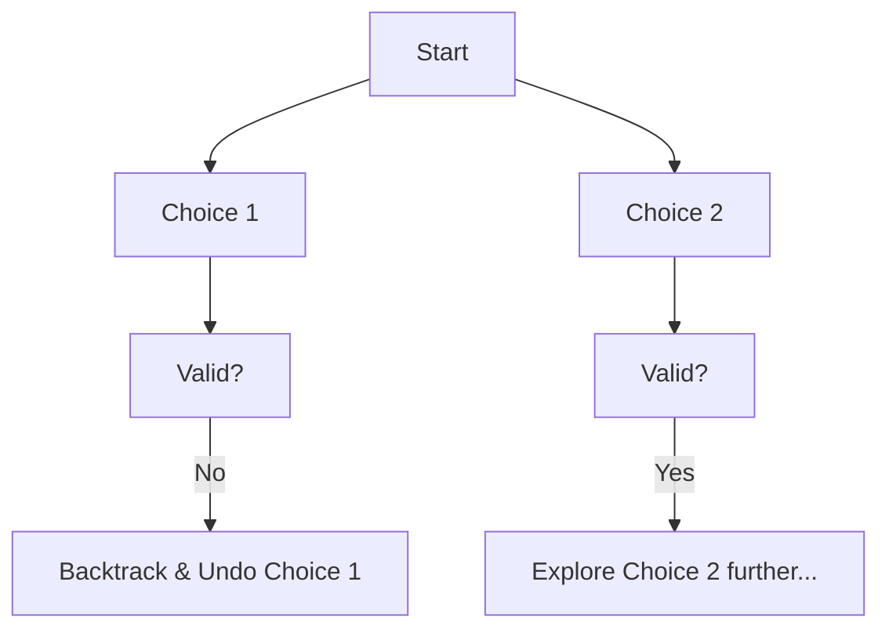

**Backtracking** is an algorithmic technique for solving problems recursively by trying to build a solution incrementally, one piece at a time, removing those solutions that fail to satisfy the constraints of the problem at any point in time.

It is often called a "Refined Brute Force".

---

## 1. The Intuition: "Exploring a Maze"

Imagine you are in a maze.
1. Each time you reach a junction, you choose a path.
2. If you reach a dead-end, you don't just stand there — you **"backtrack"** to the last junction and try a different path.
3. You keep doing this until you either find the exit or explore every possible path.

In programming, Backtracking is exactly that. We make a choice, see if it leads to a valid solution, and if not, we **undo** that choice and try the next one.

---

## 2. How we go about it: The Core Pattern

Every backtracking algorithm follows the same three steps:
1.  **Choose**: Pick a potential next step for the solution.
2.  **Explore**: Move forward and recursively try to complete the solution.
3.  **Un-choose**: If moving forward didn't work, undo the step so the next iteration starts with a clean slate.



---

## 3. Complexity Analysis

Backtracking problems usually follow a **Decision Tree**.

| Scenario | Time Complexity | Space Complexity |
| :------- | :-------------- | :--------------- |
| **Permutations** | O(N!)           | O(N)             |
| **Subsets** | O(2^N)          | O(N)             |
| **N-Queens** | O(N!)           | O(N)             |

*The space complexity is O(N) because the recursion stack usually goes as deep as the size of the input.*

---

## 4. Multi-Language Implementation (N-Queens)

The **N-Queens** problem is the perfect example: Place N queens on an N×N chessboard so that no two queens attack each other.

```language-code-tabs
[
  {
    "label": "Javascript",
    "language": "javascript",
    "code": "function solveNQueens(n) {\n    let result = [];\n    let board = Array.from({ length: n }, () => '.'.repeat(n).split(''));\n\n    function backtrack(row) {\n        if (row === n) {\n            result.push(board.map(r => r.join('')));\n            return;\n        }\n\n        for (let col = 0; col < n; col++) {\n            if (isValid(row, col)) {\n                board[row][col] = 'Q'; // CHOOSE\n                backtrack(row + 1);    // EXPLORE\n                board[row][col] = '.'; // UN-CHOOSE\n            }\n        }\n    }\n\n    function isValid(row, col) {\n        for (let i = 0; i < row; i++) {\n            if (board[i][col] === 'Q') return false;\n            // Check diagonals...\n        }\n        return true; // Simplified for brevity\n    }\n\n    backtrack(0);\n    return result;\n}"
  },
  {
    "label": "Python",
    "language": "python",
    "code": "def solveNQueens(n):\n    res = []\n    board = [['.' for _ in range(n)] for _ in range(n)]\n\n    def backtrack(row):\n        if row == n:\n            res.append([\"\".join(r) for r in board])\n            return\n        \n        for col in range(n):\n            if is_valid(row, col):\n                board[row][col] = 'Q' # CHOOSE\n                backtrack(row + 1)    # EXPLORE\n                board[row][col] = '.' # UN-CHOOSE\n                \n    def is_valid(row, col):\n        # Check column and diagonals\n        return True\n\n    backtrack(0)\n    return res"
  },
  {
    "label": "Java",
    "language": "java",
    "code": "class Solution {\n    public List<List<String>> solveNQueens(int n) {\n        char[][] board = new char[n][n];\n        for(int i=0; i<n; i++) Arrays.fill(board[i], '.');\n        List<List<String>> res = new ArrayList<>();\n        backtrack(res, board, 0);\n        return res;\n    }\n\n    private void backtrack(List<List<String>> res, char[][] board, int row) {\n        if(row == board.length) {\n            res.add(construct(board));\n            return;\n        }\n        for(int col=0; col<board.length; col++) {\n            if(isValid(board, row, col)) {\n                board[row][col] = 'Q'; // CHOOSE\n                backtrack(res, board, row + 1); // EXPLORE\n                board[row][col] = '.'; // UN-CHOOSE\n            }\n        }\n    }\n}"
  }
]
```

---

## 5. Why prune?

The magic of Backtracking isn't just trying everything — it's **Pruning**.
As soon as we see a choice violates a rule (e.g., placing a Queen where she is attacked), we immediately stop that branch. This prevents millions of useless calculations.

---

## 6. Interview Pro-Tips

### The Three Steps Are Your Template
In any backtracking interview problem, immediately structure your solution as: **Choose → Explore → Un-choose**. Writing these three comments in your code before filling in the logic keeps you on track and shows the interviewer you have a systematic approach.

### Pruning is the Difference Between Pass and Fail
A backtracking solution without pruning is just brute force with extra steps. Always ask: "What constraint can I check early to avoid going down a dead-end path?" For N-Queens, checking columns and diagonals before placing. For Sudoku, checking rows/cols/boxes before inserting.

### Classic Problems to Know
- **Subsets / Permutations / Combinations** — The foundational trio. Know all three.
- **N-Queens** — The canonical backtracking interview problem.
- **Sudoku Solver** — More complex pruning.
- **Word Search** — Backtracking on a 2D grid.
- **Palindrome Partitioning** — Backtracking meets DP.

### What Interviewers Are Testing
- Do you have the Choose/Explore/Un-choose pattern clearly in your code?
- Is your pruning condition correct and applied early?
- Do you understand why time complexity is O(N!) or O(2^N) and why pruning helps?
- Can you trace through the decision tree of a small example?

---

## Key Takeaway

Backtracking is "Trial and Error" done systematically. It's the go-to algorithm for **searching a space of possibilities** where constraints are tight.
