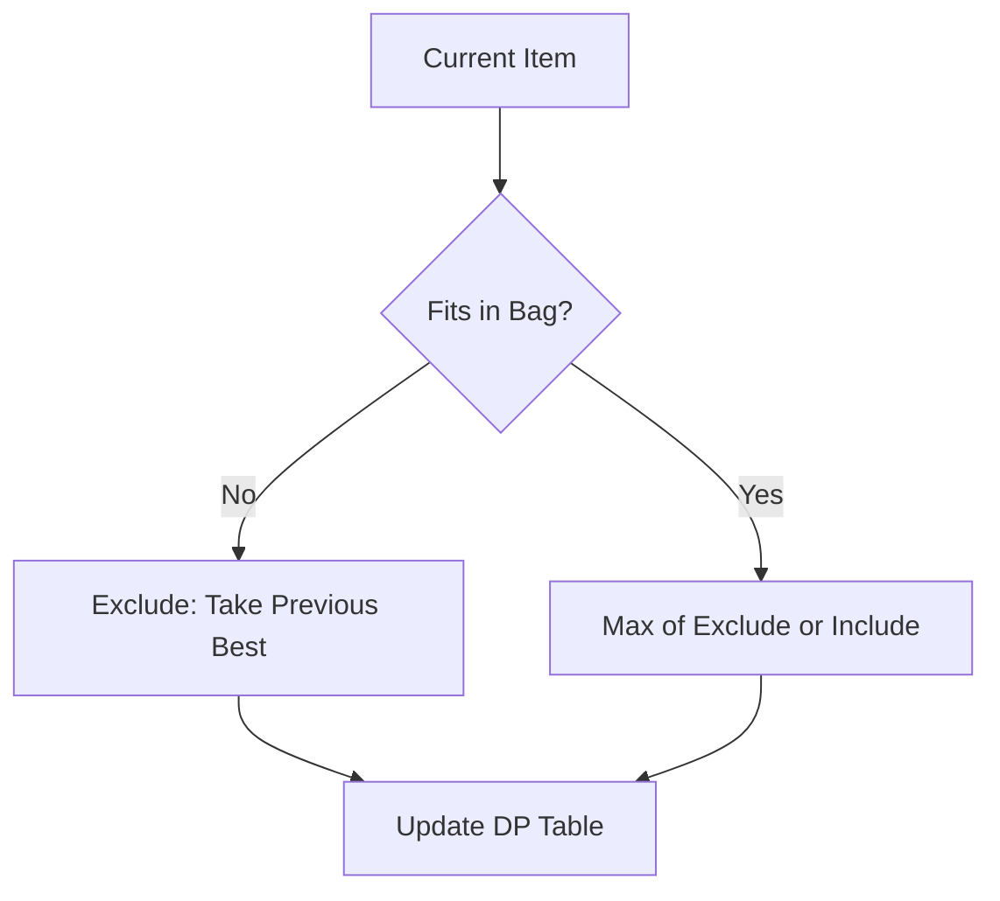

The **0/1 Knapsack Problem** is a classic optimization problem. Given a set of items, each with a weight and a value, determine the maximum value you can carry in a knapsack of a fixed capacity.

---

## 1. The Intuition: "Limit of Value"

Imagine you are a treasure hunter who found a cave full of heavy gold artifacts.
- You have a backpack that can only hold **50 kg**.
- You can't break the artifacts into pieces (it's "0/1"—you either take it or leave it).
- How do you pick the artifacts so that the total value in your backpack is the **absolute highest possible**?

If you try to be "Greedy" and pick the most valuable item first, it might be so heavy that you can't fit anything else. 0/1 Knapsack uses DP to check every possible combination without recalculating the same sub-problems.

---

## 2. How we go about it: The Decision Table

We build a 2D table `dp[item][capacity]`.
For every item `i` and every possible capacity `w`, we ask a simple question: **"Is it better to take this item or not?"**

1.  **Exclude**: If we don't take the item, our profit is just whatever we could get from the *previous* items at that same capacity.
2.  **Include**: If we take the item (and it fits!), our profit is the **value of this item** + whatever we could get from the *previous* items with the **remaining space**.

We pick the `max` of these two choices.



---

## 3. Complexity Analysis

| Scenario | Time Complexity | Space Complexity |
| :------- | :-------------- | :--------------- |
| **DP** | O(N * W)        | O(W) (optimized) |

- `N` = Number of items.
- `W` = Capacity of the knapsack.
- **Space**: A 2D table uses O(N * W), but because we only ever look at the "previous row," we can optimize this to a single O(W) array.

---

## 4. Multi-Language Implementation

```language-code-tabs
[
  {
    "label": "Javascript (Space Optimized)",
    "language": "javascript",
    "code": "function knapsack(values, weights, capacity) {\n  let n = values.length;\n  let dp = new Array(capacity + 1).fill(0);\n\n  for (let i = 0; i < n; i++) {\n    // Walk backwards so we don't use the same item twice\n    for (let w = capacity; w >= weights[i]; w--) {\n      dp[w] = Math.max(dp[w], values[i] + dp[w - weights[i]]);\n    }\n  }\n  return dp[capacity];\n}"
  },
  {
    "label": "Python (Space Optimized)",
    "language": "python",
    "code": "def knapsack(values, weights, capacity):\n    dp = [0] * (capacity + 1)\n    \n    for i in range(len(values)):\n        for w in range(capacity, weights[i] - 1, -1):\n            dp[w] = max(dp[w], values[i] + dp[w - weights[i]])\n            \n    return dp[capacity]"
  },
  {
    "label": "Java (Base Form)",
    "language": "java",
    "code": "public int knapsack(int[] values, int[] weights, int capacity) {\n    int n = values.length;\n    int[][] dp = new int[n + 1][capacity + 1];\n\n    for (int i = 1; i <= n; i++) {\n        for (int w = 1; w <= capacity; w++) {\n            if (weights[i - 1] <= w) {\n                dp[i][w] = Math.max(values[i - 1] + dp[i - 1][w - weights[i - 1]], dp[i - 1][w]);\n            } else {\n                dp[i][w] = dp[i - 1][w];\n            }\n        }\n    }\n    return dp[n][capacity];\n}"
  }
]
```

---

## 5. Interview Pro-Tips

### The "Include or Exclude" Framing is Everything
Every 0/1 Knapsack problem reduces to the same binary decision: for each item, do you take it or leave it? Framing it this way immediately gives you the recurrence:
`dp[w] = max(dp[w], value[i] + dp[w - weight[i]])`

### Walk Backwards When Space-Optimizing
The crucial insight for the 1D space-optimized version: you must iterate `w` from **right to left** (from `capacity` down to `weight[i]`). If you go left to right, you'd be using the updated value of `dp[w - weight[i]]`, meaning you'd count the same item twice (turning it into the "Unbounded Knapsack" problem).

### 0/1 vs. Unbounded Knapsack
- **0/1 Knapsack**: Each item can only be used **once** → iterate capacity backwards.
- **Unbounded Knapsack**: Each item can be used **unlimited times** → iterate capacity forwards.
Coin Change (where you can reuse coins) is Unbounded Knapsack.

### Common Problems Using This Pattern
- Partition Equal Subset Sum
- Target Sum
- Last Stone Weight II
- All of these reduce to "can we pick a subset that sums to X?"

### What Interviewers Are Testing
- Can you define the DP state and write the recurrence relation?
- Do you know the backwards iteration trick for space optimization?
- Can you distinguish 0/1 from Unbounded Knapsack?

---

## Key Takeaway

0/1 Knapsack is the foundation of **Resource Allocation**. Whether it's a computer deciding which processes to run within memory limits or a company deciding which projects to fund with a fixed budget, this algorithm is the definitive solution.
