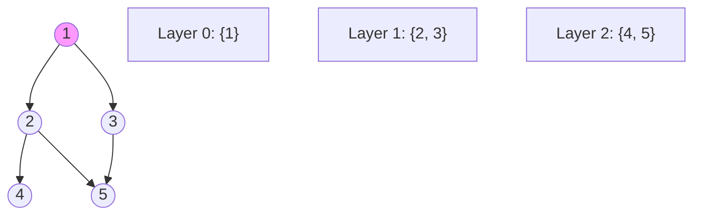

**Breadth-First Search (BFS)** is an algorithm for traversing or searching through a graph. It explores all the nodes at the current "depth" before moving on to nodes at the next depth level.

---

## 1. The Intuition: "A Ripple in a Pond"

Imagine you throw a stone into a still pond.
1. The water creates a **ripple** that starts at one point.
2. The ripple spreads outward in **perfect circles**.
3. It hits everything that is 1 foot away first, then everything 2 feet away, then 3 feet, and so on.

BFS is exactly like that ripple. It visits the "neighbors" (1 step away), then the "neighbors of neighbors" (2 steps away), and continues until it has covered the whole pond (graph).

---

## 2. How we go about it: The Queue

BFS uses a **Queue** (First-In, First-Out) to keep things in order.
1.  **Start**: Put the starting node in the Queue and mark it as `Visited`.
2.  **Loop**: While the queue isn't empty:
    -   Take the first node out of the queue (the parent).
    -   Look at all its **unvisited neighbors**.
    -   Mark each neighbor as `Visited` and put them in the **back** of the queue.



---

## 3. Complexity Analysis

| Scenario | Time Complexity | Space Complexity |
| :------- | :-------------- | :--------------- |
| **Graph** | O(V + E)       | O(V)             |

- `V` = Number of Vertices (Nodes).
- `E` = Number of Edges (Connections).
- **Space**: We need to store up to O(V) nodes in the queue (at the widest part of the graph).

---

## 4. Multi-Language Implementation

```language-code-tabs
[
  {
    "label": "Javascript",
    "language": "javascript",
    "code": "function bfs(graph, start) {\n  let queue = [start];\n  let visited = new Set([start]);\n  let result = [];\n\n  while (queue.length > 0) {\n    let node = queue.shift();\n    result.push(node);\n\n    for (let neighbor of graph[node] || []) {\n      if (!visited.has(neighbor)) {\n        visited.add(neighbor);\n        queue.push(neighbor);\n      }\n    }\n  }\n  return result;\n}"
  },
  {
    "label": "Python",
    "language": "python",
    "code": "from collections import deque\n\ndef bfs(graph, start):\n    queue = deque([start])\n    visited = {start}\n    result = []\n    \n    while queue:\n        node = queue.popleft()\n        result.append(node)\n        \n        for neighbor in graph.get(node, []):\n            if neighbor not in visited:\n                visited.add(neighbor)\n                queue.append(neighbor)\n    return result"
  },
  {
    "label": "Java",
    "language": "java",
    "code": "public void bfs(Map<Integer, List<Integer>> graph, int start) {\n    Queue<Integer> queue = new LinkedList<>();\n    Set<Integer> visited = new HashSet<>();\n    \n    queue.add(start);\n    visited.add(start);\n    \n    while (!queue.isEmpty()) {\n        int node = queue.poll();\n        System.out.print(node + \" \");\n\n        for (int neighbor : graph.getOrDefault(node, new ArrayList<>())) {\n            if (!visited.contains(neighbor)) {\n                visited.add(neighbor);\n                queue.add(neighbor);\n            }\n        }\n    }\n}"
  }
]
```

---

## 5. The "Superpower" of BFS

The most important thing to remember about BFS: In an **unweighted graph**, BFS is guaranteed to find the **shortest path** between two nodes. Because it explores layer by layer, the first time it hits the target, it *must* have taken the shortest route.

---

## 6. Interview Pro-Tips

### The Shortest Path Signal
If a problem says "find the minimum number of steps/moves/hops," that's BFS. Interviewers use it constantly for maze problems, word ladders, and "six degrees of separation" style questions.

### Use a `visited` Set — Always
Forgetting to mark nodes as visited when they're *enqueued* (not when they're *dequeued*) is the most common BFS bug. If you mark visited too late, you enqueue the same node multiple times and your solution becomes exponentially slow or infinite-loops. Always add to `visited` the moment you add to the queue.

### Multi-Source BFS
A powerful pattern: instead of starting from a single node, you can push *all* source nodes into the queue at once. This lets you find the shortest distance from any source simultaneously. Classic example: "Rotting Oranges" — all rotten oranges spread at the same time.

### What Interviewers Are Testing
- Do you use a Queue (not a Stack)?
- Do you mark visited on enqueue, not dequeue?
- Can you adapt BFS to track distance (hint: track level by level or store `(node, distance)` pairs)?
- Do you know the difference between BFS on trees (no need for `visited`) and BFS on graphs (need `visited`)?

---

## Key Takeaway

BFS is the "Wide and Shallow" search. Use it for finding the shortest path, social network "degrees of connection," or web crawling.
