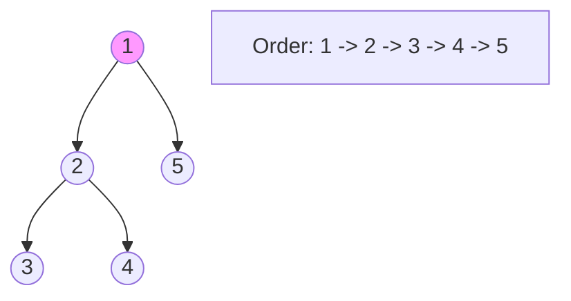

**Depth-First Search (DFS)** is an algorithm for traversing or searching through a graph. It goes as "deep" as possible along a single branch before backtracking.

---

## 1. The Intuition: "Exploring a Maze (Again)"

Imagine you are in a dark maze with a ball of string.
1. You pick a path and keep walking straight until you hit a wall or a dead-end.
2. You use the string to trace your path back to the last intersection.
3. You then pick a new path you haven't tried yet and go straight again.

DFS is a **"Stubborn"** search. It wants to reach the end of a path before it even considers looking at anything else.

---

## 2. How we go about it: The Stack (Recursion)

DFS uses a **Stack** (Last-In, First-Out). In most code, this is handled naturally via **Recursion**.
1.  **Visit**: Start at a node, mark it as `Visited`.
2.  **Explore**: Look at its first unvisited neighbor and move there immediately (recursively call DFS).
3.  **Backtrack**: When a node has no more unvisited neighbors, the recursive function "finishes" and returns control to the parent node.



---

## 3. Complexity Analysis

| Scenario | Time Complexity | Space Complexity |
| :------- | :-------------- | :--------------- |
| **Graph** | O(V + E)       | O(V)             |

- `V` = Number of Vertices.
- `E` = Number of Edges.
- **Space**: In the worst case (a graph that is just one long line), the recursion stack will be O(V) deep.

---

## 4. Multi-Language Implementation

```language-code-tabs
[
  {
    "label": "Javascript (Recursive)",
    "language": "javascript",
    "code": "function dfs(graph, node, visited = new Set()) {\n  if (visited.has(node)) return;\n  \n  console.log(`Visited: ${node}`);\n  visited.add(node);\n\n  for (let neighbor of graph[node] || []) {\n    dfs(graph, neighbor, visited);\n  }\n}"
  },
  {
    "label": "Python (Recursive)",
    "language": "python",
    "code": "def dfs(graph, node, visited=None):\n    if visited is None: visited = set()\n    \n    if node in visited: return\n    \n    print(f\"Visited: {node}\")\n    visited.add(node)\n    \n    for neighbor in graph.get(node, []):\n        dfs(graph, neighbor, visited)"
  },
  {
    "label": "Java (Recursive)",
    "language": "java",
    "code": "public void dfs(Map<Integer, List<Integer>> graph, int node, Set<Integer> visited) {\n    if (visited.contains(node)) return;\n\n    System.out.println(\"Visited: \" + node);\n    visited.add(node);\n\n    for (int neighbor : graph.getOrDefault(node, new ArrayList<>())) {\n        dfs(graph, neighbor, visited);\n    }\n}"
  }
]
```

---

## 5. When to use DFS?

- **Pathfinding**: If you just need *any* path from A to B (not necessarily the shortest).
- **Cycle Detection**: DFS is the classic way to find loops in a graph.
- **Topological Sorting**: Ordering tasks with dependencies.
- **Exhaustive Search**: Like finding all possible solutions to a Sudoku puzzle.

---

## 6. Interview Pro-Tips

### DFS vs. BFS — Know When to Use Each
BFS = shortest path in unweighted graphs. DFS = exhaustive search, cycle detection, topological sort. If you're unsure, ask yourself: "Do I need the *shortest* path?" If yes, BFS. If I need to *explore everything* or find *any* path, DFS.

### Iterative DFS to Avoid Stack Overflow
The recursive DFS is elegant but risks stack overflow on deep graphs (e.g., a graph with 100,000 nodes in a chain). In interviews, if the graph can be very deep, mention you can rewrite it iteratively using an explicit stack — that's the production-safe version.

### Tracking State: 3 Colors
For cycle detection in directed graphs, use three states instead of two: **White** (unvisited), **Gray** (in current DFS path / being processed), **Black** (fully processed). If you hit a Gray node during DFS, you've found a back-edge — a cycle. This is the standard interview approach.

### What Interviewers Are Testing
- Do you handle the `visited` set correctly to avoid infinite loops?
- Can you write both the recursive and iterative versions?
- Do you know how DFS gives you topological order (post-order reverse)?
- Can you detect cycles using DFS?

---

## Key Takeaway

DFS is the "Deep and Narrow" search. It is elegant, uses recursion naturally, and is the backbone for more complex algorithms like finding **Connected Components**.
