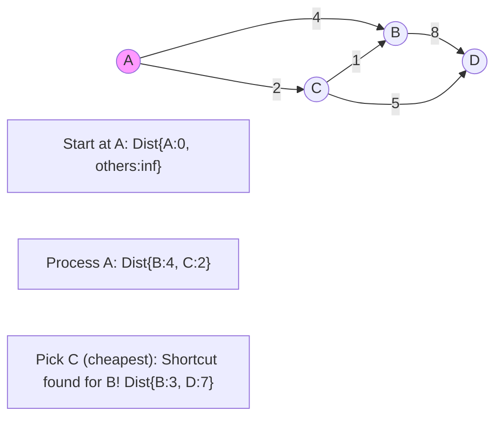

**Dijkstra's Algorithm** is the gold standard for finding the **shortest path** between nodes in a weighted graph.

---

## 1. The Intuition: "A Greedy Explorer"

Imagine you are a traveler trying to find the quickest route to a destination.
1. You start at your home (Distance = 0). You look at all the towns you can reach directly.
2. You pick the **closest** town you haven't visited yet.
3. Once you arrive at that town, you check if going *through* it provides a "shortcut" to any of its neighbors that you didn't know about before.
4. You repeat this "pick the closest" strategy until you've reached every town.

Dijkstra's is a **Greedy Algorithm** because it always makes the best local choice right now, trusting it will lead to the best global result.

---

## 2. How we go about it: Relaxation

The core "trick" of Dijkstra's is **Relaxation**.

1.  **Initialize**: Set distance `0` for the start node and `Infinity` for everyone else.
2.  **Pick**: Select the unvisited node with the **smallest distance** (usually using a **Priority Queue**).
3.  **Relax**: Look at all its neighbors. If `(Distance to current node + Weight of edge)` is smaller than the `Current distance to neighbor`, update the neighbor's distance.
4.  **Finish**: Mark the current node as `Visited` and repeat.



---

## 3. Complexity Analysis

Using a **Binary Heap (Priority Queue)**:

| Scenario | Time Complexity | Space Complexity |
| :------- | :-------------- | :--------------- |
| **Graph** | O((V + E) log V) | O(V)             |

- `V` = Vertices, `E` = Edges.
- **Log V** comes from the cost of adding/removing from the Priority Queue.

---

## 4. Multi-Language Implementation

```language-code-tabs
[
  {
    "label": "Javascript",
    "language": "javascript",
    "code": "function dijkstra(graph, start) {\n  let distances = {};\n  let pq = new MinPriorityQueue(); // Hypothetical PQ\n  \n  for (let node in graph) distances[node] = Infinity;\n  distances[start] = 0;\n  pq.enqueue(start, 0);\n\n  while (!pq.isEmpty()) {\n    let { element: currNode, priority: d } = pq.dequeue();\n    \n    if (d > distances[currNode]) continue;\n\n    for (let neighbor in graph[currNode]) {\n      let weight = graph[currNode][neighbor];\n      let distance = d + weight;\n\n      if (distance < distances[neighbor]) {\n        distances[neighbor] = distance;\n        pq.enqueue(neighbor, distance);\n      }\n    }\n  }\n  return distances;\n}"
  },
  {
    "label": "Python",
    "language": "python",
    "code": "import heapq\n\ndef dijkstra(graph, start):\n    distances = {node: float('inf') for node in graph}\n    distances[start] = 0\n    pq = [(0, start)]\n\n    while pq:\n        curr_d, u = heapq.heappop(pq)\n\n        if curr_d > distances[u]: continue\n\n        for v, weight in graph[u].items():\n            distance = curr_d + weight\n            if distance < distances[v]:\n                distances[v] = distance\n                heapq.heappush(pq, (distance, v))\n    return distances"
  },
  {
    "label": "Java",
    "language": "java",
    "code": "public Map<Integer, Integer> dijkstra(Map<Integer, List<Edge>> graph, int start) {\n    Map<Integer, Integer> distances = new HashMap<>();\n    PriorityQueue<Node> pq = new PriorityQueue<>(Comparator.comparingInt(n -> n.dist));\n    \n    pq.add(new Node(start, 0));\n    distances.put(start, 0);\n\n    while (!pq.isEmpty()) {\n        Node curr = pq.poll();\n        if (curr.dist > distances.getOrDefault(curr.id, Integer.MAX_VALUE)) continue;\n\n        for (Edge edge : graph.getOrDefault(curr.id, new ArrayList<>())) {\n            int newDist = curr.dist + edge.weight;\n            if (newDist < distances.getOrDefault(edge.to, Integer.MAX_VALUE)) {\n                distances.put(edge.to, newDist);\n                pq.add(new Node(edge.to, newDist));\n            }\n        }\n    }\n    return distances;\n}"
  }
]
```

---

## 5. Important Limitation!

Dijkstra's **only** works on graphs with **non-negative weights**. If your graph has negative edges (like a debt system or a gravity beam), Dijkstra's "greedy" assumption breaks because it might find a massive negative path later on that it already "settled." In that case, use **Bellman-Ford**.

---

## Key Takeaway

Dijkstra's is the backbone of GPS navigation and network routing. It’s fast, efficient, and proof that being "greedy" sometimes pays off in a big way.
