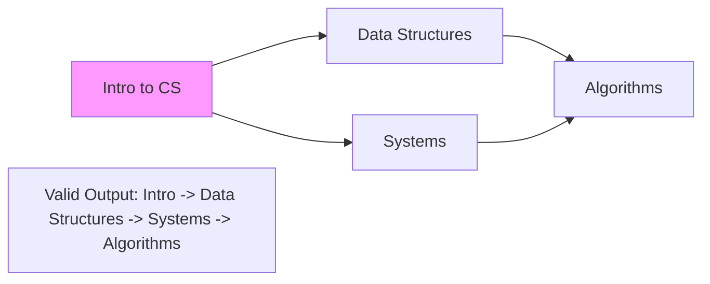

**Topological Sort** is a linear ordering of vertices in a **Directed Acyclic Graph (DAG)**. For every directed edge `U -> V`, vertex `U` must come before `V` in the final ordering.

---

## 1. The Intuition: "A Task List with Prerequisites"

Imagine you are a University student planning your degree.
- To take **"Algorithms 102"**, you must first pass **"Data Structures 101"**.
- To take **"Data Structures 101"**, you must first pass **"Intro to Programming"**.

You can't do things in any random order. Some things *depend* on others. A Topological Sort gives you a valid sequence (a "Schedule") where you always finish a prerequisite before starting the next thing.

---

## 2. How we go about it: Kahn’s Algorithm

The most popular way to solve this is **Kahn's Algorithm**, which uses **In-degree**.

1.  **Count**: For every node, count how many incoming arrows (prerequisites) it has. This is the **In-degree**.
2.  **Start**: Find all nodes with an **In-degree of 0** (no prerequisites). Put them in a **Queue**.
3.  **Process**:
    -   Take a node `U` out of the queue and add it to the final result.
    -   Look at everyone that depended on `U`. Since `U` is now "finished," reduce their in-degree score by 1.
    -   If anyone's score reaches **0**, it's their turn! Put them in the Queue.



---

## 3. Complexity Analysis

| Scenario | Time Complexity | Space Complexity |
| :------- | :-------------- | :--------------- |
| **Graph** | O(V + E)       | O(V)             |

- `V` = Number of Vertices.
- `E` = Number of Edges.
- **Space**: We need extra space for the `in-degree` array and the `queue`.

---

## 4. Multi-Language Implementation (Kahn’s)

```language-code-tabs
[
  {
    "label": "Javascript",
    "language": "javascript",
    "code": "function topologicalSort(numNodes, edges) {\n  const adj = Array.from({ length: numNodes }, () => []);\n  const inDegree = new Array(numNodes).fill(0);\n\n  for (const [u, v] of edges) {\n    adj[u].push(v);\n    inDegree[v]++;\n  }\n\n  const queue = [];\n  for (let i = 0; i < numNodes; i++) {\n    if (inDegree[i] === 0) queue.push(i);\n  }\n\n  const result = [];\n  while (queue.length > 0) {\n    const u = queue.shift();\n    result.push(u);\n\n    for (const v of adj[u]) {\n      inDegree[v]--;\n      if (inDegree[v] === 0) queue.push(v);\n    }\n  }\n\n  return result.length === numNodes ? result : \"Cycle Detected!\";\n}"
  },
  {
    "label": "Python",
    "language": "python",
    "code": "from collections import deque\n\ndef topological_sort(num_nodes, edges):\n    adj = {i: [] for i in range(num_nodes)}\n    in_degree = [0] * num_nodes\n    \n    for u, v in edges:\n        adj[u].append(v)\n        in_degree[v] += 1\n        \n    queue = deque([i for i in range(num_nodes) if in_degree[i] == 0])\n    result = []\n    \n    while queue:\n        u = queue.popleft()\n        result.append(u)\n        \n        for v in adj[u]:\n            in_degree[v] -= 1\n            if in_degree[v] == 0:\n                queue.append(v)\n                \n    return result if len(result) == num_nodes else \"Cycle Detected!\""
  },
  {
    "label": "Java",
    "language": "java",
    "code": "public int[] topologicalSort(int n, int[][] edges) {\n    List<Integer>[] adj = new ArrayList[n];\n    int[] inDegree = new int[n];\n    for (int i = 0; i < n; i++) adj[i] = new ArrayList<>();\n\n    for (int[] edge : edges) {\n        adj[edge[0]].add(edge[1]);\n        inDegree[edge[1]]++;\n    }\n\n    Queue<Integer> queue = new LinkedList<>();\n    for (int i = 0; i < n; i++) {\n        if (inDegree[i] == 0) queue.add(i);\n    }\n\n    int[] result = new int[n];\n    int index = 0;\n    while (!queue.isEmpty()) {\n        int u = queue.poll();\n        result[index++] = u;\n\n        for (int v : adj[u]) {\n            if (--inDegree[v] == 0) queue.add(v);\n        }\n    }\n    return index == n ? result : new int[0];\n}"
  }
]
```

---

## 5. Watch out for Cycles!

Topological sort is **only** possible in a DAG (Directed **Acyclic** Graph). If there is a cycle (e.g., Task A depends on B, and B depends on A), you will never be able to start either task. Kahn's algorithm is great because if the final `result` list doesn't include every node, it **proves** the graph has a cycle.

---

## 6. Interview Pro-Tips

### Two Algorithms — Know Both
**Kahn's Algorithm** (shown above) is BFS-based, uses in-degree counts, and naturally detects cycles (result length < N). **DFS-based Topological Sort** processes nodes in DFS post-order and reverses the result. Both produce valid orderings.

### The Cycle Detection Bonus
Kahn's cycle detection is a freebie — if `result.length !== numNodes`, there's a cycle. This makes it the preferred interview approach for problems like "Course Schedule" (LeetCode 207), which is essentially "can you topologically sort this graph?"

### Common Interview Problems Using This Pattern
- **Course Schedule I & II** (detect cycles / find ordering)
- **Alien Dictionary** (infer ordering of characters from sorted word list)
- **Minimum Number of Semesters** (parallel scheduling variant)

When you see "dependencies" or "prerequisites" in a problem, Topological Sort is almost certainly the answer.

### What Interviewers Are Testing
- Do you recognize the "prerequisite" pattern and map it to a DAG?
- Can you implement Kahn's algorithm correctly (handling the in-degree queue)?
- Do you know how to detect cycles as a side effect?
- Can you explain the DFS-based alternative?

---

## Key Takeaway

Topological Sort is how we build **Scheduling Engines**. Whether it's a compiler ordering files for build or a project manager mapping out milestones, "Topo Sort" is the magic behind the scenes.
