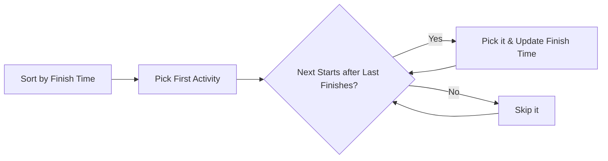

**Activity Selection** is a classic greedy problem. Given a set of activities with start and finish times, find the maximum number of non-overlapping activities that can be performed by a single person.

---

## 1. The Intuition: "The Early Bird"

Imagine you are managing a single conference room.
- Many people want to host presentations, but their schedules overlap.
- You want to host the **maximum number of presentations** possible throughout the day.

Your "Greedy" strategy: **Always pick the presentation that finishes earliest.**
1. By picking the one that finishes earliest, you leave the **maximum possible time** remaining for other presentations.
2. Even if a presentation is very short, if it starts late and finishes late, it "blocks" more future opportunities than an earlier one.

---

## 2. How we go about it: Sort by Finish Time

1.  **Sort**: Sort all activities by their **Finish Time**.
2.  **Pick First**: Always take the first activity (the one that finishes soonest).
3.  **Iterate**: For every other activity, check if its **Start Time** is greater than or equal to the **Finish Time** of the last activity you picked.
4.  **Repeat**: If it is, pick it and update the "Last Finish Time."



---

## 3. Complexity Analysis

| Scenario | Time Complexity | Space Complexity |
| :------- | :-------------- | :--------------- |
| **Complete** | O(N log N)      | O(1) or O(N)       |

- **O(N log N)** is for sorting the activities initially.
- **O(N)** for the single pass to select activities.

---

## 4. Multi-Language Implementation

```language-code-tabs
[
  {
    "label": "Javascript",
    "language": "javascript",
    "code": "function selectActivities(start, finish) {\n  let n = start.length;\n  let activities = [];\n  \n  for (let i = 0; i < n; i++) {\n    activities.push({ id: i, start: start[i], finish: finish[i] });\n  }\n\n  // 1. Sort by finish time\n  activities.sort((a, b) => a.finish - b.finish);\n\n  let selected = [activities[0].id];\n  let lastFinish = activities[0].finish;\n\n  for (let i = 1; i < n; i++) {\n    // 2. Greedy Choice\n    if (activities[i].start >= lastFinish) {\n      selected.push(activities[i].id);\n      lastFinish = activities[i].finish;\n    }\n  }\n  return selected;\n}"
  },
  {
    "label": "Python",
    "language": "python",
    "code": "def select_activities(start, finish):\n    # Combine and sort by finish time\n    activities = sorted(zip(start, finish), key=lambda x: x[1])\n    \n    selected_count = 1\n    last_finish = activities[0][1]\n    \n    for i in range(1, len(activities)):\n        curr_start, curr_finish = activities[i]\n        if curr_start >= last_finish:\n            selected_count += 1\n            last_finish = curr_finish\n            \n    return selected_count"
  },
  {
    "label": "Java",
    "language": "java",
    "code": "public int selectActivities(int[] start, int[] finish) {\n    int n = start.length;\n    Activity[] activities = new Activity[n];\n    for (int i = 0; i < n; i++) \n        activities[i] = new Activity(start[i], finish[i]);\n\n    Arrays.sort(activities, Comparator.comparingInt(a -> a.finish));\n\n    int count = 1;\n    int lastFinish = activities[0].finish;\n\n    for (int i = 1; i < n; i++) {\n        if (activities[i].start >= lastFinish) {\n            count++;\n            lastFinish = activities[i].finish;\n        }\n    }\n    return count;\n}"
  }
]
```

---

## 5. Why Greedy works here?

This is one of the few problems where the **Greedy Choice Property** holds perfectly. Picking the activity that finishes first leaves the most time for others, and it's impossible for another choice to be "better" because any other activity would finish at the same time or later, leaving less or equal time.

---

## 6. Interview Pro-Tips

### Sort by Finish Time — Committed to Memory
The non-obvious insight is sorting by **finish time**, not start time and not duration. Many candidates instinctively sort by start time (wrong) or by shortest duration (wrong). Finish time is the key because it maximizes remaining time for future activities.

### Interval Scheduling is Everywhere
Activity Selection is the foundational "interval scheduling" problem. Variants you'll see:
- **Meeting Rooms I**: Can one person attend all meetings? (Check overlaps)
- **Meeting Rooms II**: Minimum rooms needed (sort starts & ends, use two pointers)
- **Non-overlapping Intervals**: Minimum removals to make intervals non-overlapping (same greedy)
- **Job Scheduling to Maximize Profit**: Weighted Activity Selection (uses DP instead)

### When Does Greedy Fail? Use DP Instead
The un-weighted version (maximize count) → Greedy. The **weighted** version (maximize total value/profit of selected activities) → DP. This is a classic interview trick: make the activities have different "profits" and the greedy finish-time approach no longer works.

### What Interviewers Are Testing
- Can you explain *why* sorting by finish time is the right greedy choice?
- Do you recognize this as the template for interval scheduling problems?
- Can you tell when greedy is sufficient vs. when you need DP?

---

## Key Takeaway

Activity selection is the basis for **Job Scheduling** and **Resource Management**. It proves that sometimes, the simplest local decision is exactly what you need to solve the global problem.
