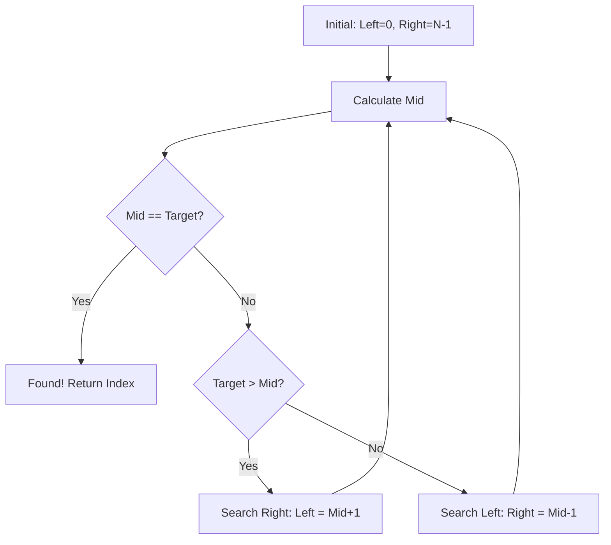

Binary Search is a highly efficient algorithm for finding an item from a **sorted** list of items. It works by repeatedly dividing in half the portion of the list that could contain the item.

---

## 1. The Intuition: "Guess the Number"

Imagine someone asks you to guess a number between **1 and 100**.
- You guess **50**. They say, "The number is **higher**."
- You now know the number is NOT between 1 and 50. You've eliminated half the search space in one go!
- Next, you guess **75** (the middle of 51 and 100).

This is exactly what Binary Search does. Instead of checking every single element (Linear Search), it checks the middle and throws away half of the options every time.

---

## 2. How we go about it

1.  **Requirement**: The list MUST be **sorted**. Without order, we can't know which half to throw away.
2.  **Pointers**: We maintain two pointers, `left` and `right`, representing the bounds of our current search space.
3.  **Middle**: Calculate the middle index: `mid = left + (right - left) / 2`.
4.  **Compare**:
    - If `target == mid`, we are done!
    - If `target < mid`, the number must be in the left half → Move `right` to `mid - 1`.
    - If `target > mid`, the number must be in the right half → Move `left` to `mid + 1`.



---

## 3. Complexity Analysis

| Scenario | Time Complexity | Space Complexity |
| :------- | :-------------- | :--------------- |
| **Best Case** | O(1)            | O(1)             |
| **Average Case** | O(log N)       | O(1)             |
| **Worst Case** | O(log N)        | O(1)             |

> **Why O(log N)?** Because we divide the input by 2 at every step. 2^10 is ~1,000. So even with 1,000 items, we only need ~10 steps to find anything!

---

## 4. Multi-Language Implementation

```language-code-tabs
[
  {
    "label": "Javascript",
    "language": "javascript",
    "code": "function binarySearch(nums, target) {\n  let left = 0;\n  let right = nums.length - 1;\n\n  while (left <= right) {\n    let mid = Math.floor(left + (right - left) / 2);\n    \n    if (nums[mid] === target) return mid;\n    \n    if (nums[mid] < target) {\n      left = mid + 1;\n    } else {\n      right = mid - 1;\n    }\n  }\n\n  return -1;\n}"
  },
  {
    "label": "Python",
    "language": "python",
    "code": "def binary_search(nums, target):\n    left, right = 0, len(nums) - 1\n    \n    while left <= right:\n        mid = left + (right - left) // 2\n        \n        if nums[mid] == target:\n            return mid\n        \n        if nums[mid] < target:\n            left = mid + 1\n        else:\n            right = mid - 1\n            \n    return -1"
  },
  {
    "label": "Java",
    "language": "java",
    "code": "class Solution {\n    public int binarySearch(int[] nums, int target) {\n        int left = 0;\n        int right = nums.length - 1;\n        \n        while (left <= right) {\n            int mid = left + (right - left) / 2;\n            \n            if (nums[mid] == target) return mid;\n            \n            if (nums[mid] < target) {\n                left = mid + 1;\n            } else {\n                right = mid - 1;\n            }\n        }\n        \n        return -1;\n    }\n}"
  }
]
```

---

## 5. Common Variations to Know

### Find First / Last Occurrence
When duplicates exist, the basic template returns *any* match. To find the **first occurrence**, when you find a match, record the index and keep searching **left** (`right = mid - 1`). For the **last occurrence**, keep searching **right** (`left = mid + 1`).

### Find Insertion Point
When the target isn't found, `left` ends up pointing to exactly where the target *should* be inserted to keep the array sorted. This is how `bisect_left` in Python works.

### Binary Search on the Answer Space
This is the most powerful pattern. Instead of searching an *array*, you binary search on a *range of possible answers*. You define a `canAchieve(mid)` function and find the minimum/maximum valid answer. Classic examples: "Minimum speed to finish tasks," "Capacity to ship packages in D days," "Koko eating bananas." If you ever see "minimize the maximum" or "maximize the minimum" in a problem, think binary search on the answer.

---

## 6. Interview Pro-Tips

### Pattern Recognition Signal
If a question mentions a **sorted array**, or if you can establish a **monotonic condition** (all values on one side are valid, all on the other are invalid), Binary Search is likely the right tool.

### The Overflow Edge Case
In Java/C++, `(left + right) / 2` can silently overflow the `int` limit for large arrays. **Always use** `left + (right - left) / 2` — it's the production-safe way that interviewers expect you to know.

### The `left < high` vs `left <= high` Trap
The choice of `<` vs `<=` and whether boundaries move to `mid` or `mid ± 1` is the single most common source of bugs. A safe default: use `left <= right` with boundaries at `mid + 1` and `mid - 1`. Only deviate when you have a clear reason (e.g., finding a boundary condition).

### What Interviewers Are Testing
- Do you recognize that the input must be sorted?
- Do you handle the overflow edge case for `mid`?
- Can you adapt the template for "find first/last" and "insertion point"?
- Can you apply binary search beyond arrays (i.e., on the answer space)?
