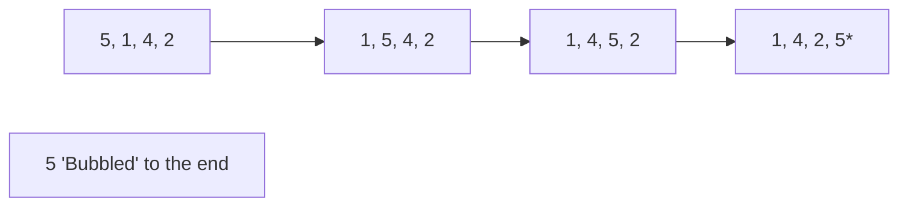

**Bubble Sort** is the simplest sorting algorithm. It works by repeatedly swapping adjacent elements if they are in the wrong order.

---

## 1. The Intuition: "Bubbling to the Top"

Imagine you have a row of bubbles of different sizes underwater. The largest bubbles are the most "buoyant" and will float to the surface faster.

In Bubble Sort, the "heaviest" (largest) elements gradually move to the end of the array (the "surface") in each pass. By the time you finish the first pass, the largest element is guaranteed to be at the last position.

---

## 2. How we go about it

1.  **Iterate**: Compare the first two elements. If the first is larger than the second, **swap** them.
2.  **Slide**: Move to the next pair and repeat until you reach the end.
3.  **Repeat**: Start over from the beginning. Each time you complete a full pass, one more "large" element is parked at the end.



---

## 3. Complexity Analysis

| Scenario | Time Complexity | Space Complexity |
| :------- | :-------------- | :--------------- |
| **Best Case (Optimized)** | O(N)            | O(1)             |
| **Average Case** | O(N²)           | O(1)             |
| **Worst Case** | O(N²)           | O(1)             |

---

## 4. Multi-Language Implementation

We will show both the **Base** implementation and the **Optimized** version which stops early if the array is already sorted.

```language-code-tabs
[
  {
    "label": "Javascript (Optimized)",
    "language": "javascript",
    "code": "function bubbleSort(arr) {\n  let n = arr.length;\n  for (let i = 0; i < n; i++) {\n    let swapped = false;\n    \n    // Last i elements are already in place\n    for (let j = 0; j < n - i - 1; j++) {\n      if (arr[j] > arr[j + 1]) {\n        // Swap elements\n        [arr[j], arr[j + 1]] = [arr[j + 1], arr[j]];\n        swapped = true;\n      }\n    }\n    \n    // If no two elements were swapped by inner loop, then break\n    if (!swapped) break;\n  }\n  return arr;\n}"
  },
  {
    "label": "Python (Base)",
    "language": "python",
    "code": "def bubble_sort(arr):\n    n = len(arr)\n    for i in range(n):\n        for j in range(0, n - i - 1):\n            if arr[j] > arr[j + 1]:\n                arr[j], arr[j + 1] = arr[j + 1], arr[j]\n    return arr"
  },
  {
    "label": "Java (Optimized)",
    "language": "java",
    "code": "public class BubbleSort {\n    void bubbleSort(int arr[]) {\n        int n = arr.length;\n        boolean swapped;\n        for (int i = 0; i < n - 1; i++) {\n            swapped = false;\n            for (int j = 0; j < n - i - 1; j++) {\n                if (arr[j] > arr[j + 1]) {\n                    // swap arr[j] and arr[j+1]\n                    int temp = arr[j];\n                    arr[j] = arr[j + 1];\n                    arr[j + 1] = temp;\n                    swapped = true;\n                }\n            }\n            // If no two elements were swapped, break\n            if (!swapped) break;\n        }\n    }\n}"
  }
]
```

---

## 5. The Optimization: The `swapped` Flag

**The Problem**: A standard Bubble Sort will keep running all $N$ passes even if the array becomes sorted after the very first pass. This is a waste of time.

**The Fix**: We add a `swapped` boolean. If we go through a whole inner loop and **never** perform a swap, it means the array is already sorted! We can `break` early. This brings our **Best Case** down from O(N²) to **O(N)**.

---

## Key Takeaway

Bubble Sort is rarely used in production because it's slow (O(N²)), but it is the perfect introduction to the idea of **In-place** swapping and **Best-case optimization**.
