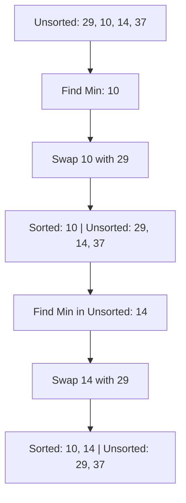

**Selection Sort** is an intuitive sorting algorithm that segments the list into two parts: a sorted part at the beginning and an unsorted part at the end.

---

## 1. The Intuition: "Picking the Smallest"

Imagine you have a messy pile of numbered blocks.
1. You look through the whole pile to find the **absolute smallest** block.
2. You take that block and put it at the very beginning of a new row.
3. You look through the remaining pile for the **next smallest**, and place it next to the first.

In Selection Sort, we "select" the minimum element from the unsorted portion and swap it into its correct position.

---

## 2. How we go about it

1.  **Search**: Find the minimum element in the unsorted part of the array.
2.  **Swap**: Swap that minimum element with the first element of the unsorted part.
3.  **Advance**: The "sorted" boundary moves one step to the right.



---

## 3. Complexity Analysis

| Scenario | Time Complexity | Space Complexity |
| :------- | :-------------- | :--------------- |
| **Best Case** | O(N²)           | O(1)             |
| **Average Case** | O(N²)           | O(1)             |
| **Worst Case** | O(N²)           | O(1)             |

*Note: Selection Sort always performs O(N²) comparisons because it has to scan the remaining unsorted array every time to be sure it found the minimum.*

---

## 4. Multi-Language Implementation

```language-code-tabs
[
  {
    "label": "Javascript",
    "language": "javascript",
    "code": "function selectionSort(arr) {\n  let n = arr.length;\n\n  for (let i = 0; i < n - 1; i++) {\n    let minIdx = i;\n    \n    // Find min in the unsorted segment\n    for (let j = i + 1; j < n; j++) {\n      if (arr[j] < arr[minIdx]) {\n        minIdx = j;\n      }\n    }\n\n    // Swap the found minimum with the first element\n    if (minIdx !== i) {\n      [arr[i], arr[minIdx]] = [arr[minIdx], arr[i]];\n    }\n  }\n  return arr;\n}"
  },
  {
    "label": "Python",
    "language": "python",
    "code": "def selection_sort(arr):\n    n = len(arr)\n    for i in range(n):\n        min_idx = i\n        for j in range(i + 1, n):\n            if arr[j] < arr[min_idx]:\n                min_idx = j\n        \n        # Swap\n        arr[i], arr[min_idx] = arr[min_idx], arr[i]\n    return arr"
  },
  {
    "label": "Java",
    "language": "java",
    "code": "public class SelectionSort {\n    void sort(int arr[]) {\n        int n = arr.length;\n\n        for (int i = 0; i < n - 1; i++) {\n            int min_idx = i;\n            for (int j = i + 1; j < n; j++) {\n                if (arr[j] < arr[min_idx])\n                    min_idx = j;\n            }\n\n            // Swap\n            int temp = arr[min_idx];\n            arr[min_idx] = arr[i];\n            arr[i] = temp;\n        }\n    }\n}"
  }
]
```

---

## 5. When to use it?

Selection Sort is rarely used for large datasets, but it has one specific advantage: **it minimizes the number of swaps**. If swapping elements is a very expensive operation (e.g., swapping large images in memory), Selection Sort might be preferred over algorithms that swap constantly.

---

## Key Takeaway

Selection Sort is the definition of "Searching and Sorting." It spends all its energy searching for the minimum to make the sorting part trivial.
