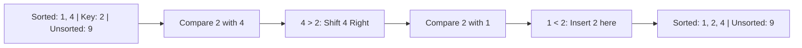

**Insertion Sort** is a simple sorting algorithm that builds the final sorted array one item at a time. It is much more efficient on small datasets or datasets that are already nearly sorted.

---

## 1. The Intuition: "Sorting a Hand of Cards"

Imagine you are playing cards.
1. You have a sorted hand of cards.
2. You pick up a **new card** from the deck.
3. You slide it along your hand until you find the **exact spot** where it belongs (between a smaller card and a larger card) and "insert" it there.

In Insertion Sort, we take one element from the unsorted part and find its correct position in the sorted part by "shifting" larger elements to the right.

---

## 2. How we go about it

1.  **Mark**: Assume the first element is "sorted".
2.  **Pick**: Take the next unsorted element (the `key`).
3.  **Compare & Shift**: Compare the `key` with elements in the sorted part (moving right to left). If an element is larger than the `key`, shift it one position to the right.
4.  **Insert**: Once you find an element smaller than the `key`, insert the `key` right after it.



---

## 3. Complexity Analysis

| Scenario | Time Complexity | Space Complexity |
| :------- | :-------------- | :--------------- |
| **Best Case (Nearly Sorted)** | O(N)            | O(1)             |
| **Average Case** | O(N²)           | O(1)             |
| **Worst Case (Reverse Sorted)** | O(N²)           | O(1)             |

---

## 4. Multi-Language Implementation

```language-code-tabs
[
  {
    "label": "Javascript",
    "language": "javascript",
    "code": "function insertionSort(arr) {\n  for (let i = 1; i < arr.length; i++) {\n    let key = arr[i];\n    let j = i - 1;\n\n    // Move elements of arr[0..i-1] that are greater than key\n    // to one position ahead of their current position\n    while (j >= 0 && arr[j] > key) {\n      arr[j + 1] = arr[j];\n      j = j - 1;\n    }\n    arr[j + 1] = key;\n  }\n  return arr;\n}"
  },
  {
    "label": "Python",
    "language": "python",
    "code": "def insertion_sort(arr):\n    for i in range(1, len(arr)):\n        key = arr[i]\n        j = i - 1\n        \n        # Shift elements\n        while j >= 0 and key < arr[j]:\n            arr[j + 1] = arr[j]\n            j -= 1\n        arr[j + 1] = key\n    return arr"
  },
  {
    "label": "Java",
    "language": "java",
    "code": "public class InsertionSort {\n    void sort(int arr[]) {\n        int n = arr.length;\n        for (int i = 1; i < n; ++i) {\n            int key = arr[i];\n            int j = i - 1;\n\n            /* Shift elements */\n            while (j >= 0 && arr[j] > key) {\n                arr[j + 1] = arr[j];\n                j = j - 1;\n            }\n            arr[j + 1] = key;\n        }\n    }\n}"
  }
]
```

---

## 5. Why use Insertion Sort?

Insertion Sort is surprisingly useful in the real world:
- **Small Data**: It has very low overhead, making it faster than Merge/Quick Sort for small N (typically < 10-20).
- **Online Sorting**: It can sort a list as it receives it (incremental sorting).
- **Nearly Sorted Data**: It runs in O(N) time if the list is already mostly in order. This is why it's often used as the "base case" for more advanced algorithms like Timsort.

---

## 6. Interview Pro-Tips

### Know Why Timsort Uses It
Python's built-in `sorted()` and Java's `Arrays.sort()` for objects use **Timsort** — a hybrid that runs Insertion Sort on small runs (size < 64), then Merge Sort to combine them. Why? Because for tiny arrays, Insertion Sort's low overhead makes it faster than the asymptotically-better algorithms. This is a great thing to mention in interviews to show you know how real-world sorts work.

### It IS Stable
Insertion Sort only moves an element past another if it is *strictly smaller*, so it preserves the relative order of equal elements. It is a **stable** sort.

### Best Case O(N) — Know When That Matters
If data arrives in a nearly sorted stream (e.g., a live feed of timestamps that are "mostly" in order), Insertion Sort is genuinely the best choice — it will process it in near-linear time while Quick Sort would still pay a full O(N log N) bill.

### What Interviewers Are Testing
- Can you trace the "shift-right-until-correct-position" logic step by step?
- Do you know when O(N²) is acceptable or even preferable?
- Do you know the connection to Timsort and real-world adaptive sorting?

---

## Key Takeaway

Insertion Sort is adaptive and stable. It's the most "human" way of sorting items and is the unsung hero that helps faster algorithms finish the job.
