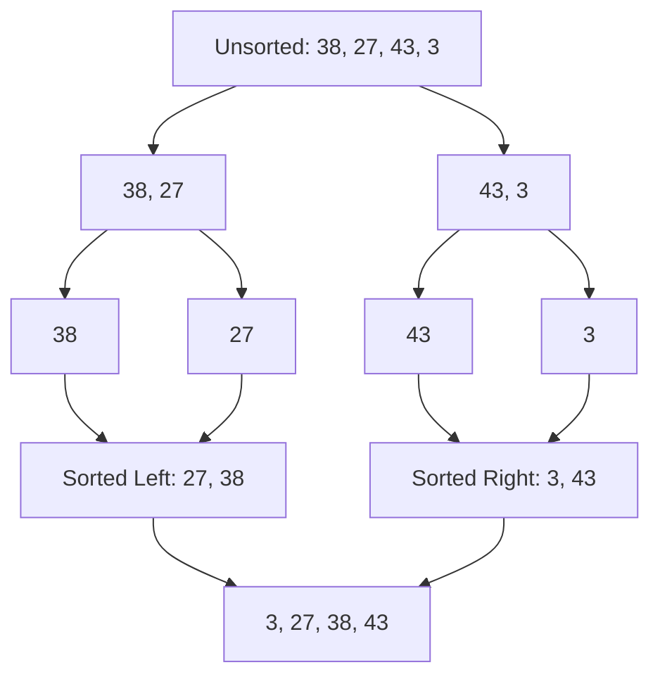

Merge Sort is a **stable**, **comparison-based** sorting algorithm that uses the **Divide and Conquer** paradigm. It is known for its consistent performance and predictable behavior.

---

## 1. The Intuition: "Divide and Rule"

Imagine you have a huge stack of unsorted papers. It's overwhelming to sort them all at once.
1. You split the stack in half and give one half to a friend.
2. Both of you keep splitting your stacks until you each have just **one paper** in your hand. A single paper is, by definition, "sorted".
3. Now, you start merging the single papers back together in the correct order. Then you merge the pairs, then the groups of four, and so on.

By the time you and your friend combine your final sorted stacks, the entire pile is perfectly ordered.

---

## 2. How we go about it

1.  **Divide**: Find the middle point of the array and split it in two.
2.  **Conquer**: Recursively call `mergeSort` on both halves until the base case (size 1) is reached.
3.  **Merge**: Combine the two sorted halves into one by comparing the first element of each and picking the smaller one.



---

## 3. Complexity Analysis

| Scenario | Time Complexity | Space Complexity |
| :------- | :-------------- | :--------------- |
| **Best Case** | O(N log N)      | O(N)             |
| **Average Case** | O(N log N)   | O(N)             |
| **Worst Case** | O(N log N)     | O(N)             |

> **Why O(N)?** Merge Sort is not "In-place". It needs to create temporary arrays during the merge step to hold the sorted values before copying them back.

---

## 4. Multi-Language Implementation

```language-code-tabs
[
  {
    "label": "Javascript",
    "language": "javascript",
    "code": "function mergeSort(arr) {\n  if (arr.length <= 1) return arr;\n\n  const mid = Math.floor(arr.length / 2);\n  const left = mergeSort(arr.slice(0, mid));\n  const right = mergeSort(arr.slice(mid));\n\n  return merge(left, right);\n}\n\nfunction merge(left, right) {\n  let result = [], i = 0, j = 0;\n  while (i < left.length && j < right.length) {\n    if (left[i] < right[j]) result.push(left[i++]);\n    else result.push(right[j++]);\n  }\n  return [...result, ...left.slice(i), ...right.slice(j)];\n}"
  },
  {
    "label": "Python",
    "language": "python",
    "code": "def merge_sort(arr):\n    if len(arr) <= 1: return arr\n    \n    mid = len(arr) // 2\n    left = merge_sort(arr[:mid])\n    right = merge_sort(arr[mid:])\n    \n    return merge(left, right)\n\ndef merge(left, right):\n    result = []\n    i = j = 0\n    while i < len(left) and j < len(right):\n        if left[i] < right[j]:\n            result.append(left[i])\n            i += 1\n        else:\n            result.append(right[j])\n            j += 1\n    result.extend(left[i:])\n    result.extend(right[j:])\n    return result"
  },
  {
    "label": "Java",
    "language": "java",
    "code": "class MergeSort {\n    void merge(int arr[], int l, int m, int r) {\n        // Find sizes of two subarrays to be merged\n        int n1 = m - l + 1;\n        int n2 = r - m;\n\n        int L[] = new int[n1];\n        int R[] = new int[n2];\n\n        for (int i = 0; i < n1; ++i) L[i] = arr[l + i];\n        for (int j = 0; j < n2; ++j) R[j] = arr[m + 1 + j];\n\n        int i = 0, j = 0, k = l;\n        while (i < n1 && j < n2) {\n            if (L[i] <= R[j]) arr[k++] = L[i++];\n            else arr[k++] = R[j++];\n        }\n\n        while (i < n1) arr[k++] = L[i++];\n        while (j < n2) arr[k++] = R[j++];\n    }\n\n    void sort(int arr[], int l, int r) {\n        if (l < r) {\n            int m = l + (r - l) / 2;\n            sort(arr, l, m);\n            sort(arr, m + 1, r);\n            merge(arr, l, m, r);\n        }\n    }\n}"
  }
]
```

---

## 5. Why Use Merge Sort?

-   **Stability**: It preserves the original order of duplicate elements.
-   **Guaranteed Performance**: It never degrades to O(N²).
-   **External Sorting**: It is the preferred algorithm for sorting data that is stored on a disk (too big for RAM).

---

## Key Takeaway

Merge Sort is the "Reliable Professional." It takes up more space than others, but it is fast, stable, and perfectly consistent every time.
