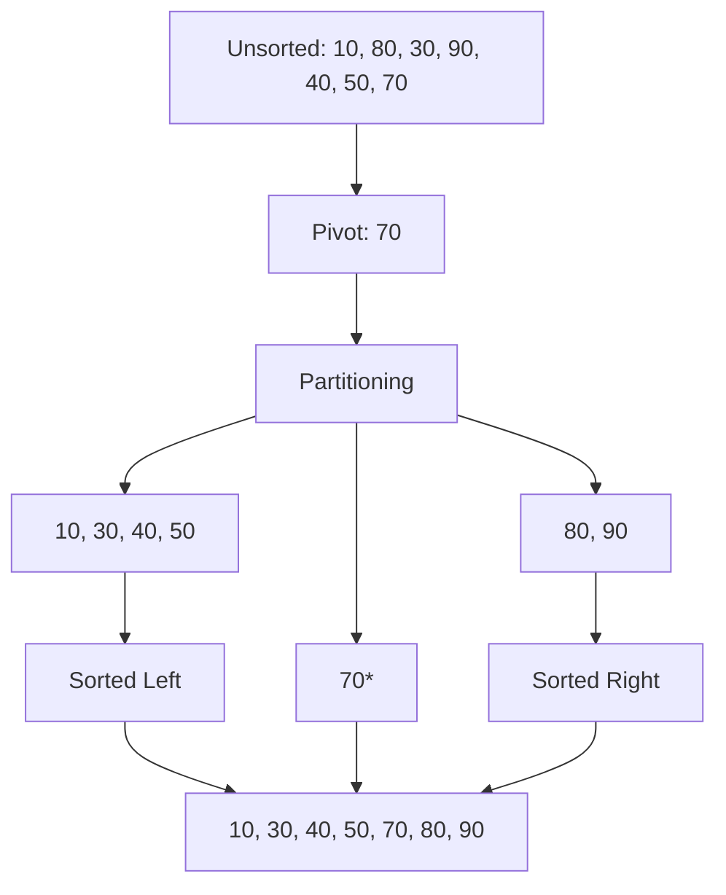

Quick Sort is an **in-place**, **unstable** sorting algorithm that uses the **Divide and Conquer** paradigm. In practice, it is often the fastest sorting algorithm due to its low constant factors and "Cache Friendly" nature.

---

## 1. The Intuition: "Pick a side"

Imagine you are sorting a group of people by height.
1. You pick one person at random (the **Pivot**).
2. You tell everyone else: "If you are shorter than the pivot, move to the left. If you are taller, move to the right."
3. Now, the **Pivot** is in its exact correct position.
4. You repeat this process for the group on the left and the group on the right.

By the time every "sub-group" has chosen a pivot and partitioned, the whole line is sorted.

---

## 2. How we go about it

1.  **Pivot Selection**: Choose an element (e.g., the last element).
2.  **Partition**: Reorder the array so smaller elements are to the left of the pivot and larger ones are to the right.
3.  **Recursion**: Apply the same logic to the sub-arrays on the left and right.



---

## 3. Complexity Analysis

| Scenario | Time Complexity | Space Complexity |
| :------- | :-------------- | :--------------- |
| **Best Case** | O(N log N)      | O(log N)         |
| **Average Case** | O(N log N)   | O(log N)         |
| **Worst Case** | O(N²)           | O(N)             |

> **The Worst Case**: This happens when the pivot is consistently the smallest or largest element (e.g., sorting an already sorted array). We can avoid this by picking a **Random Pivot**.

---

## 4. Multi-Language Implementation

```language-code-tabs
[
  {
    "label": "Javascript",
    "language": "javascript",
    "code": "function quickSort(arr, low = 0, high = arr.length - 1) {\n  if (low < high) {\n    let pi = partition(arr, low, high);\n\n    quickSort(arr, low, pi - 1);\n    quickSort(arr, pi + 1, high);\n  }\n  return arr;\n}\n\nfunction partition(arr, low, high) {\n  let pivot = arr[high];\n  let i = low - 1;\n\n  for (let j = low; j < high; j++) {\n    if (arr[j] < pivot) {\n      i++;\n      [arr[i], arr[j]] = [arr[j], arr[i]];\n    }\n  }\n  [arr[i + 1], arr[high]] = [arr[high], arr[i + 1]];\n  return i + 1;\n}"
  },
  {
    "label": "Python",
    "language": "python",
    "code": "def quick_sort(arr):\n    if len(arr) <= 1: return arr\n    \n    pivot = arr[len(arr) // 2]\n    left = [x for x in arr if x < pivot]\n    middle = [x for x in arr if x == pivot]\n    right = [x for x in arr if x > pivot]\n    \n    return quick_sort(left) + middle + quick_sort(right)"
  },
  {
    "label": "Java",
    "language": "java",
    "code": "class QuickSort {\n    int partition(int arr[], int low, int high) {\n        int pivot = arr[high];\n        int i = (low - 1);\n        for (int j = low; j < high; j++) {\n            if (arr[j] < pivot) {\n                i++;\n                int temp = arr[i];\n                arr[i] = arr[j];\n                arr[j] = temp;\n            }\n        }\n        int temp = arr[i + 1];\n        arr[i + 1] = arr[high];\n        arr[high] = temp;\n        return i + 1;\n    }\n\n    void sort(int arr[], int low, int high) {\n        if (low < high) {\n            int pi = partition(arr, low, high);\n            sort(arr, low, pi - 1);\n            sort(arr, pi + 1, high);\n        }\n    }\n}"
  }
]
```

---

## 5. Interview Pro-Tips

### In-Place vs. Stable
Quick Sort is **in-place** (O(log N) stack space for recursion), but it is **not stable**. If two items have the same value, their relative order might flip. Use Merge Sort when stability is required.

### Always Randomise the Pivot
When implementing Quick Sort in an interview, add random pivot selection immediately. The worst-case O(N²) happens on already-sorted input with a naive last-element pivot. Randomising the pivot makes this essentially impossible — and shows the interviewer you know the real-world pitfall.

```javascript
// Randomise pivot before partitioning
const randIdx = Math.floor(Math.random() * (high - low + 1)) + low;
[arr[randIdx], arr[high]] = [arr[high], arr[randIdx]];
```

### The "Dual Pivot" — Know It for System Design
Java's `Arrays.sort()` on primitives uses **Dual-Pivot Quicksort** (two pivots, three partitions). Java's `Arrays.sort()` on *objects* uses **Timsort** (stable). Knowing this distinction is a great thing to mention when asked about language internals.

### What Interviewers Are Testing
- Can you implement the `partition` function correctly without off-by-one errors?
- Do you know the worst case and how to mitigate it?
- Can you articulate in-place vs. stable and when each matters?
- Do you know why standard libraries prefer Quick Sort for primitives?

---

## Key Takeaway

Quick Sort is the "Ferrari" of algorithms. It's built for speed, works beautifully on hardware caches, and is the implementation of choice for most high-performance language libraries.
