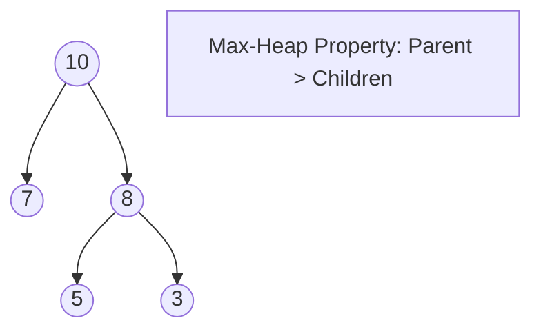

Heap Sort is a **comparison-based** sorting technique based on a **Binary Heap** data structure. It is as fast as Merge Sort but uses zero extra memory.

---

## 1. The Intuition: "King of the Hill"

Imagine a tournament where only the strongest (largest) person can stand at the peak of a mountain (**Max Heap**).
1. We organize everyone into a heap structure.
2. We take the "King" (the current maximum) from the peak and move them to the end of the line.
3. Someone else takes the peak, we "re-balance" to find the new strongest person, and repeat.

Essentially, we are building a sorting machine that automatically gives us the largest remaining element every time we ask.

---

## 2. How we go about it

1.  **Heapify**: Transform the array into a **Max-Heap**.
2.  **Extract**: Swap the root (largest) with the last element of the heap.
3.  **Reduce**: Exclude the last element (it's sorted now) and re-heapify the root to find the next largest.



---

## 3. Complexity Analysis

| Scenario | Time Complexity | Space Complexity |
| :------- | :-------------- | :--------------- |
| **Best Case** | O(N log N)      | O(1)             |
| **Average Case** | O(N log N)   | O(1)             |
| **Worst Case** | O(N log N)     | O(1)             |

---

## 4. Multi-Language Implementation

```language-code-tabs
[
  {
    "label": "Javascript",
    "language": "javascript",
    "code": "function heapSort(arr) {\n  let n = arr.length;\n\n  // Build max heap\n  for (let i = Math.floor(n / 2) - 1; i >= 0; i--) {\n    heapify(arr, n, i);\n  }\n\n  // Extract elements from heap one by one\n  for (let i = n - 1; i > 0; i--) {\n    [arr[0], arr[i]] = [arr[i], arr[0]];\n    heapify(arr, i, 0);\n  }\n  return arr;\n}\n\nfunction heapify(arr, n, i) {\n  let largest = i;\n  let l = 2 * i + 1;\n  let r = 2 * i + 2;\n\n  if (l < n && arr[l] > arr[largest]) largest = l;\n  if (r < n && arr[r] > arr[largest]) largest = r;\n\n  if (largest !== i) {\n    [arr[i], arr[largest]] = [arr[largest], arr[i]];\n    heapify(arr, n, largest);\n  }\n}"
  },
  {
    "label": "Python",
    "language": "python",
    "code": "def heapify(arr, n, i):\n    largest = i\n    l, r = 2 * i + 1, 2 * i + 2\n    \n    if l < n and arr[l] > arr[largest]: largest = l\n    if r < n and arr[r] > arr[largest]: largest = r\n    \n    if largest != i:\n        arr[i], arr[largest] = arr[largest], arr[i]\n        heapify(arr, n, largest)\n\ndef heap_sort(arr):\n    n = len(arr)\n    for i in range(n // 2 - 1, -1, -1):\n        heapify(arr, n, i)\n    for i in range(n-1, 0, -1):\n        arr[i], arr[0] = arr[0], arr[i]\n        heapify(arr, i, 0)\n    return arr"
  },
  {
    "label": "Java",
    "language": "java",
    "code": "public class HeapSort {\n    public void sort(int arr[]) {\n        int n = arr.length;\n        for (int i = n / 2 - 1; i >= 0; i--) heapify(arr, n, i);\n        for (int i = n - 1; i > 0; i--) {\n            int temp = arr[0];\n            arr[0] = arr[i];\n            arr[i] = temp;\n            heapify(arr, i, 0);\n        }\n    }\n\n    void heapify(int arr[], int n, int i) {\n        int largest = i;\n        int l = 2 * i + 1, r = 2 * i + 2;\n        if (l < n && arr[l] > arr[largest]) largest = l;\n        if (r < n && arr[r] > arr[largest]) largest = r;\n        if (largest != i) {\n            int swap = arr[i];\n            arr[i] = arr[largest];\n            arr[largest] = swap;\n            heapify(arr, n, largest);\n        }\n    }\n}"
  }
]
```

---

## 5. Priority Queues

Heap Sort is interesting, but the **Binary Heap** itself is even more useful for implementing **Priority Queues**.
- In systems like an Operation System, high-priority tasks must be processed first.
- In Dijkstra's Algorithm, we always need the "shortest distance" node next.
- A Heap provides O(log N) insertion and O(1) peek for the highest priority item.

---

## Key Takeaway

Heap Sort is the "Efficiency Expert." It guarantees O(N log N) performance without using a single byte of extra space, making it perfect for memory-constrained embedded systems.
