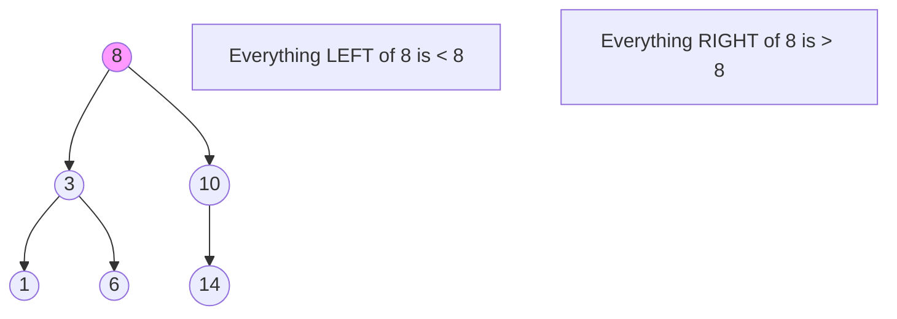

A **Binary Search Tree** is a special type of binary tree that maintains a specific order, making it incredibly fast for searching, addition, and removal.

---

## 1. The Intuition: "Left is Less, Right is More"

Imagine you are a librarian with a shelf of books.
- When you get a **new book**, you look at the middle of the shelf.
- If the new book's title is alphabetically "smaller," you only look at the **left side**.
- If it's "larger," you only look at the **right side**.

A BST is exactly this logic turned into a tree structure. It ensures that for every "Parent" node, everyone on the left is smaller and everyone on the right is larger.

---

## 2. How we go about it: Core Logic

1.  **Search**: Start at the root. If the target is smaller than the current node, go left. If it's larger, go right.
2.  **Insert**: Search for the target value. When you hit a `null` spot where that value SHOULD have been, you place it there.
3.  **Delete**: 
    - If the node has **no children**, just delete it.
    - If it has **one child**, swap it with its child.
    - If it has **two children**, replace it with its **In-order Successor** (the smallest value in its right subtree).



---

## 3. Complexity Analysis

| Operation | Average (Balanced) | Worst (Skewed / Linked-List) |
| :------- | :----------------- | :--------------------------- |
| **Search** | O(log N)           | O(N)                         |
| **Insert** | O(log N)           | O(N)                         |
| **Delete** | O(log N)           | O(N)                         |

*Note: The Worst Case (O(N)) happens if the tree becomes a single line (i.e., you insert 1, 2, 3, 4 in order). Self-balancing trees like **AVL** or **Red-Black** trees solve this.*

---

## 4. Multi-Language Implementation (Insert & Search)

```language-code-tabs
[
  {
    "label": "Javascript",
    "language": "javascript",
    "code": "class Node {\n  constructor(val) {\n    this.val = val;\n    this.left = null;\n    this.right = null;\n  }\n}\n\nclass BST {\n  insert(val, node = this.root) {\n    if (!this.root) { this.root = new Node(val); return; }\n    if (val < node.val) {\n      if (!node.left) node.left = new Node(val);\n      else this.insert(val, node.left);\n    } else {\n      if (!node.right) node.right = new Node(val);\n      else this.insert(val, node.right);\n    }\n  }\n\n  search(val, node = this.root) {\n    if (!node) return false;\n    if (node.val === val) return true;\n    return val < node.val \n      ? this.search(val, node.left) \n      : this.search(val, node.right);\n  }\n}"
  },
  {
    "label": "Python",
    "language": "python",
    "code": "class Node:\n    def __init__(self, val):\n        self.val = val\n        self.left = None\n        self.right = None\n\ndef search(root, val):\n    if not root or root.val == val:\n        return root\n    if root.val < val:\n        return search(root.right, val)\n    return search(root.left, val)\n\ndef insert(root, val):\n    if not root: return Node(val)\n    if root.val < val:\n        root.right = insert(root.right, val)\n    else:\n        root.left = insert(root.left, val)\n    return root"
  },
  {
    "label": "Java",
    "language": "java",
    "code": "class Node {\n    int val; Node left, right;\n    public Node(int item) { val = item; }\n}\n\nclass BinarySearchTree {\n    Node root;\n    void insert(int val) { root = insertRec(root, val); }\n    Node insertRec(Node root, int val) {\n        if (root == null) return new Node(val);\n        if (val < root.val) root.left = insertRec(root.left, val);\n        else root.right = insertRec(root.right, val);\n        return root;\n    }\n}"
  }
]
```

---

## Key Takeaway

A BST combines the flexibility of a Linked List with the search speed of a Sorted Array. It is the core reason why database indexes are so fast!
