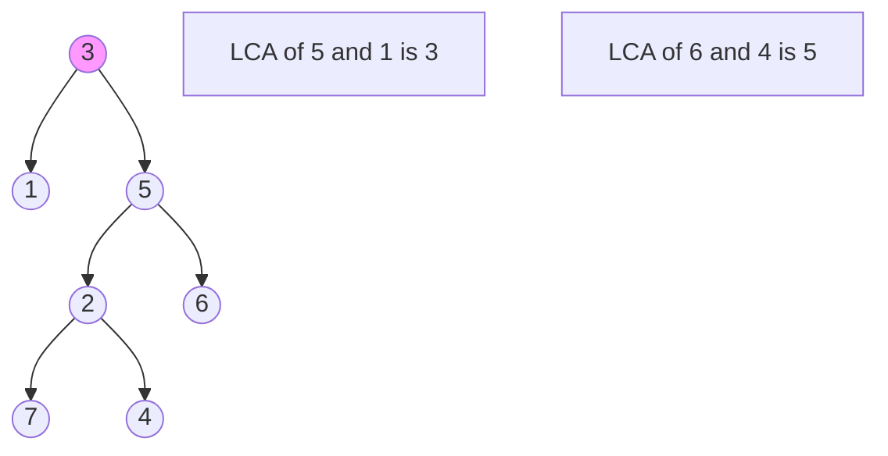

The **Lowest Common Ancestor (LCA)** of two nodes `P` and `Q` in a tree is the lowest (deepest) node that has both `P` and `Q` as descendants.

---

## 1. The Intuition: "Tracing Family Roots"

Imagine a family tree. You and your cousin share a common ancestor (your grandparent).
1. Your **parent** is your ancestor.
2. Your **grandparent** is also your ancestor.
3. Both you and your cousin trace your roots back to the **same grandparent**.

The **Lowest Common Ancestor** is the *first* person (the lowest one in the tree) where the paths from you and your cousin finally meet.

---

## 2. How we go about it (Binary Tree)

For a general Binary Tree (not necessarily sorted), we use a recursive "Search and Report" strategy:
1.  **Base Case**: If the current node is `null`, or if it matches `P` or `Q`, return the current node.
2.  **Divide**: Recursively search for `P` and `Q` in the **left** and **right** subtrees.
3.  **Combine**:
    - If the left search returns a node AND the right search returns a node, it means `P` and `Q` are in different subtrees. Therefore, **the current node must be the LCA**.
    - If only one subtree returns a node, it means both `P` and `Q` are located down that one path. Return whatever that path found.



---

## 3. Complexity Analysis

| Scenario | Time Complexity | Space Complexity |
| :------- | :-------------- | :--------------- |
| **Average Case** | O(N)            | O(H) (height)    |
| **Worst Case** | O(N)            | O(N)             |

- **Time**: We look at every node once in the worst case.
- **Space**: The depth of the recursion stack depends on the height of the tree.

---

## 4. Multi-Language Implementation

```language-code-tabs
[
  {
    "label": "Javascript",
    "language": "javascript",
    "code": "function lowestCommonAncestor(root, p, q) {\n  if (!root || root === p || root === q) return root;\n\n  const left = lowestCommonAncestor(root.left, p, q);\n  const right = lowestCommonAncestor(root.right, p, q);\n\n  // If p and q are in different subtrees, root is LCA\n  if (left && right) return root;\n\n  // Otherwise return whichever side found a node\n  return left || right;\n}"
  },
  {
    "label": "Python",
    "language": "python",
    "code": "def lowestCommonAncestor(root, p, q):\n    if not root or root == p or root == q:\n        return root\n    \n    left = lowestCommonAncestor(root.left, p, q)\n    right = lowestCommonAncestor(root.right, p, q)\n    \n    if left and right:\n        return root\n    \n    return left or right"
  },
  {
    "label": "Java",
    "language": "java",
    "code": "class Solution {\n    public TreeNode lowestCommonAncestor(TreeNode root, TreeNode p, TreeNode q) {\n        if (root == null || root == p || root == q) return root;\n        \n        TreeNode left = lowestCommonAncestor(root.left, p, q);\n        TreeNode right = lowestCommonAncestor(root.right, p, q);\n        \n        if (left != null && right != null) return root;\n        \n        return left != null ? left : right;\n    }\n}"
  }
]
```

---

## Key Takeaway

LCA is a foundational problem. It’s used in **Version Control Systems** (to find where two branches diverged) and **Object Inheritance** in programming languages.
