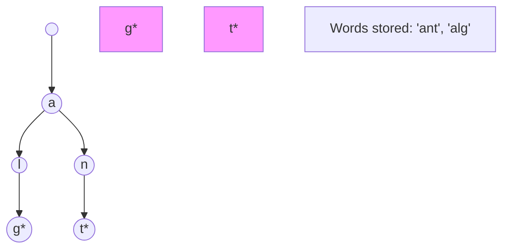

A **Trie** (pronounced "try" or "tree") is an advanced data structure used for efficient retrieval of strings. It is often called a **Prefix Tree** because the nodes store prefixes of strings.

---

## 1. The Intuition: "A Dictionary Paths"

Imagine you are looking up a word in a paper dictionary.
1. You go to the section for **"A"**.
2. Then you look for **"L"** within that section.
3. Then **"G"**, then **"O"**.

In a Trie, every single **character** of a word is a "junction" or a "node" in a tree. 
- To find "ALGO", you follow a path: `Root -> A -> L -> G -> O`.
- If you want to find all words starting with "ALG," you just go to the **G** node and look at all the children under it.

Unlike a Hash Map, which can only tell you if a whole word exists, a Trie can tell you about **prefixes** instantly.

---

## 2. How we go about it: Nodes and Flags

1.  **Node Structure**: Each node contains a map of its children (e.g., `A` through `Z`) and a boolean flag `isEndOfWord`.
2.  **Insertion**: For every character in the word, if the child node doesn't exist, create it. At the very last character, mark `isEndOfWord = true`.
3.  **Search**: Follow the path of characters. If a character is missing, the word doesn't exist. If you reach the end, check the `isEndOfWord` flag.



---

## 3. Complexity Analysis

| Operation | Time Complexity | Space Complexity |
| :------- | :-------------- | :--------------- |
| **Insert** | O(L)            | O(L * N)         |
| **Search** | O(L)            | O(1)             |
| **Prefix Search** | O(L)     | O(1)             |

- `L` = Length of the word.
- `N` = Number of words.
- **Why O(L)?** We don't care how many billions of words are in the Trie. We only care how long the word we are currently typing is!

---

## 4. Multi-Language Implementation

```language-code-tabs
[
  {
    "label": "Javascript",
    "language": "javascript",
    "code": "class TrieNode {\n  constructor() {\n    this.children = {};\n    this.isEndOfWord = false;\n  }\n}\n\nclass Trie {\n  constructor() {\n    this.root = new TrieNode();\n  }\n\n  insert(word) {\n    let node = this.root;\n    for (let char of word) {\n      if (!node.children[char]) node.children[char] = new TrieNode();\n      node = node.children[char];\n    }\n    node.isEndOfWord = true;\n  }\n\n  startsWith(prefix) {\n    let node = this.root;\n    for (let char of prefix) {\n      if (!node.children[char]) return false;\n      node = node.children[char];\n    }\n    return true;\n  }\n}"
  },
  {
    "label": "Python",
    "language": "python",
    "code": "class TrieNode:\n    def __init__(self):\n        self.children = {}\n        self.is_end_of_word = False\n\nclass Trie:\n    def __init__(self):\n        self.root = TrieNode()\n\n    def insert(self, word):\n        node = self.root\n        for char in word:\n            if char not in node.children:\n                node.children[char] = TrieNode()\n            node = node.children[char]\n        node.is_end_of_word = True\n\n    def starts_with(self, prefix):\n        node = self.root\n        for char in prefix:\n            if char not in node.children: return False\n            node = node.children[char]\n        return True"
  },
  {
    "label": "Java",
    "language": "java",
    "code": "class TrieNode {\n    TrieNode[] children = new TrieNode[26];\n    boolean isEndOfWord = false;\n}\n\nclass Trie {\n    private TrieNode root = new TrieNode();\n\n    public void insert(String word) {\n        TrieNode curr = root;\n        for (char c : word.toCharArray()) {\n            if (curr.children[c - 'a'] == null) \n                curr.children[c - 'a'] = new TrieNode();\n            curr = curr.children[c - 'a'];\n        }\n        curr.isEndOfWord = true;\n    }\n}"
  }
]
```

---

## 5. Interview Pro-Tips

### When to Reach for a Trie
If the problem involves **prefixes**, **autocomplete**, or **searching many strings with a common prefix**, a Trie is almost always the right data structure. Key signals: "startsWith", "words that start with", "count words with prefix."

### Hash Map vs. Trie — Know the Trade-off
A Hash Map can tell you if a *whole word* exists in O(1). A Trie can tell you if a *prefix* exists in O(L) and retrieve all words with that prefix. For prefix-heavy workloads, Trie wins decisively. For pure word lookup with no prefix requirements, a Hash Map is simpler.

### Implement `search` and `startsWith` — Know Both
The difference is tiny but important:
- `search("alg")`: Follow path A→L→G, then check `isEndOfWord`. Must be true.
- `startsWith("alg")`: Follow path A→L→G. Only check that the path exists — `isEndOfWord` doesn't matter.

### Space Considerations
A Trie with 26 children per node can be memory-hungry for sparse datasets. Alternatives:
- Use a `Map<char, TrieNode>` instead of a fixed array (saves space for sparse alphabets).
- **Compressed Trie (Radix Tree)**: Collapses single-child chains into single edges. Used in Linux kernel's routing tables.

### What Interviewers Are Testing
- Can you implement `insert`, `search`, and `startsWith` correctly?
- Do you know when to use a Trie vs. a Hash Map?
- Can you extend the Trie to count words, handle wildcards (`.` matching any char), or support deletion?

---

## Key Takeaway

Tries are the "Autocomplete Masters." They are why Google starts suggesting searches for you after just two letters. If you ever need to perform "Starts-with" queries on millions of strings, the Trie is your best friend.
