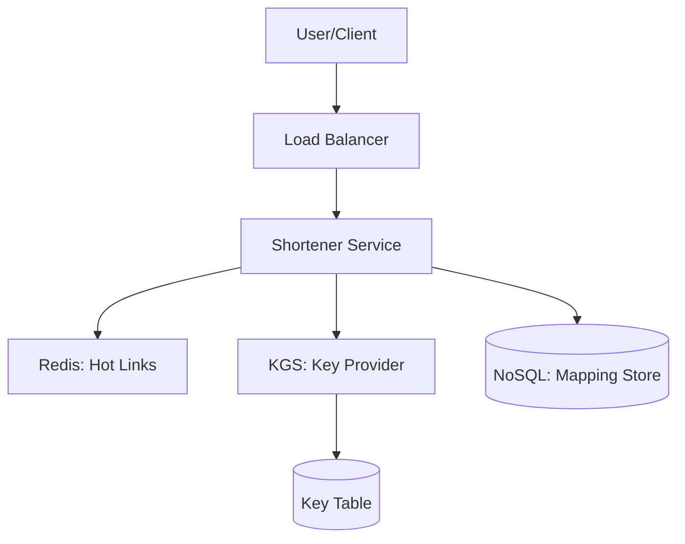

Designing and building a URL shortener is a classic exercise that covers everything from simple data encoding to high-scale data partitioning.

---

## 1. The Blueprint (Requirements)

To build a production-grade URL shortener (like Bitly), we need to handle:
- **Shortening**: Long URL → Short unique string (e.g., `bitly.com/xY7z`).
- **Redirection**: Instant redirect from short link to the original.
- **Scale**: Handling 100M+ new links per month and billions of redirects.

---

## 2. Step-by-Step Implementation

### Step 1: The Encoding Logic
We need a way to turn a unique numeric ID into a short string. We use **Base62** (a-z, A-Z, 0-9) because it's URL-friendly and provides many combinations in just 7 characters ($62^7 \approx 3.5$ Trillion).

**Conceptual Logic:**
```python
def encode_id_to_base62(id):
    chars = "0123456789abcdefghijklmnopqrstuvwxyzABCDEFGHIJKLMNOPQRSTUVWXYZ"
    result = ""
    while id > 0:
        result = chars[id % 62] + result
        id //= 62
    return result
```

### Step 2: Hashing vs. Key Generation (KGS)
In a high-scale system, you can't just hash the URL and hope there are no collisions.
- **The Pro Approach**: Build a separate **Key Generation Service (KGS)**. 
- The KGS pre-generates unique 7-character strings and stores them in a database.
- When you need a new short link, you just "take" one from the table. This eliminates collision logic entirely.

---

## 3. High-Level Architecture



---

## 4. Handling Scale (The "System Design" Part)

### Database Choice: Read vs. Write
- A URL shortener is **Read-Heavy** (100:1 ratio).
- Use a **NoSQL Key-Value Store** (like DynamoDB or Cassandra). 
- Performance: Point lookups (`GET url WHERE id = X`) are extremely fast in NoSQL.

### Caching Strategy
Most clicks come from a small percentage of "Hot" links (the 80/20 rule).
- **Redis Cache**: Store the most frequently accessed `id -> long_url` mappings in memory.
- This reduces DB load by nearly 80-90% in most production environments.

### Data Partitioning
Once your database hits 10+ Terabytes, you must **Shard** it.
- **Approach**: Partition by the `hash(short_id)`. This ensures that traffic is evenly distributed across multiple database nodes.

---

## Key Takeaway

Building a URL shortener isn't just about a hash function; it's about **Stateless Services**, **Pre-generated Keys**, and **Aggressive Caching** to handle massive redirection traffic.
