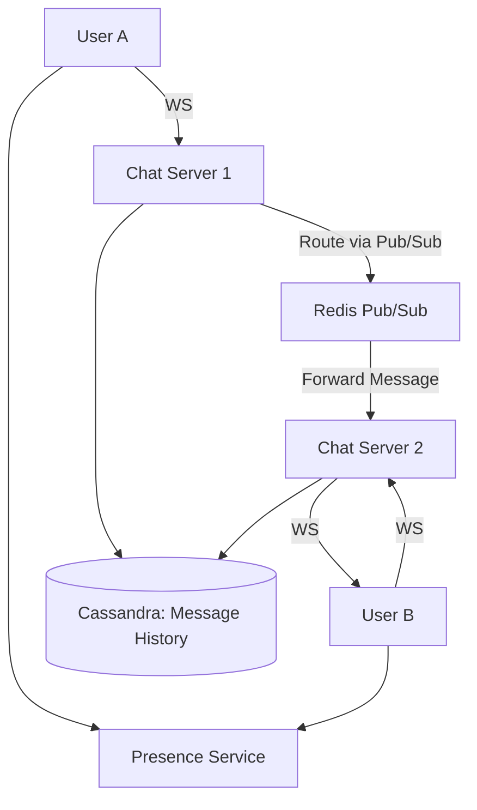

A chat system requires managing thousands of persistent connections and delivering messages with sub-second latency.

---

## 1. The Blueprint (Requirements)

A production-grade system (WhatsApp, Slack) must handle:
- **Real-time Delivery**: Messages must arrive instantly.
- **Presence**: Knowing if someone is online/offline.
- **Message Ordering**: Ensuring "Hello" arrives before "How are you?".
- **Scale**: Handling millions of concurrent users.

---

## 2. Step-by-Step Implementation

### Step 1: Choosing a Protocol
Standard HTTP (Request/Response) doesn't work well for chat because the server needs to "push" data to the client.

- **WebSockets**: The industry standard. Provides a persistent, two-way connection between the user and the server.
- **Alternative (SSE)**: Simpler, but only one-way (server-to-client). Good for simple notifications but less ideal for a full chat system.

### Step 2: Connection Management
Since WebSockets are **stateful**, the server needs to remember who is connected.
- Store a mapping of `userId -> WebSocketID` in an in-memory store like **Redis**.

---

## 3. High-Level Architecture

---

## 4. Handling Scale (The "System Design" Part)

### Database: Massive Parallel Writes
Chat creates a huge volume of "small" writes every time a message is sent.
- **The Choice**: **Cassandra** or **HBase**.
- **Why?** These are "Wide-Column" stores optimized for high-speed writes and can be sharded horizontally across hundreds of servers.

### Presence Service (Heartbeats)
How do we know if a user is online? We don't query a database every 2 seconds.
1. The client sends a small "Pulse" (Heartbeat) to the server every 30 seconds.
2. The **Presence Service** stores this heartbeat in Redis with a 60-second TTL (Time-to-Live).
3. If the record expires, the user is marked as **Offline**.

### Message Ordering with Sequence IDs
In a distributed system, clocks can be slightly out of sync. To ensure correct order:
- Assign every message a **Global Sequence ID** or use a **Snowflake ID** (time-based unique ID) produced by a central service.

---

## Key Takeaway

Building for chat is about **State Management**. You must bridge the gap between multiple stateful WebSocket servers using a **Message Broker** (like Redis Pub/Sub) and use a write-optimized database to store the history.
