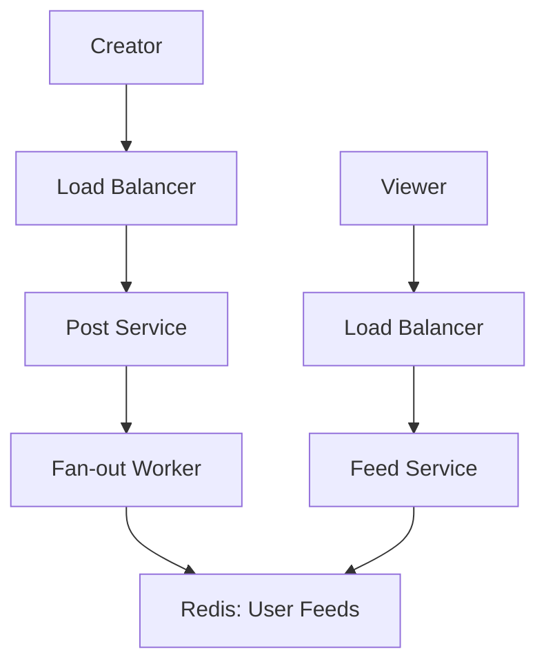

A News Feed (like Twitter, Facebook, or Instagram) is one of the most complex scaling challenges in system design due to the "Fan-out" problem.

---

## 1. The Blueprint (Requirements)

A production-ready feed must handle:
- **Feed Generation**: Collecting posts from all the people you follow.
- **High Performance**: The feed must load in milliseconds.
- **Ranking**: Showing the "most interesting" posts first.
- **Scale**: Handling celebrities with millions of followers.

---

## 2. Step-by-Step Implementation

### Step 1: Feed Data Model
A feed item is basically a list of `post_ids` associated with a `user_id`.
- **Query**: `SELECT * FROM posts WHERE user_id IN (following_list) ORDER BY created_at DESC LIMIT 20`.
- **Problem**: This query is extremely slow when you follow 1,000+ people.

### Step 2: Pre-calculation (The Fan-out)
To make it fast, we don't calculate the feed when you log in. We calculate it **when people post**.

---

## 3. High-Level Architecture

---

## 4. Handling Scale (The "System Design" Part)

### The Fan-out Problem
How do you deliver a post to 100 million people?

1.  **Push Model (Fan-out on Write)**:
    -   When User A posts, the system pushes that post to the "Home Feed" caches of all their followers.
    -   **Pro**: Near-instant for the viewer.
    -   **Con**: If User A is a celebrity (e.g., Cristiano Ronaldo), pushing to 500M followers takes too long and crashes the system.

2.  **Pull Model (Fan-out on Load)**:
    -   Feeds are generated only when a user logs in.
    -   **Pro**: No write-time pressure.
    -   **Con**: Very slow for the viewer if they follow many people.

### The "Hybrid" Approach (Used by Twitter/Facebook)
- **Normal Users**: Use the **Push Model**. It's fast and efficient.
- **Celebrities/Influencers**: Use the **Pull Model**. Followers of a celebrity "pull" the celebrity's latest posts and merge them into their pre-calculated feed at runtime.

### Feed Ranking
In reality, you don't just see the newest posts.
- Use a **Ranking Service** that looks at signals like: "Is the user friends with the poster?", "Is the post trending?", "Has the user looked at this type of content before?".
- This is usually a Machine Learning model that re-ranks a candidate list of 100-200 posts.

---

## Key Takeaway

Scaling a News Feed is a trade-off between **Write latency** and **Read speed**. A hybrid approach using **Pre-computed Caches** for normal users and **On-demand Pulling** for celebrities is the standard solution for massive scale.
