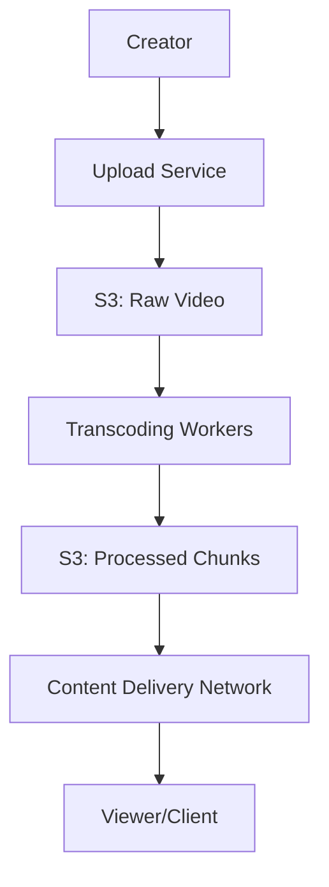

Building a video streaming platform requires handling massive amounts of data (Petabytes) and ensuring smooth playback across different network speeds and devices.

---

## 1. The Blueprint (Requirements)

A world-class streaming service must manage:
- **Uploading**: Fast and reliable video uploads.
- **Transcoding**: Converting one video into multiple resolutions (1080p, 720p, 480p) and formats.
- **Delivery**: Streaming video to millions of global users with no buffering.
- **Scale**: Handling massive storage and high bandwidth costs.

---

## 2. Step-by-Step Implementation

### Step 1: The Upload Workflow
Videos are huge. You cannot upload them in one single HTTP request.
- **Chunked Uploads**: The client breaks the video into small chunks (e.g., 5MB each) and uploads them in parallel.
- If a chunk fails, only that chunk needs to be re-uploaded.

### Step 2: Adaptive Bitrate Streaming (ABS)
Users have different internet speeds. To prevent buffering, we use ABS.
1. The video is transcoded into several bitrates.
2. The client checks the user's connection speed every few seconds.
3. If the speed is low, the player automatically switches to a lower-bandwidth chunk (e.g., 480p).

---

## 3. High-Level Architecture

---

## 4. Handling Scale (The "System Design" Part)

### CDN: Bringing Content Closer
You cannot serve a 4K video from a server in New York to a user in Tokyo without massive lag.
- **Solution**: Use **CDN Edge Servers**. 
- The video is cached in servers physically close to the user. This reduces the number of "hops" the data has to travel.

### Transcoding at Scale
Transcoding is CPU-heavy. You need a **Distributed DAG (Directed Acyclic Graph)** workflow.
- A single video is split into 100 small segments.
- Each segment is transcoded in parallel by different workers.
- A final worker stitches the metadata together into a playlist file (e.g., `.m3u8` or `.mpd`).

### Storage Efficiency
Storing every video in every resolution is expensive.
- **Tiered Storage**: Use Fast SSDs for popular trending videos.
- Use **Cold Storage** (S3 Glacier) for old videos that haven't been watched in months.

---

## Key Takeaway

Building YouTube or Netflix is a **Bandwidth and Storage** puzzle. The key is **Distributed Transcoding** to handle the heavy lifting and a **Global CDN** to ensure that data travels the shortest distance possible to the viewer.
