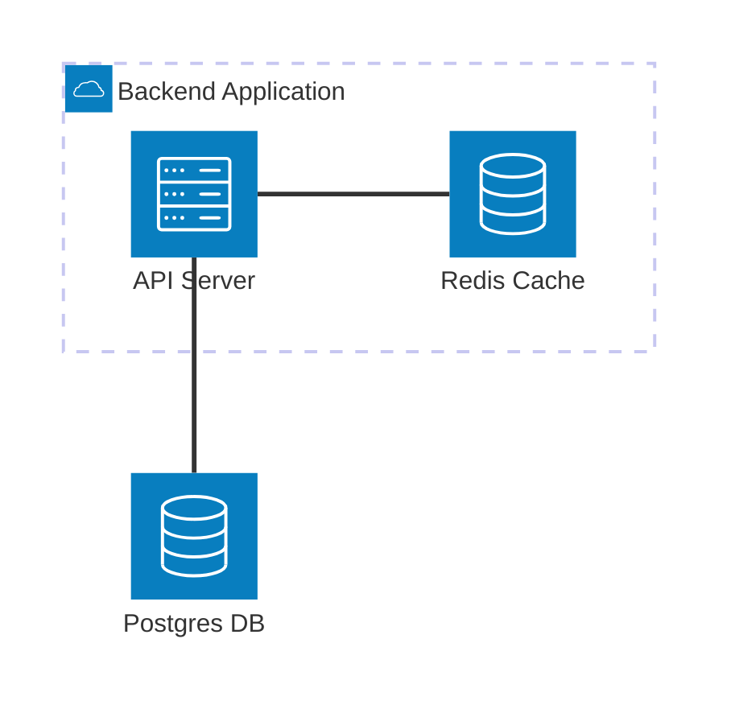

# In-Memory Databases and Caching

Disk I/O is the primary bottleneck in most data-intensive applications. Even with fast NVMe SSDs, reading from disk takes milliseconds, whereas reading from RAM takes nanoseconds. In-memory databases store their entire dataset in RAM, trading volatility and cost for extreme performance.

## 1. Caching Strategies

Before discussing specific databases, you must understand how to integrate a cache into your system architecture.

> [!TIP]
> **ELI5: The Librarian and the Desk**
> The Database is a massive, slow library in the basement. The Cache is the librarian's small desk upstairs.
> *   **Cache-Aside (Lazy Loading):** A student asks the librarian for a book. The librarian checks their desk (the cache). If it's not there (Cache Miss), they walk down to the basement, get the book (Database query), give it to the student, and *leave a copy on the desk* for the next student who asks.
> *   **Write-Through:** When a student returns a book, the librarian immediately walks it down to the basement, ensuring the library is perfectly up to date, but the student has to wait for the librarian to come back.

### Cache-Aside (The Most Common)
1.  Application checks the cache.
2.  If data is found (Hit), return it.
3.  If data is not found (Miss), query the main database.
4.  Write the result to the cache for future requests.

## 2. Cache Eviction Policies

RAM is expensive and limited. You cannot cache everything. When the desk fills up, the librarian must throw away old books to make room.

*   **LRU (Least Recently Used):** Evicts the data that hasn't been accessed for the longest time. (Throw away the book nobody has asked for in weeks).
*   **LFU (Least Frequently Used):** Evicts the data that is accessed least often overall.
*   **TTL (Time To Live):** Every item is given an expiration time (e.g., 60 seconds). This ensures data doesn't remain stale indefinitely.

## 3. Redis: The King of In-Memory

Redis (Remote Dictionary Server) is the most popular in-memory database. 

### Why Redis?
*   **Complex Data Structures:** Unlike Memcached which only stores strings, Redis supports Lists, Sets, Sorted Sets, Hashes, and Bitmaps. This allows you to perform complex operations directly in memory (e.g., maintaining a real-time gaming leaderboard using a Sorted Set).
*   **Single-Threaded Architecture:** Redis processes commands sequentially in a single thread. This eliminates race conditions, ensuring atomic operations without complex locking.

### Persistence in Redis
In-memory doesn't have to mean volatile. Redis offers mechanisms to persist data to the hard drive, allowing it to act as a primary database.

1.  **RDB (Redis Database Backup):** Point-in-time snapshots of the dataset at specified intervals (e.g., every 5 minutes). 
2.  **AOF (Append Only File):** Logs every single write operation received by the server to disk. Provides much stronger durability guarantees but results in large file sizes.
