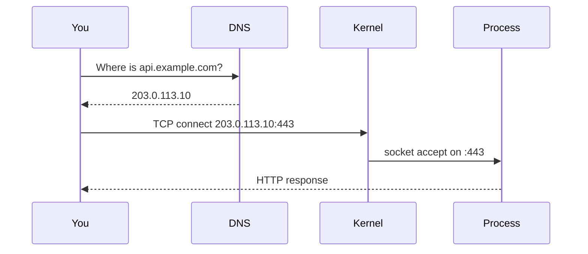

Almost every production server you will ever SSH into is Linux. Before Docker, Kubernetes, or AWS, you need to be able to land on a box, figure out what it is doing, and fix it when it is not.

If a service is down at 2am, there is no GUI. There is a shell, some log files, and a set of tools that answer three questions: is the process alive, can it talk on the network, and does it have permission to do its job.

> [!TIP]
> **ELI5: The apartment building**
> A Linux server is a building. **Processes** are people living in apartments (PIDs). **Files** are rooms and drawers. **Permissions** are keys: owner, housemates, strangers. **Ports** are numbered doors to the street. `ss` and `curl` tell you which doors are open and whether anyone answers.

## 1. The process model

Everything running is a **process**. The kernel tracks each one with a PID, a parent PID, open file descriptors, and resource usage.

```bash
# Who is eating CPU and RAM right now?
htop          # nicer; install it if missing
top           # always available

# Find a specific program
ps aux | grep nginx

# What is PID 1421 doing, and who started it?
ps -o pid,ppid,user,stat,cmd -p 1421
```

Process state letters you will see in `ps`:

| State | Meaning |
| :--- | :--- |
| `R` | Running or ready to run |
| `S` | Sleeping, waiting on I/O or a timer (normal) |
| `Z` | Zombie: child exited, parent never called `wait()` |
| `D` | Uninterruptible sleep, usually stuck on disk I/O |

### Signals: how you actually stop things

`kill` does not "kill" by default. It sends **SIGTERM** (15): "please shut down, flush your buffers, close connections."

```bash
kill 1421          # SIGTERM — graceful
kill -15 1421      # same thing
kill -9 1421       # SIGKILL — kernel yanks the process, no cleanup
```

> [!WARNING]
> `kill -9` skips destructors, connection draining, and lock release. Use it when the process is wedged. If you SIGKILL a database, you can leave WAL files and lock files in a bad state.

On modern servers, you usually do not `kill` by PID. You talk to **systemd**, which knows how to start, stop, and restart the service:

```bash
systemctl status nginx
systemctl restart nginx
journalctl -u nginx -n 100 --no-pager   # last 100 log lines
```

`systemctl` sends SIGTERM, waits a timeout (often 90s), then SIGKILL if the process ignores you. That timeout is why a "restart" can hang.

## 2. Files, users, and permissions

Linux security is still mostly: **who owns this file, and what bits are set**.

Every file has an owner user, an owner group, and three permission triples: **user / group / other**, each `rwx`.

```
-rwxr-xr-x  1 app app  4096  deploy.sh
 ^          ^   ^
 type       owner group
```

Numeric form is just addition: read=4, write=2, execute=1.

| Mode | Meaning |
| :--- | :--- |
| `755` | Owner rwx, everyone else rx. Typical for scripts and directories. |
| `644` | Owner rw, everyone else r. Typical for config and source. |
| `600` | Owner only. SSH keys, secrets, env files. |
| `777` | Anyone can do anything. Almost never correct. |

```bash
ls -l /etc/nginx/nginx.conf
chmod 644 /etc/nginx/nginx.conf
chown root:root /etc/nginx/nginx.conf

# Your app should run as a dedicated user, not root
id app
sudo -u app -H ./server
```

> [!CAUTION]
> If the web app runs as `root` and an attacker gets remote code execution, they own the machine: they can read `/etc/shadow`, install a cron backdoor, and dump every other tenant on the box. Create a user, give it only the files it needs, drop privileges after bind-to-port-80 if you must.

Directories need **execute** to be entered (`cd`) even if you can read them. A common deploy bug is `chmod 644` on a directory, then Nginx returns 403 because it cannot traverse to `index.html`.

## 3. How a request reaches a process

When you type `https://api.example.com/health` the box has to succeed at several independent steps. Debugging is walking this chain.



1. **DNS** turns the name into an IP (`dig`, `nslookup`).
2. **Routing** sends packets toward that IP (`ip route`, `traceroute`).
3. **Firewall** decides whether the packet is allowed (`iptables`/`nft`/`ufw`, or a cloud security group in front of the box).
4. A process must be **listening** on that port (`ss -lptn`).
5. The process must **accept** and speak the protocol (`curl -v`).

```bash
# Does DNS resolve, and to what?
dig +short api.example.com

# Is anything listening on 443?
ss -lptn | grep 443
# older boxes: netstat -tulpn | grep 443

# Can we complete TLS and HTTP from here?
curl -vI https://api.example.com/health

# Where do packets die?
traceroute -n api.example.com
```

`curl -v` is the most useful HTTP tool you have. It prints DNS, TCP, TLS, request headers, and response headers. If TLS fails, you never reach the app. If TCP hangs, you never reach TLS.

### Ports and binding

A process **binds** an address and port. `0.0.0.0:8080` means "all interfaces." `127.0.0.1:8080` means "only this machine." That is why "it works on the server when I curl localhost" and "it fails from my laptop" can both be true: the app bound to loopback, or a firewall dropped the public path.

```bash
# Show listening sockets and the process that owns them
ss -lptn
```

## 4. Logs live on disk until they do not

Default places to look, in order:

| Path | What is there |
| :--- | :--- |
| `journalctl -u <service>` | systemd-captured stdout/stderr |
| `/var/log/nginx/` | access.log, error.log |
| `/var/log/syslog` or `/var/log/messages` | kernel and system |
| `dmesg` | kernel ring buffer (OOM killer lives here) |

When a process "just disappears," check `dmesg | grep -i oom`. The **OOM killer** is the kernel shooting a process because RAM is gone. From the app's point of view it was murdered, not crashed.

## 5. A real debugging loop: "the API is down"

Do not guess. Walk the path.

1. `curl -vI https://api.example.com/health` from your laptop. DNS? TLS? Timeout? Connection refused? HTTP 502?
2. SSH in. `systemctl status api` and `journalctl -u api -n 200`.
3. `ss -lptn | grep 8080` — is the process even listening?
4. `curl -sS http://127.0.0.1:8080/health` on the box. If localhost works and the public URL does not, the problem is proxy, TLS, security group, or bind address — not application code.
5. `df -h` and `free -h`. Disks at 100% make logs and databases fail in bizarre ways. RAM at 0 triggers OOM.

> [!NOTE]
> `ping` only tests ICMP. Many clouds disable ICMP. A failed ping does not mean the HTTP port is down. Always test the real protocol with `curl` or `nc`.

## What to remember

- SIGTERM asks, SIGKILL forces. Prefer `systemctl`.
- Permissions are owner/group/other × rwx. Do not run apps as root.
- Network failures are a chain: DNS → route → firewall → listen → protocol.
- `ss`, `curl -v`, `journalctl`, and `dmesg` solve most "the server is broken" tickets.
