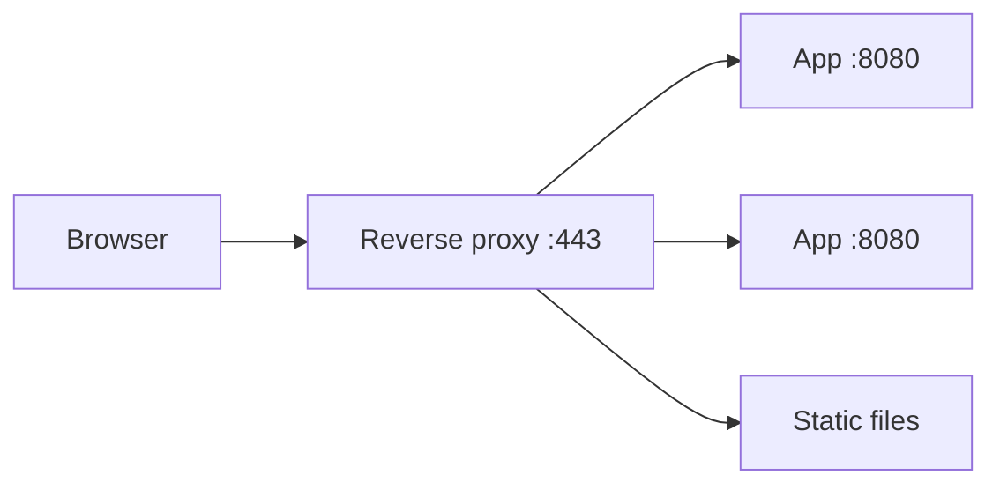

Your Node, Go, or Python process should not be the first thing on the public internet. In front of it sits a **reverse proxy**: Nginx, Caddy, Envoy, HAProxy, or a cloud load balancer that speaks the same ideas.

The proxy owns TLS, idle connections, slow clients, static files, and routing. The app owns business logic.

> [!TIP]
> **ELI5: The receptionist**
> Customers never walk into the kitchen. They talk to the receptionist (reverse proxy). She checks IDs (TLS), sends drink orders to the bar and food orders to the kitchen (path routing), and if one cook is slammed she sends the next ticket to another (load balancing). The kitchen never learns the customer's home address unless she writes it down (`X-Forwarded-For`).

## 1. Forward proxy vs reverse proxy

| | Forward proxy | Reverse proxy |
| :--- | :--- | :--- |
| Sits in front of | Clients | Servers |
| Who configured it | The user / company | You, the operator |
| Example | Corporate HTTP proxy, some VPNs | Nginx in front of your API |
| Hides | The client from the internet | Your origin servers from the internet |

A **forward** proxy is "fetch this URL on my behalf." A **reverse** proxy is "I *am* `api.example.com`; I will pick an internal server."



## 2. What the proxy actually does

**TLS termination.** Decrypting HTTPS is CPU work and certificate management. The proxy holds the cert, speaks TLS to the world, and talks plain HTTP (or mTLS) to the app on a private network. Your app code never sees the private key.

**Load balancing.** Several identical app processes. The proxy picks one per request: round robin, least connections, or a hash of the client IP.

**Buffering slow clients.** Mobile networks stall. If the app writes the response directly to a phone, an app worker is blocked. The proxy can take the full response quickly, then drip it to the client.

**Static files and caching.** Nginx serving `/assets/*.js` from disk is faster and cheaper than your app framework doing it.

**Hiding origins.** Attackers see the proxy IP. App servers live in a private subnet and only accept connections from the proxy.

## 3. A config you can actually read

This is a realistic Nginx shape for one API and one set of static files.

```nginx
upstream api {
    least_conn;
    server 10.0.1.11:8080 max_fails=3 fail_timeout=10s;
    server 10.0.1.12:8080 max_fails=3 fail_timeout=10s;
}

server {
    listen 443 ssl http2;
    server_name api.example.com;

    ssl_certificate     /etc/nginx/certs/fullchain.pem;
    ssl_certificate_key /etc/nginx/certs/privkey.pem;

    # Do not let one client hold a worker forever
    client_max_body_size 2m;
    proxy_read_timeout 30s;

    location /assets/ {
        root /var/www;
        expires 7d;
        add_header Cache-Control "public";
    }

    location / {
        proxy_pass http://api;
        proxy_set_header Host              $host;
        proxy_set_header X-Real-IP         $remote_addr;
        proxy_set_header X-Forwarded-For   $proxy_add_x_forwarded_for;
        proxy_set_header X-Forwarded-Proto $scheme;
    }
}
```

Three headers matter:

- **`Host`**: the app may generate URLs from this. If you forget it, the app thinks it is `10.0.1.11:8080`.
- **`X-Forwarded-For`**: the real client IP. Without it, every log line says the proxy's IP. **Do not trust this header from the public internet** unless the proxy overwrites it. Clients can spoof it.
- **`X-Forwarded-Proto`**: `https`. Without it, the app redirects HTTP→HTTPS forever or generates `http://` links.

> [!WARNING]
> If Nginx is the only thing that should set `X-Forwarded-For`, configure it to **replace**, not append blindly. Otherwise a client sends `X-Forwarded-For: 127.0.0.1` and your rate limiter or audit log believes them.

Health: `max_fails` + `fail_timeout` is Nginx's crude health check. If a backend returns errors or times out enough times, Nginx stops sending it traffic for a while. Dedicated load balancers (ALB, Envoy, HAProxy) run active HTTP health checks against `/health`.

## 4. Layer 4 vs Layer 7

This is the same OSI split you saw in fundamentals, applied to a proxy.

**Layer 4 (TCP/UDP).** The proxy copies bytes between sockets. It sees IP + port, not `/users/42`. It is fast, protocol-agnostic, and can balance Postgres, Redis, or TLS without decrypting (pass-through). It cannot route `/api` to one service and `/images` to another.

**Layer 7 (HTTP).** The proxy parses the request. It can route on path, header, cookie, or gRPC method; add headers; retry idempotent GETs; do canary splits (`10% to v2`). It must terminate TLS (or trust a header) to see that HTTP.

| Need | Layer |
| :--- | :--- |
| Balance raw TCP to a database | L4 |
| `Host: api.example.com` vs `Host: app.example.com` | L7 |
| Send `/checkout` to the payments service | L7 |
| TLS pass-through because the app owns the cert | L4 |
| WebSocket upgrade | L7, with `Upgrade` headers forwarded |

Cloud mapping: AWS **NLB** is L4. **ALB** is L7 HTTP. Nginx/Caddy/Envoy in HTTP mode are L7.

## 5. Nginx vs HAProxy vs Envoy vs Caddy

**Nginx.** General-purpose HTTP server. Excellent static files, gzip, TLS, reverse proxy. Config is files on disk. Still the default "put this in front of my app" choice.

**HAProxy.** Born as a load balancer. Very strong L4, precise queueing, stick tables for rate limits, rock-solid for high connection counts. Less of a static file server.

**Envoy.** Built for service meshes. Config is often pushed dynamically (xDS) instead of reloading a file. First-class HTTP/2 and gRPC, retries, outlier detection, distributed tracing headers. Sidecar in Istio/Linkerd.

**Caddy.** Automatic HTTPS from Let's Encrypt by default. Smaller ops surface for simple sites. Less common as a giant L7 fleet balancer.

You do not need all four. A typical path: Caddy or Nginx on a single VM; ALB or Nginx for a small fleet; Envoy when you already run Kubernetes and want per-service policy.

## 6. Failure modes you will actually see

**502 Bad Gateway.** Proxy could not get a valid response from upstream. Upstream down, crashed mid-request, or not listening on the socket Nginx thinks it is.

**504 Gateway Timeout.** Upstream did not answer within `proxy_read_timeout`. Either the app is stuck (lock, DB) or the timeout is tighter than a legitimate slow endpoint.

**WebSockets die at 60s.** Default proxy idle timeouts. You must raise `proxy_read_timeout` and forward `Upgrade` / `Connection` headers.

**The app sees every client as 10.0.0.2.** Missing `X-Forwarded-For`, or the app does not tell its framework to trust the proxy.

```nginx
# WebSocket location
proxy_http_version 1.1;
proxy_set_header Upgrade    $http_upgrade;
proxy_set_header Connection "upgrade";
proxy_read_timeout 3600s;
```

## What to remember

- Terminate TLS and slow clients at the proxy; keep apps private.
- Always pass `Host`, `X-Forwarded-For`, `X-Forwarded-Proto` on purpose, not by accident.
- L4 is fast and blind. L7 can route on HTTP but must see the request.
- 502/504 are proxy-to-app failures. Debug with `curl` to the proxy *and* to localhost on the app.
