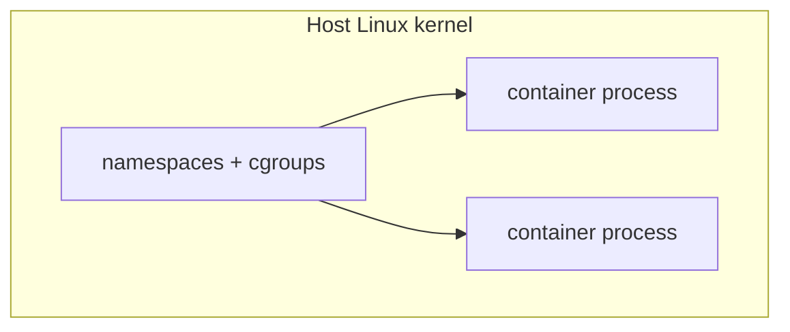

A container is not a tiny VM. It is a regular Linux process with extra kernel fences around it, plus a packaged filesystem. Docker is the common tool for building that package and running the process.

The problem it solved: your laptop has Python 3.12 and `libssl` 3; production has Python 3.9 and an older OpenSSL. The app worked locally and exploded in staging. A container ships **the app, the interpreter, and the libraries** as one artifact that runs the same way on every machine that can run the Linux kernel.

> [!TIP]
> **ELI5: The shipping container**
> Before shipping containers, cargo was loose: pianos next to bananas, different crates, different ships. A steel container is a standard box. Cranes, trucks, and ships do not care what is inside. Docker images are that box for software. The host OS is the ship; it does not install your Python. It just runs the box.

## 1. Why this is not a virtual machine

A **VM** boots a full guest kernel on emulated hardware (or a hypervisor). Three VMs means three kernels, three copies of userspace, minutes to boot, gigabytes of RAM.

A **container** shares the **host kernel**. Isolation comes from Linux:

- **Namespaces** hide things: PID namespace (you think you are PID 1), network namespace (your own interfaces), mount namespace (your own root filesystem).
- **cgroups** cap CPU, memory, pids. This is what stops one container from OOM-killing the whole node — if you set the limit.
- **Union filesystems** (overlayfs) stack image layers so 50 containers can share the same `python:3.12` files in disk cache.



Consequences:

- Boot is process start, not BIOS. Milliseconds.
- You cannot run a Windows kernel inside a Linux container. You can run a Windows *userspace* only on Windows (or via a VM).
- Isolation is weaker than a VM. Kernel exploits can break out. Treat the host as in the same trust zone as the containers on it.

## 2. Image vs container vs Dockerfile

| Thing | What it is |
| :--- | :--- |
| **Image** | Immutable snapshot: layered filesystem + metadata (default command, env, ports). A blueprint. |
| **Container** | A running (or stopped) instance of an image: a process + a thin writable layer on top. |
| **Dockerfile** | The recipe used to *build* an image. |
| **Registry** | Where images live (Docker Hub, GHCR, ECR). You `push` / `pull` by name:tag. |

```bash
docker build -t myapp:1.4 .
docker run --rm -p 8080:8080 myapp:1.4
docker ps
docker logs <id>
```

`-p 8080:8080` is `hostPort:containerPort`. If the process inside listens on 8080, this publishes it on the host. If it listens on 3000, this mapping does nothing useful.

## 3. Layers, and why order matters

Each Dockerfile instruction usually creates a **layer**. Docker caches layers. If `COPY package.json` has not changed, `RUN npm ci` is reused. If you `COPY . .` *before* `npm ci`, any source edit busts the dependency cache and your CI build takes 4 minutes extra.

```dockerfile
FROM node:22-alpine AS deps
WORKDIR /app
COPY package.json package-lock.json ./
RUN npm ci --omit=dev

FROM node:22-alpine
WORKDIR /app
ENV NODE_ENV=production
RUN adduser -D app
COPY --from=deps /app/node_modules ./node_modules
COPY --chown=app:app . .
USER app
EXPOSE 8080
CMD ["node", "server.js"]
```

What this is doing:

1. **Pin a small base.** Alpine or `distroless` means fewer packages, fewer CVEs, faster pulls. Alpine uses musl; some native C++ addons expect glibc — then use `node:22-bookworm-slim` instead of fighting musl.
2. **Install deps in a stage** from lockfile only, so source changes do not reinstall npm.
3. **Copy the result into a clean image.** Compilers, git, and npm cache stay in the builder stage.
4. **`USER app`.** Running as root in production is the VM mistake all over again.
5. **`CMD` in exec form** `["node", "server.js"]` so PID 1 is your app and it receives SIGTERM. Shell form `CMD node server.js` wraps in `/bin/sh`, which may eat signals and make graceful shutdown fail.

> [!WARNING]
> `latest` is not a version. `FROM node:latest` today and next month are different images. Pin `node:22.14-alpine` (or a digest `@sha256:...`) so production is reproducible.

`.dockerignore` should exclude `.git`, `node_modules`, `.env`, tests, and local junk. Otherwise you copy secrets and bust the cache constantly.

## 4. Compose: more than one process

A web app plus Postgres plus Redis should not be three memorized `docker run` commands. Compose is a local (and sometimes prod) graph of containers on one network.

```yaml
services:
  web:
    build: .
    ports:
      - "8080:8080"
    environment:
      DATABASE_URL: postgres://app:app@db:5432/app
    depends_on:
      db:
        condition: service_healthy
  db:
    image: postgres:16-alpine
    environment:
      POSTGRES_PASSWORD: app
      POSTGRES_USER: app
      POSTGRES_DB: app
    volumes:
      - pgdata:/var/lib/postgresql/data
    healthcheck:
      test: ["CMD-SHELL", "pg_isready -U app"]
      interval: 5s
      retries: 5

volumes:
  pgdata:
```

Hostname `db` resolves inside the Compose network. `localhost` inside `web` is the web container, not Postgres. That mix-up causes a week of "connection refused" for almost everyone.

**Volumes** persist data beyond the container lifecycle. Without `pgdata`, `docker compose down` wipes the database. Bind mounts (`./src:/app`) are for live reload in development, not for production databases.

## 5. Networking and health

Default bridge network: containers can reach each other by service name. The host reaches them only through published ports.

If the process binds `127.0.0.1:8080` *inside* the container, published ports still fail from the host. Bind `0.0.0.0:8080`.

Healthchecks tell Compose/Kubernetes the process accepted a connection, not that it started. A Node server that listens after a 20s migration needs a probe delay or it will be killed in a restart loop.

## 6. Production mistakes

| Mistake | What happens |
| :--- | :--- |
| No memory limit | One leak OOMs the host, not just the container |
| Running as root | Container breakout or RCE becomes host root |
| Copying `.env` into the image | Secrets in every registry and every laptop that pulled |
| Fat image (1GB+ node_modules + build tools) | Slow deploys, slow autoscaling |
| No PID 1 signal handling | `docker stop` waits 10s, then SIGKILL, in-flight requests die |
| Mutable `latest` tag in production | You cannot roll back because you overwrote the tag |

```bash
docker run --memory=256m --cpus=1 --read-only ...
```

Read-only root filesystem plus an explicit tmp volume is a good default once the app stops writing to itself.

## What to remember

- A container is a namespaced process plus a filesystem, not a VM.
- Images are layered; put rarely changing instructions first.
- Multi-stage builds keep compilers out of production.
- Run as a non-root user, pin tags, and handle SIGTERM as PID 1.
- `localhost` in a container is the container. Use service names on the Compose/Kubernetes network.
