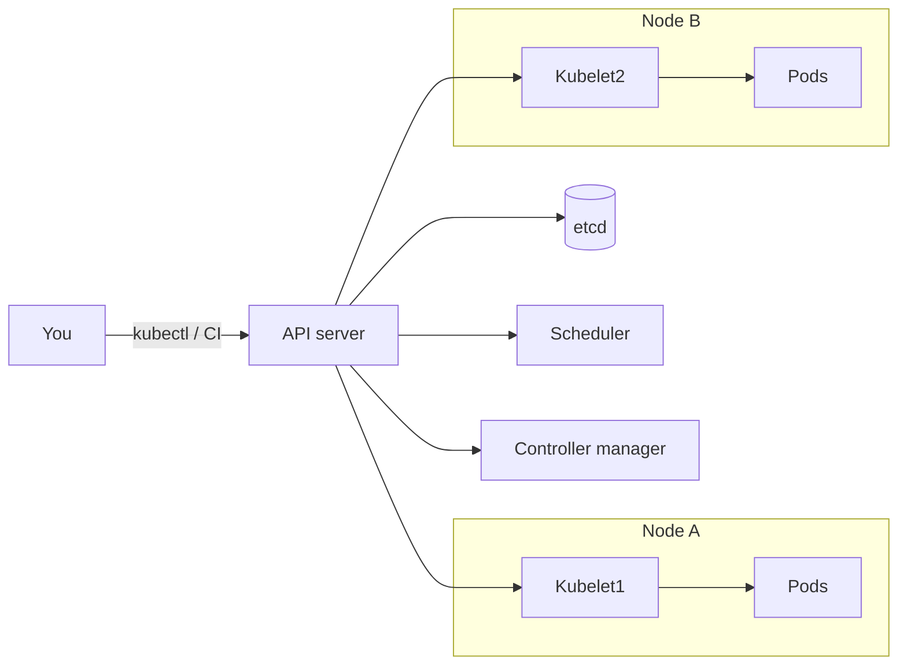

Docker runs a container on one machine. Production needs many machines, rolling deploys, and something that starts a replacement when a process dies at 3am. That is **orchestration**. Kubernetes is the common API for it.

You do not "SSH and start the app." You declare the desired state: "3 copies of `myapp:1.4`, behind a stable name, with 256Mi RAM each." Kubernetes keeps reality matching that file.

> [!TIP]
> **ELI5: The conductor**
> Each container is a musician who only knows their part. Kubernetes is the conductor with sheet music (YAML). It places players on chairs (nodes), replaces anyone who faints, and turns the volume up (more replicas) when the hall fills. You do not shout at individual musicians during the concert. You change the sheet music.

## 1. Control plane vs worker nodes



**API server.** The only public brain. `kubectl`, controllers, and kubelets all talk to it. Authn/authz happens here.

**etcd.** The cluster's database. Desired state and actual state live here. If etcd is gone, the cluster cannot make decisions. Back it up.

**Scheduler.** New Pod has no node yet. Scheduler picks one with enough CPU/RAM and matching constraints (zone, GPU, taints).

**Controller manager.** Loops that say: Deployment wants 3 replicas, there are 2, create one more. ReplicaSets, Jobs, StatefulSets, all work this way.

**Kubelet.** Agent on each machine. "API server says this Pod should run here" → talk to container runtime (containerd) → report status.

**kube-proxy / CNI.** Makes Services' virtual IPs reach Pods. Different clusters use iptables, IPVS, or eBPF (Cilium). You rarely configure this on day one, but "Service IP does not connect" often lives here or in NetworkPolicies.

Workers are disposable. Drain a node, Kubernetes reschedules the Pods. That only works if your app is stateless or stores state in a volume/database, not in the container's disk.

## 2. The objects you will actually write

**Pod.** Smallest unit. One or more containers that share network (`localhost`) and volumes. Almost always **one main container per Pod**. Two containers in one Pod is for sidecars (proxy, log shipper), not for "api + redis."

Pods are mortal. They get a new IP when they restart. Never point clients at a Pod IP.

**Deployment.** "I want N copies of this Pod template." It creates a ReplicaSet, which creates Pods. A rollout updates the template; ReplicaSet is replaced gradually.

**Service.** Stable virtual IP + DNS name (`payments.default.svc.cluster.local`) that load-balances to Pods with matching **labels**. When Pods die and come back, the Service membership updates.

**Ingress / Gateway.** HTTP routing from the internet into Services. TLS, hostnames, paths. Implemented by Nginx, Traefik, Envoy, or a cloud controller.

**ConfigMap / Secret.** Config and credentials injected as env vars or files. Same image in staging and prod; different ConfigMaps.

**StatefulSet.** Ordered names (`mysql-0`, `mysql-1`), stable storage. Databases. Prefer a managed database until you know you need this.

```yaml
apiVersion: apps/v1
kind: Deployment
metadata:
  name: api
spec:
  replicas: 3
  selector:
    matchLabels:
      app: api
  template:
    metadata:
      labels:
        app: api
    spec:
      containers:
        - name: api
          image: ghcr.io/acme/api:1.4
          ports:
            - containerPort: 8080
          resources:
            requests:
              cpu: 100m
              memory: 128Mi
            limits:
              memory: 256Mi
          readinessProbe:
            httpGet:
              path: /healthz
              port: 8080
            initialDelaySeconds: 5
            periodSeconds: 10
          livenessProbe:
            httpGet:
              path: /livez
              port: 8080
            initialDelaySeconds: 20
            periodSeconds: 20
---
apiVersion: v1
kind: Service
metadata:
  name: api
spec:
  selector:
    app: api
  ports:
    - port: 80
      targetPort: 8080
```

Labels are how everything finds everything. If the Service selector does not match the Pod labels, you get an empty Service and mysterious timeouts.

## 3. Probes: the difference between "started" and "ready"

| Probe | Question | If it fails |
| :--- | :--- | :--- |
| **Readiness** | Should we send traffic? | Removed from the Service. Not killed. |
| **Liveness** | Is the process stuck? | Kubelet kills and restarts the container. |
| **Startup** | Is a slow boot still going? | Disables the other probes until it passes. |

A common outage: liveness hits `/` which talks to the database. Database blips, every Pod fails liveness, Kubernetes restarts all of them at once, database never recovers. Liveness should be "is the process alive" (`/livez` that does not touch the DB). Readiness can check dependencies.

## 4. What happens during a deploy

You change the image tag to `1.5` and `kubectl apply`.

1. Deployment creates a new ReplicaSet.
2. New Pods start. They are not in the Service until **readiness** passes.
3. Old Pods are terminated with SIGTERM. `terminationGracePeriodSeconds` (default 30s) is how long they have to finish in-flight requests.
4. If the new Pods never become ready, a correct rollout (with `maxUnavailable`) keeps old Pods serving.

Your app must listen for SIGTERM, stop accepting new work, drain, then exit. If it ignores SIGTERM, Kubernetes SIGKILLs at 30s and users see dropped connections.

## 5. Debugging a CrashLoopBackOff

`CrashLoopBackOff` means the container started, exited, started, exited. Kubernetes waits longer each time.

```bash
kubectl get pods -l app=api
kubectl describe pod api-7d9f8c-xk2l     # events: OOMKilled, image pull, probe fail
kubectl logs api-7d9f8c-xk2l --previous  # logs from the crashed instance
kubectl logs api-7d9f8c-xk2l -c api
kubectl exec -it api-7d9f8c-xk2l -- sh   # only if it stays up
```

Typical causes:

- App binds `localhost` instead of `0.0.0.0` — readiness never succeeds, or only works from inside the container.
- Missing env var, DB URL points at `localhost`.
- **OOMKilled** in `describe` — `limits.memory` too low.
- Image pull errors — bad tag, private registry, missing `imagePullSecrets`.
- Probe path 404 because the app mounts at `/api` and you probed `/healthz`.

Helm wraps these YAML files as charts (templates + values). Useful once the raw objects make sense. It will not save you from not understanding Pods and Services.

## What to remember

- You declare desired state. Controllers reconcile. Pods are cattle.
- Deployment runs copies; Service is the stable name; probes decide traffic vs restart.
- Never point clients at Pod IPs. Never make liveness depend on the database.
- `describe` + `logs --previous` is the CrashLoop toolkit.
