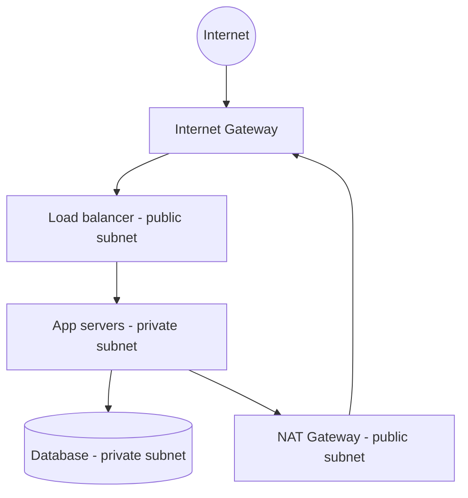

AWS, GCP, and Azure sell the same building blocks with different names: virtual machines, object storage, isolated networks, and an identity system that decides who can touch which block. If you understand one provider's primitives, the others are a dictionary lookup.

The hard part is not "what is S3." The hard part is putting a database on the internet by accident, or giving an app a key that can delete the account.

> [!TIP]
> **ELI5: The office park**
> A **VPC** is a fenced office park with its own street numbers (private IPs). The **internet gateway** is the front gate. **Public subnets** face the road (load balancers). **Private subnets** are inner buildings with no street door (app servers, databases). A **NAT gateway** is a mailroom: inner buildings can send mail out, nobody can walk in. **IAM** is the badge system: not every employee can open the payroll safe.

## 1. Compute and storage, without the brochure

**Virtual machines** (EC2, GCE, Azure VMs). You get a kernel, a disk, a network interface. You patch the OS, or you don't and you get pwned. Maximum control, maximum chores. Still the right tool for odd binaries, long-lived connections, and "I need a box."

**Managed runtimes** (ECS, Cloud Run, App Runner, Elastic Beanstalk). You ship a container; they run it. You still design the network and IAM.

**Object storage** (S3, GCS, Azure Blob). A flat key/value of bytes in buckets. You cannot `chmod` a byte in the middle of a file; you replace the object. Strong durability, effectively infinite capacity, HTTP-native.

Use object storage for uploads, backups, static assets, data lake files. Do not use it as a POSIX disk for a database. Latency is higher than local disk; listing millions of keys is expensive; there is no real `append`.

Block storage (EBS, Persistent Disk) is the disk attached to a VM. File storage (EFS, Filestore) is NFS for when several VMs must share a filesystem. Know which of the three you are talking about — interviews mix them on purpose.

## 2. A VPC that is not a trap

Default VPCs in AWS are convenient and too open for production. You want a network that matches how traffic should flow.



**Public subnet.** Route table: `0.0.0.0/0 → Internet Gateway`. Resources here can have public IPs. Put only things that must accept traffic from the world: load balancers, bastion/SSM endpoints, NAT gateways.

**Private subnet.** Route table: `0.0.0.0/0 → NAT Gateway` (for outbound package installs, APIs) and **no** internet gateway. App servers and databases live here. They talk to the load balancer internally; the database security group only allows the app security group on 5432.

**NAT vs public IP on the app.** If the app VM has a public IP, you have already lost the plot. Outbound goes through NAT so many apps share one egress IP you can allowlist at a payment provider.

CIDR planning matters once: `10.0.0.0/16` for the VPC, `10.0.0.0/24` public-a, `10.0.1.0/24` public-b, `10.0.10.0/24` private-a, and so on. Overlapping CIDRs with an on-prem VPN or another VPC will ruin peering later.

> [!CAUTION]
> A database with a public IP and `0.0.0.0/0` on port 5432 will be scanned within minutes. Even with a strong password. Put it in a private subnet and allow only the app's security group.

## 3. Security groups vs network ACLs

**Security groups** are stateful firewalls on the ENI (the VM's network card). If you allow inbound 443, the return packets are allowed automatically. Rules reference CIDRs or **other security groups** — that is the good pattern: `db-sg` allows 5432 from `app-sg`, not from `10.0.10.0/24` (which might later contain a compromised worker).

**NACLs** are stateless, subnet-level, rarely the first tool you want. Forget to allow ephemeral return ports and you get mysterious timeouts.

Cloud analog: GCP **VPC firewall rules**, Azure **NSGs**. Same idea: default deny inbound, allow specific sources.

## 4. IAM: who, what, which resource

IAM answers: **principal** × **action** × **resource**, with optional conditions (source IP, MFA, time, tags).

- **Users** are people (or, unfortunately, leftover access keys). Prefer SSO + short-lived sessions.
- **Roles** are identities that a VM, Lambda, or a human can *assume*. No long-lived access key sitting in a repo.
- **Policies** are JSON documents of Allow/Deny.

Evaluation is not "first match." In AWS, an explicit **Deny** always wins. Then there must be an **Allow**. If nobody allowed it, it is denied.

```json
{
  "Version": "2012-10-17",
  "Statement": [
    {
      "Sid": "WriteOwnUploads",
      "Effect": "Allow",
      "Action": ["s3:PutObject", "s3:GetObject"],
      "Resource": "arn:aws:s3:::acme-uploads/prod/${aws:PrincipalTag/team}/*"
    }
  ]
}
```

This is **least privilege**: not `s3:*` on `arn:aws:s3:::*`, which is how ransomware-in-one-compromised-web-process happens.

**Instance / workload identity.** Attach a role to the EC2 instance or Kubernetes service account (IRSA / Workload Identity). The SDK fetches rotating credentials from a metadata endpoint. You never put `AWS_SECRET_ACCESS_KEY` in an env file on the server.

> [!WARNING]
> The EC2 metadata service (`169.254.169.254`) hands credentials to **anything that can make HTTP from the box**. SSRF in the app (`http://169.254.169.254/latest/meta-data/iam/security-credentials/...`) is a classic steal-the-role attack. IMDSv2 (session hop limit) exists because of this. Require it.

Human access: SSO, MFA, no shared "admin" user, CloudTrail on. Break-glass root credentials in a safe, not in 1Password-for-the-whole-company.

## 5. A mental checklist for a new service

1. Private subnet, no public IP on the compute.
2. Security group: inbound only from the load balancer SG (or mesh), outbound only what it needs.
3. Role: only the S3 prefix, queue, and secrets that service uses.
4. Data: encryption at rest (provider default is fine; manage CMKs when compliance asks), TLS in transit.
5. Public buckets: block all public access unless the bucket *is* the CDN origin, and even then prefer a CloudFront OAC / load balancer, not `s3:GetObject` for the world on a data bucket.

## What to remember

- Public subnet = load balancers and NAT. Private subnet = apps and data.
- Security groups should reference security groups, not `0.0.0.0/0`.
- Roles + short-lived credentials, never long-lived keys in git.
- Explicit Deny wins; least privilege is a resource ARN, not `*`.
- Object storage is not a disk. VMs are not your only compute.
