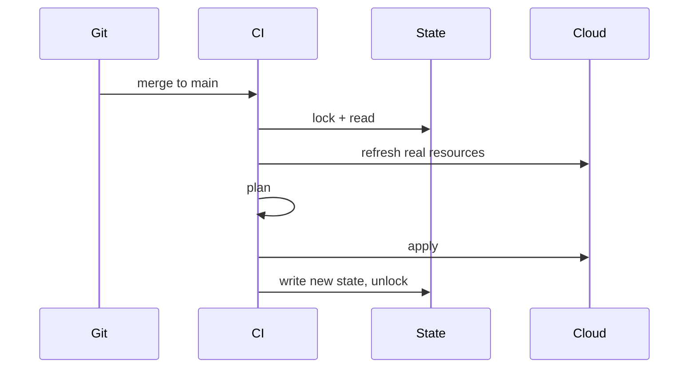

Clicking in a cloud console does not scale and does not review. The production VPC that "only Priya understands" is a **snowflake**: unique, undocumented, one bad click from an outage. **Infrastructure as Code** makes the network, IAM, and databases the same as application code: files in git, reviewed, repeatable.

> [!TIP]
> **ELI5: Lego instructions vs a pile of bricks**
> Imperative scripts are "put the red brick on the blue brick, then..." If a brick is already there, the script may glue a second one on top. Declarative IaC is the picture on the box: "this is the house." The tool looks at the table, looks at the picture, and only moves what is wrong.

## 1. Declarative vs imperative

**Imperative** (bash, Ansible playbooks in "run these steps" mode): you specify *how*. Order matters. Run twice, you may create two load balancers unless you wrote guards.

**Declarative** (Terraform, Pulumi, CloudFormation, CDK): you specify *what*. The tool computes a diff against recorded state and the real API.

```hcl
resource "aws_s3_bucket" "uploads" {
  bucket = "acme-prod-uploads"
}

resource "aws_s3_bucket_public_access_block" "uploads" {
  bucket                  = aws_s3_bucket.uploads.id
  block_public_acls       = true
  block_public_policy     = true
  ignore_public_acls      = true
  restrict_public_buckets = true
}
```

Apply this 1 time or 100 times: one bucket, public access blocked. That is **idempotence**.

Ansible is still useful for *configuring a VM you already have* (write a file, restart systemd). For "create the VM, the subnet, the DNS record," Terraform/Pulumi is the default. If every app is a container, you need less Ansible than in 2015.

## 2. Terraform's real lifecycle

```bash
terraform init    # download providers, configure backend
terraform plan    # read state + cloud APIs, print the diff
terraform apply   # ask you to confirm, then call APIs
terraform destroy # the scary one
```

**State** is a JSON file mapping `aws_s3_bucket.uploads` → the real bucket id. Terraform *must* have this to know what it already created. Lose state, and the next apply tries to create duplicates — or you import by hand for a week.

Store state in a remote backend (S3 + DynamoDB lock, Terraform Cloud, GCS). **Never** commit `terraform.tfstate` — it contains resource IDs and sometimes secrets.

**Locking** prevents two applies at once. Without a lock, two CI jobs can corrupt state.



`plan` in CI on every pull request is the actual product. Humans review the plan: "this will replace the database" is a conversation. `apply` on main, with protection against destroying prod.

> [!CAUTION]
> Some changes are **replace**, not update: changing a subnet CIDR, many RDS properties, a Launch Template that is immutable. Terraform will destroy then create. For a database, that is data loss unless you staged it. Read the plan for `must be replaced`.

## 3. Modules, workspaces, and environments

Copy-pasting 400 lines for staging and prod guarantees they drift. A **module** is a folder with variables in and outputs out:

```hcl
module "network" {
  source     = "./modules/vpc"
  cidr_block = "10.2.0.0/16"
  env        = "prod"
}
```

**One state per environment** (separate backends or workspaces used carefully). Do not keep prod and staging in one state file. A staging experiment should not lock or corrupt prod state.

Passing secrets: use the cloud's secret manager (AWS Secrets Manager, SSM, GCP Secret Manager) and pass **references**, or inject via CI OIDC. Do not put `password = "hunter2"` in git, even in `terraform.tfvars` if that file is committed. `*.tfvars` with secrets stays local or in the secret store.

## 4. Drift

Drift is reality moving without Terraform: someone opened the console and opened port 22 to the world. Next `plan` should show it. If your team still clicks in prod, either ban it (SCP / org policy) or you do not have IaC, you have a suggestion.

`terraform refresh` / the plan's refresh step re-reads APIs. Import existing resources (`terraform import`) when you adopt a snowflake account.

## 5. Terraform vs Pulumi vs cloud-native

| Tool | You write | Fits |
| :--- | :--- | :--- |
| **Terraform** | HCL | Multi-cloud, huge provider catalog, hiring pool |
| **OpenTofu** | HCL | Terraform fork, similar workflow |
| **Pulumi** | TypeScript/Go/Python | Want real languages, loops, tests |
| **CloudFormation / CDK** | YAML or CDK | AWS-only shops, official resource coverage |
| **Ansible** | YAML + SSH | Mutate OS on existing boxes |

Pick one per layer. Terraform for cloud objects, Kubernetes YAML/Helm/Kustomize for in-cluster objects, maybe a little Ansible for the bastion. Three tools managing the same security group is how you get fights.

## 6. A review checklist for an IaC PR

- Plan attached, not just the HCL.
- No `*` IAM unless justified.
- No public database, no `0.0.0.0/0` on SSH.
- State backend and lock present.
- Destroy/replace of stateful resources called out.
- Tags: `env`, `owner`, `service` so billing and cleanup work.

## What to remember

- Declarative IaC diffs desired vs recorded state. The state file is sacred.
- `plan` is the review artifact. Apply is mechanical.
- Remote state + lock, one state per environment, secrets out of git.
- Replaces can delete data. Read the plan.
- Console clicking creates drift. Treat the console as read-only in prod.
