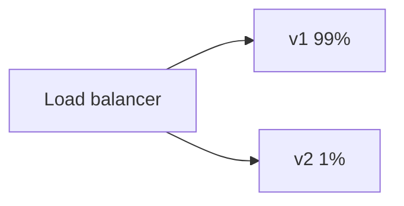

CI/CD is the path from a git push to running software, without a human SSHing to production. **CI** proves the change is not broken. **CD** puts it somewhere users can hit — with a button (delivery) or automatically (deployment).

If that path is manual, it is slow, it is done at 5pm on Fridays by the person who has the passwords, and it is skipped when people are scared. Automation makes deploys boring. Boring deploys are the goal.

> [!TIP]
> **ELI5: The factory line**
> CI is every car getting the same inspection the second the wheel is bolted on. If a bolt is missing, the line stops **now**, not after 10,000 cars. CD is the truck to the dealership. GitOps is the dealership ordering from a catalog (git) instead of a factory worker driving a truck into the store with a key to the stockroom.

## 1. Continuous Integration, concretely

On every pull request:

1. Check out the commit (not `main` plus local junk).
2. Install deps from the **lockfile**.
3. Lint, unit tests, build.
4. Optionally integration tests against ephemeral Postgres.
5. Fail the PR if any of that fails. Merge is blocked.

```yaml
# .github/workflows/ci.yml
name: ci
on:
  pull_request:
  push:
    branches: [main]

jobs:
  test:
    runs-on: ubuntu-latest
    services:
      postgres:
        image: postgres:16-alpine
        env:
          POSTGRES_PASSWORD: test
        ports: ["5432:5432"]
        options: >-
          --health-cmd="pg_isready"
          --health-interval=5s
    steps:
      - uses: actions/checkout@v4
      - uses: actions/setup-go@v5
        with:
          go-version-file: go.mod
          cache: true
      - run: go test ./...
      - run: go build -o bin/api ./cmd/api
```

Properties that matter:

- **Hermetic.** Same result on a laptop and in CI. Pin tool versions.
- **Fast.** 20 minutes of tests trains people to ignore CI. Parallelize, cache, and keep unit tests off the network.
- **On the right commit.** Test the merge SHA, not "whatever was on the runner."

CI also builds the **artifact**: a Docker image tagged with the git SHA, not `latest`. `myapp:a1b2c3d` can be rolled back. `myapp:latest` cannot, because you overwrote it.

```bash
docker build -t ghcr.io/acme/api:${GITHUB_SHA} .
docker push ghcr.io/acme/api:${GITHUB_SHA}
```

## 2. Delivery vs deployment

**Continuous delivery:** main is always *deployable*. A human (or a protected environment) clicks Deploy to prod after looking at the changelog.

**Continuous deployment:** every green main commit goes to prod. This needs tests you trust, instant rollback, and feature flags for unfinished work.

Neither is "we merge and Dave runs a script from memory."

## 3. How the new version actually replaces the old

**Rolling.** Replace instances a few at a time. Default in Kubernetes Deployments. Needs the new version to run next to the old (migrations must be compatible with both).

**Blue-green.** Two full fleets. Switch the load balancer. Instant rollback (switch back). Double compute cost during the cut.

**Canary.** Send 1% of traffic to v2, watch error rate and latency, then 10%, 50%, 100%. Needs metrics that are actually about *that* version (see observability). If you cannot measure, a canary is theater.



**Expand/contract migrations.** Deploy code that can read the new schema, migrate, then deploy code that writes it. Never "stop the world, ALTER TABLE, pray" on a large table without a plan.

> [!WARNING]
> A deploy that runs `ALTER TABLE users ADD COLUMN ... NOT NULL` without a default will lock the table and take the site down. Schema changes are part of CD, not a side quest.

**Feature flags** decouple "code is in production" from "users see it." That is how continuous deployment stays sane.

## 4. GitOps: pull, don't push

Push CD: GitHub Actions has a kubeconfig (or `aws eks update-kubeconfig`) and runs `kubectl apply`. The CI runner is now a production admin. Steal the GitHub org, steal the cluster.

**GitOps** (Argo CD, Flux):

1. A repo holds desired manifests (`apps/prod/api.yaml` image tag `a1b2c3d`).
2. CI only **pushes an image** and **opens a PR / commits the tag** in that repo.
3. A controller **inside** the cluster watches git, diffs, and applies.
4. If a human kubectl-ed a change, the controller reverts it (or alerts on drift).

The cluster pulls. Credentials to change prod are not in GitHub secrets; the controller's ServiceAccount can only talk to its own API server. Git history is the audit log of what prod was supposed to be.

You still need promotion: PR from `staging` values to `prod` values, or separate folders with human approval.

## 5. What a production pipeline looks like end-to-end

```text
PR → lint/test → merge to main
  → build image :sha → push registry
  → update staging manifest → Argo syncs staging
  → smoke test / integration
  → PR or auto-promote prod manifest
  → canary → metrics → full
```

Fail any step, stop. Roll back by reverting the manifest to the previous SHA (GitOps) or by pointing the Deployment at the previous tag. Practice rollback on a quiet day. An untested rollback is not a rollback plan.

## What to remember

- CI is a reproducible test+build on every change. Artifacts are immutable SHA tags.
- Delivery = always deployable. Deployment = it actually went out.
- Rolling needs compatible deploys. Canary needs metrics. Blue-green needs spare capacity.
- GitOps pulls from git; CI should not hold cluster-admin keys.
- Schema changes and flags are part of the pipeline, not afterthoughts.
