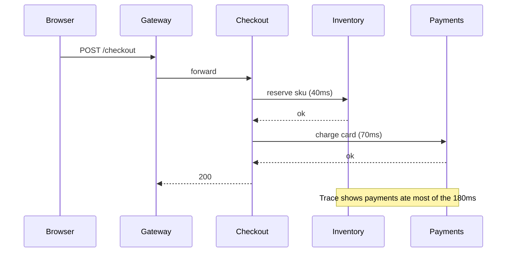

Monitoring tells you the disk is 90% full because you predicted that graph would matter. **Observability** is being able to ask a new question at 3am — "which tenant's queries just got slow?" — without shipping new code first.

In a monolith, you open one log file. In a system of 20 services, one click becomes a tree of RPCs. Without correlated **logs, metrics, and traces**, you are guessing.

> [!TIP]
> **ELI5: The hospital**
> **Metrics** are the vital signs board: heart rate 180. You know something is wrong, not why. **Logs** are the nurse's notes: "patient vomited at 14:02." **Traces** are the full chart of one visit: ER → x-ray → pharmacy, with timestamps, so you see x-ray took 47 minutes. You need all three. Paging a doctor for every slightly elevated pulse is how they stop answering the phone (**alert fatigue**).

## 1. SLIs, SLOs, and why dashboards are not the goal

An **SLI** (service level indicator) is a number that *is* the user experience:

- Availability: `successful requests / total` (exclude 4xx that are the client's fault if you are honest).
- Latency: p50 / p95 / p99 of `POST /checkout`.
- Freshness: how old is the search index.

An **SLO** is the target: `99.9% of checkout requests succeed in < 300ms over 30 days`. The remainder is the **error budget**. If you have burned the budget, you stop shipping features and fix reliability. If you never burn it, your SLO is too loose or you are over-investing.

Monitor SLIs. CPU is a **diagnostic** metric: useful after you know users are hurting, noisy as a page.

Two practical method names:

- **RED** (for request-driven services): Rate, Errors, Duration.
- **USE** (for machines): Utilization, Saturation, Errors.

A useful service dashboard is RED for the service plus its dependencies (DB pool saturation, queue depth). Not 80 unlabeled Grafana panels.

## 2. Metrics: cheap, numeric, dangerous at high cardinality

A metric is a named number, often with labels: `http_requests_total{path="/checkout", code="200"}`. Prometheus scrapes `/metrics`; Grafana graphs; Alertmanager pages.

**Cardinality** is the number of unique label combinations. `path` with `/users/12345` as a label will create millions of series, blow up Prometheus memory, and make every query slow. Label **bounded** sets: status class, route template (`/users/:id`), region, version.

```text
# good
http_request_duration_seconds_bucket{route="/checkout", code="200", le="0.3"}

# disaster
http_request_duration_seconds_bucket{user_id="99821", url="/checkout?foo=..."}
```

Counters vs gauges vs histograms: use a **histogram** (or exponential histogram) for latency so you can compute p99. Averaging CPU is fine as a gauge. Never average latency across hosts without a histogram — you will hide the slow tail.

## 3. Logs: one event, structured, with an id

A log line is a discrete event. In production, log **JSON**, not a unique snowflake format per service.

```json
{
  "ts": "2026-04-15T02:11:03.441Z",
  "level": "error",
  "msg": "checkout failed",
  "service": "checkout",
  "trace_id": "4bf92f3577b34da6",
  "order_id": "ord_9f3",
  "err": "inventory 503"
}
```

Then you can query `trace_id` or `order_id` in Loki, Elasticsearch, or Cloud Logging.

Rules that keep logs useful:

- **INFO** for requests you need to audit; **ERROR** for failures you would page on; do not `INFO` every loop iteration.
- Do not log passwords, tokens, full credit cards, or PII you cannot justify. Logs leak.
- Attach `trace_id` so a log is a click away from a trace.
- Ship stdout; let the platform (agent, sidecar, Cloud Logging) tail it. Do not write a custom UDP syslog client unless you have to.

## 4. Traces: one request across services

A **trace** is a tree of **spans**. Each span is a timed operation: `HTTP GET /checkout`, `sql SELECT inventory`, `redis GET cart`.



When checkout is slow, the trace shows **which child** ate the time. That is the difference between "optimize the API" and "the inventory DB is sitting on a table lock."

**OpenTelemetry** is the API you instrument with. Your code calls OTel; a **collector** exports to Jaeger, Tempo, Honeycomb, Datadog, whatever. Swapping vendors should not mean rewriting spans.

You do not need to span every function. You need: inbound HTTP, outbound HTTP, DB, queue produce/consume, and the few internal operations you already suspect.

Propagation: the first service generates `traceparent` (W3C) and every downstream must forward it. If one "helpful" proxy strips unknown headers, the trace breaks in half.

## 5. Alerts that people will still answer

Page a human only when **users are in pain** and **a person can do something**.

| Page | Do not page |
| :--- | :--- |
| Checkout success SLO burning fast | CPU > 70% on one instance |
| Error rate 5xx > 2% for 5 minutes | Disk 60% |
| Queue lag growing for 15 minutes, workers dead | A single pod restarted |
| TLS cert expires in 3 days | p50 latency +2ms |

Symptoms, not causes. "p99 latency high" is a symptom; "CPU high" is a cause you look at after.

**Alert fatigue** is an outage multiplier. If the channel fires 40 times a day, the 41st is the real incident and nobody will believe it. Delete or demote to a ticket/Slack that is not a phone call.

On-call: runbooks linked from the alert (`what is this, how to check, how to mitigate`). PagerDuty/Opsgenie for routing; a weekly **review of pages** to kill the noisy ones.

## 6. A debugging order that works

1. **Are users failing?** Look at RED / SLO, not a random host.
2. **Which service?** Trace a failed or slow request; find the long span or the 5xx.
3. **Which instance / version / tenant?** Metrics with a `version` label catch bad canaries.
4. **Why?** Logs for that `trace_id`. Then profiling, query plans, saturation (USE).

If you start in `kubectl logs` on a random pod, you will get there in 45 minutes instead of 5.

## What to remember

- SLIs are user-facing. SLOs give you an error budget. CPU graphs are supporting evidence.
- Metrics need bounded labels. Logs need structure and a trace id. Traces need header propagation.
- OpenTelemetry is the instrumentation; the backend is swappable.
- Page on symptoms with a runbook. Kill noisy alerts or on-call will mute you in their head.
