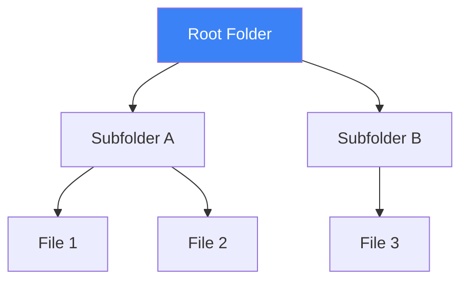

A **Tree** is a non-linear data structure that represents a **hierarchy**. It consists of **Nodes** connected by **Edges**, starting from a single node called the **Root**.

---

## 1. The Intuition: "A Filing System"

Imagine the **Folders on your computer**.
1. There is one main folder at the top (the **Root**, e.g., `C:` or `/`).
2. Inside that folder are other folders (**Children**).
3. Those folders can contain even more folders (**Sub-folders**) or files (**Leaves**).
4. No matter how many folders you have, if you follow the path upwards, you always end up at the same Root. (**Hierarchical Structure**)



---

## 2. Common Tree Types

| Type | Rule | Use Case |
| :--- | :--- | :--- |
| **Binary Tree** | Each node has at most **2** children. | General hierarchical data. |
| **Binary Search Tree (BST)** | Left child < Parent < Right child. | Fast searching and sorting. |
| **Balanced Tree** | The height of left and right subtrees is roughly equal. | Guarantees O(log n) speed (e.g., AVL, Red-Black). |

---

## 3. Key Operations & Complexity (BST)

| Operation | Average | Worst Case | Note |
| :--- | :--- | :--- | :--- |
| **Search** | O(log n) | O(n) | O(log n) requires a balanced tree. |
| **Insert** | O(log n) | O(n) | Path from root to leaf. |
| **Delete** | O(log n) | O(n) | More complex; requires re-linking. |

> [!TIP]
> **The Degenerate Case**: If you insert numbers into a BST in sorted order (1, 2, 3...), the tree becomes a single long line (like a Linked List), and performance drops to **O(n)**. This is why balanced trees are used in real-world databases.

---

## 4. Multi-Language Implementation (BST Node)

```language-code-tabs
[
  {
    "label": "Javascript",
    "language": "javascript",
    "code": "class Node {\n  constructor(val) {\n    this.val = val;\n    this.left = null;\n    this.right = null;\n  }\n}"
  },
  {
    "label": "Python",
    "language": "python",
    "code": "class Node:\n    def __init__(self, val):\n        self.val = val\n        self.left = None\n        self.right = None"
  },
  {
    "label": "Java",
    "language": "java",
    "code": "class Node {\n    int val;\n    Node left, right;\n    Node(int x) { val = x; }\n}"
  },
  {
    "label": "C++",
    "language": "cpp",
    "code": "struct Node {\n    int val;\n    Node *left, *right;\n    Node(int x) : val(x), left(nullptr), right(nullptr) {}\n};"
  }
]
```

---

## 5. Interview Pro-Tips

### Recursion is Your Best Friend
Trees are **Recursive** by nature (every child of a tree is itself the root of a smaller tree). 90% of tree interview questions can be solved with a simple recursive function that handles the "Root," "Left Child," and "Right Child."

### Know Your Traversals
Interviewers frequently ask you to visit nodes in a specific order:
- **In-Order** (Left, Root, Right): Returns items in **sorted order** for a BST.
- **Pre-Order** (Root, Left, Right): Used for creating a copy of a tree.
- **Post-Order** (Left, Right, Root): Used for deleting nodes or evaluating math expressions.
- **Level-Order** (Top-down, layer by layer): Uses a **Queue** (BFS).

### Identify the "Balanced" Requirement
If an interviewer asks for O(log n) performance on a dynamic set of data, they are hinting at a Balanced Tree. Mentioning **AVL Trees** or **Red-Black Trees** shows you know how real systems (like the Linux kernel or Java's `TreeMap`) stay fast.

### What Interviewers Are Testing
- Can you write clean recursive code?
- Do you understand the BST property?
- Can you traverse a tree level-by-level using a Queue?

---

## Key Takeaway

Trees are the master of **sorted, hierarchical data**. They provide a perfect compromise between the lightning-fast searching of a sorted array and the effortless insertion of a linked list.
