A **Graph** is a non-linear data structure that represents **relationships**. It consists of **Vertices** (nodes) connected by **Edges**. Graphs are the most flexible and powerful data structure because they can model almost anything in the real world.

---

## 1. The Intuition: "A Social Network"

Imagine **LinkedIn**.
1. Each person is a **Vertex** (a node).
2. If two people are "connected," there is an **Edge** between them.
3. If I can only see your profile but you can't see mine, that's a **Directed Edge** (an arrow). If we are mutual connections, that's an **Undirected Edge** (a line).
4. If some connections are "closer" than others (like "Family" vs. "Acquaintance"), we can add a **Weight** to the edge. (**Weighted Graph**)

```mermaid
graph LR
    subgraph Undirected ["Undirected (Mutual)"]
    A((Alice)) --- B((Bob))
    B --- C((Charlie))
    end
    
    subgraph Directed ["Directed (Following)"]
    D((Dave)) --> E((Eve))
    E --> F((Frank))
    end
    
    style Undirected fill:#1a1a1a,stroke:#333
    style Directed fill:#1a1a1a,stroke:#333
```



---

## 2. How we store Graphs

| Method | Representation | Best Case | Worst Case |
| :--- | :--- | :--- | :--- |
| **Adjacency List** | A Map where each node lists its neighbors. | Memory efficient for "sparse" graphs. | Slow to check if a *specific* edge exists. |
| **Adjacency Matrix** | A 2D grid where `grid[i][j]` is 1 if an edge exists. | Instant edge check. | Very memory-hungry (uses $V^2$ space). |

---

## 3. Key Operations & Complexity

| Operation | Adjacency List | Adjacency Matrix |
| :--- | :--- | :--- |
| **Add Vertex** | O(1) | O(V²) |
| **Add Edge** | O(1) | O(1) |
| **Check Edge** | O(V) | O(1) |
| **Traverse All** | O(V + E) | O(V²) |

---

## 4. Multi-Language Implementation (Adjacency List)

```language-code-tabs
[
  {
    "label": "Javascript",
    "language": "javascript",
    "code": "const graph = {\n  0: [1, 2],\n  1: [2],\n  2: [0, 3],\n  3: [3]\n};\n\n// Finding neighbors of node 2\nconsole.log(graph[2]); // [0, 3]"
  },
  {
    "label": "Python",
    "language": "python",
    "code": "from collections import defaultdict\ngraph = defaultdict(list)\n\ndef add_edge(u, v):\n    graph[u].append(v)\n\nadd_edge(0, 1)"
  },
  {
    "label": "Java",
    "language": "java",
    "code": "Map<Integer, List<Integer>> adjList = new HashMap<>();\nvoid addEdge(int u, int v) {\n    adjList.computeIfAbsent(u, k -> new ArrayList<>()).add(v);\n}"
  },
  {
    "label": "C++",
    "language": "cpp",
    "code": "#include <vector>\n#include <unordered_map>\nunordered_map<int, vector<int>> adj;\nvoid addEdge(int u, int v) {\n    adj[u].push_back(v);\n}"
  }
]
```

---

## 5. Interview Pro-Tips

### BFS vs. DFS: The Golden Rule
- **BFS (Breadth-First Search)**: Uses a **Queue**. Best for finding the **shortest path** in an unweighted graph (e.g., "What's the fewest literal steps from A to B?").
- **DFS (Depth-First Search)**: Uses a **Stack** or recursion. Best for **exploring every path**, detecting cycles, or solving puzzles (e.g., "Is there *any* way to get from A to B?").

### Don't Forget the `visited` Set
Graphs can have **Cycles** (loops). If you don't keep track of which nodes you've already seen using a `Set` or `visited` array, your code will get stuck in an infinite loop forever. This is the most common graph coding error!

### Matrix-based Graphs
Many interview problems don't give you an explicit graph object. Instead, they give you a **2D Grid** (like a map or a game board). In these cases, every cell $(r, c)$ is a Vertex, and its neighbors are the cells above, below, left, and right. You can run BFS/DFS directly on the grid.

### What Interviewers Are Testing
- Can you traverse a graph without getting stuck in a cycle?
- Do you know which algorithm (BFS vs. DFS) fits the specific question?
- Can you model a real-world problem (like "finding a friendship path") as a graph?

---

## Key Takeaway

Graphs are the **superstructure** of data. They are messy, complex, and nonlinear, but they are the only way to model the trillions of interconnected relationships that make up our world.
