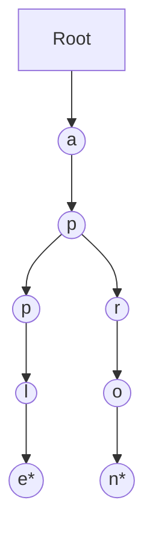

A **Trie** (pronounced "try") is a specialized tree data structure used for storing strings. It is optimized for **prefix searching**, making it the engine behind every search bar's autocomplete feature.

---

## 1. The Intuition: "Autocomplete"

Imagine you are typing in a search bar.
1. When you type **"a"**, the search engine doesn't look at every word in the dictionary. It goest to the "a" branch.
2. When you type **"ap"**, it follows the path from "a" to "p".
3. Now it only sees words like **"apple"**, **"apply"**, or **"apron"**.
4. By following a path of letters, the Trie instantly narrows down billions of possibilities to a handful of words. (**O(L) Search**, where L is word length)

---

## 2. Trie Structure

Unlike a Binary Tree, a Trie node can have many children (usually one for each letter of the alphabet).
- **Nodes**: Do not store letters. Instead, the **Edge** connecting two nodes represents a character.
- **End of Word Flag**: A boolean flag (e.g., `isEndOfWord`) marks whether a complete word ends at that node.


*Nodes with `*` indicate the end of a word ("apple", "apron").*

---

## 3. Key Operations & Complexity

| Operation | Time Complexity | Why? |
| :--- | :--- | :--- |
| **Insert** | O(L) | You follow the path for each letter in the word. |
| **Search** | O(L) | You follow the path. If you hit `null`, word doesn't exist. |
| **StartsWith**| O(L) | Similar to search, but you don't check the `isEndOfWord` flag. |

---

## 4. Multi-Language Implementation (Insert Logic)

```language-code-tabs
[
  {
    "label": "Javascript",
    "language": "javascript",
    "code": "class TrieNode {\n  constructor() {\n    this.children = {};\n    this.isEndOfWord = false;\n  }\n}\n\nfunction insert(root, word) {\n  let curr = root;\n  for (let char of word) {\n    if (!curr.children[char]) {\n      curr.children[char] = new TrieNode();\n    }\n    curr = curr.children[char];\n  }\n  curr.isEndOfWord = true;\n}"
  },
  {
    "label": "Python",
    "language": "python",
    "code": "class TrieNode:\n    def __init__(self):\n        self.children = {}\n        self.is_end = False\n\ndef insert(root, word):\n    curr = root\n    for char in word:\n        if char not in curr.children:\n            curr.children[char] = TrieNode()\n        curr = curr.children[char]\n    curr.is_end = True"
  },
  {
    "label": "Java",
    "language": "java",
    "code": "class TrieNode {\n    Map<Character, TrieNode> children = new HashMap<>();\n    boolean isEndOfWord;\n}\n\nvoid insert(String word) {\n    TrieNode curr = root;\n    for (char c : word.toCharArray()) {\n        curr.children.putIfAbsent(c, new TrieNode());\n        curr = curr.children.get(c);\n    }\n    curr.isEndOfWord = true;\n}"
  }
]
```

---

## 5. Interview Pro-Tips

### Trie vs. Hash Map
A Hash Map can tell you if a word exists in **O(1)**. A Trie takes **O(L)**. So why use a Trie?
1. **Prefix Search**: Hash Maps can't efficiently find all words starting with "abc". Tries excel at this.
2. **Space Efficiency**: If you have thousands of words starting with "inter" (internet, internal, international), a Trie stores "inter" **once**. A Hash Map stores it for every single word.

### The "Wildcard" Search
A common Trie variant is searching for words with a "." (meaning any character). To solve this, you use **DFS** (recursion). If you hit a ".", you must recursively search *all* children of the current node.

### Bitwise Trie
Tries aren't just for strings! You can build a Trie using bits (0 and 1) to solve advanced binary problems like "Find the Maximum XOR of two numbers in an array."

### What Interviewers Are Testing
- Can you implement the nested `children` structure?
- Do you understand the difference between `search` (match whole word) and `startsWith` (match prefix)?
- Can you reason about memory vs. speed trade-offs?

---

## Key Takeaway

Tries are the **specialists**. They are the single best tool for any problem involving strings and prefixes, turning massive dictionary searches into simple walks down a tree.
