In most programming languages, a **String** is more than just a piece of text—it is a specialized data structure, often implemented as an **Array of Characters**. Understanding how strings are handled in memory is the key to passing many coding interviews.

---

## 1. The Core Concept: "Immutability"

In languages like **Java**, **Python**, and **Javascript**, strings are **Immutable**.
- Once a string is created, it **cannot be changed**.
- If you do something like `str = str + "!"`, you aren't changing the original string. Instead, the computer creates a **brand new string** in memory and points your variable to it.
- Doing this inside a loop is a common way to accidentally create **O(n²)** performance bugs!

```mermaid
graph LR
    subgraph StringMem ["String in Memory: 'HELLO'"]
    H[H] --- E[E] --- L1[L] --- L2[L] --- O[O]
    end
    style StringMem fill:#1a1a1a,stroke:#333
    style H fill:#8b5cf6,color:#fff
    style E fill:#8b5cf6,color:#fff
    style L1 fill:#8b5cf6,color:#fff
    style L2 fill:#8b5cf6,color:#fff
    style O fill:#8b5cf6,color:#fff
```



---

## 2. String Complexity

| Operation | Time Complexity | Note |
| :--- | :--- | :--- |
| **Access Item** | O(1) | Just like an array. |
| **Length** | O(1) | Usually stored as metadata. |
| **Concatenation** | O(n + m) | Requires copying both strings into a new block. |
| **Substring** | O(k) | Creating a new string of length k. |

---

## 3. String Manipulation: The "Builder" Pattern

Because of immutability, concatenating strings in a loop is slow. The solution is to use a **Mutable Buffer**.

```language-code-tabs
[
  {
    "label": "Javascript",
    "language": "javascript",
    "code": "// Use an Array and join at the end\nconst parts = [];\nfor (let i = 0; i < 100; i++) {\n  parts.push(i);\n}\nconst result = parts.join(\"\");"
  },
  {
    "label": "Python",
    "language": "python",
    "code": "# Use a list and join\nparts = []\nfor i in range(100):\n    parts.append(str(i))\nresult = \"\".join(parts)"
  },
  {
    "label": "Java",
    "language": "java",
    "code": "// Use StringBuilder\nStringBuilder sb = new StringBuilder();\nfor (int i = 0; i < 100; i++) {\n    sb.append(i);\n}\nString result = sb.toString();"
  }
]
```

---

## 4. Interview Pro-Tips

### The "Anaylsis" Pattern (Hash Maps)
Almost every "Anagram" or "Frequency" problem is solved by counting string characters in a **Hash Map** (or an array of size 26 for alphabets).
- "Are these two strings anagrams?" -> Do they have the same character counts?

### The "Two Pointers" Strategy
Problems like **Reverse a String** or **Check if Palindrome** are best solved with two pointers—one at the start and one at the end, moving towards the middle. This uses **O(1) extra space**.

### String Searching Algorithms
For basic interviews, knowing `indexOf()` is enough. For advanced roles, being aware of **KMP (Knuth-Morris-Pratt)** or **Rabin-Karp** (which uses hashing to find substrings) will set you apart.

### Sliding Window
If a problem asks for the "Longest substring without repeating characters," you should immediately think **Sliding Window**. You use two pointers to define a "window" of the string and grow/shrink it as you move along.

### What Interviewers Are Testing
- Do you understand the cost of string immutability?
- Can you solve manipulation problems in-place (if the language allows, like C++)?
- Do you know when to use a StringBuilder or a list join?

---

## Key Takeaway

Strings are the **interface** of software. While they look like simple text, treating them as immutable arrays will help you write code that is both clean and performant.
