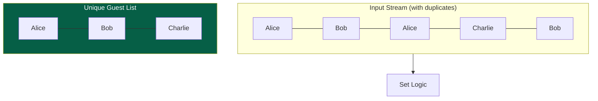

A **Set** is a collection of **Unique** elements. Unlike an array or list, a set does not allow duplicate values and typically does not maintain a specific order.

---

## 1. The Intuition: "A Guest List"

Imagine a **Party Guest List**.
1. You only want every person's name on the list **once**. If Bob tries to sign in twice, you ignore the second entry. (**Uniqueness**)
2. You don't necessarily care about the order people arrived in; you just care *if* they are on the list or not. (**Membership**)
3. To check if "Alice" is at the party, you don't want to read the whole list from top to bottom. You want to know instantly. (**O(1) Average Search**)



---

## 2. Common Set Types

| Type | Implementation | Pros | Cons |
| :--- | :--- | :--- | :--- |
| **Hash Set** | Uses a Hash Table. | Super fast O(1) ops. | Random/No order. |
| **Tree Set** | Uses a Balanced BST. | Items are **always sorted**. | Slower O(log n) ops. |
| **Linked Hash Set**| Hash Table + Linked List. | Maintains **Insertion Order**. | Uses more memory. |

---

## 3. Key Operations & Complexity (Hash Set)

| Operation | Time Complexity | Note |
| :--- | :--- | :--- |
| **Add** | O(1) | Ignores if item already exists. |
| **Remove** | O(1) | Removes item if present. |
| **Contains** | O(1) | The most common use case. |
| **Size** | O(1) | Count of unique items. |

---

## 4. Multi-Language Implementation

```language-code-tabs
[
  {
    "label": "Javascript",
    "language": "javascript",
    "code": "const mySet = new Set();\nmySet.add(1); // Add\nmySet.has(1); // Contains (true)\nmySet.delete(1); // Remove"
  },
  {
    "label": "Python",
    "language": "python",
    "code": "my_set = set()\nmy_set.add(1) # Add\n1 in my_set   # Contains (True)\nmy_set.remove(1) # Remove"
  },
  {
    "label": "Java",
    "language": "java",
    "code": "HashSet<Integer> set = new HashSet<>();\nset.add(1);\nset.contains(1);\nset.remove(1);"
  },
  {
    "label": "C++",
    "language": "cpp",
    "code": "#include <unordered_set>\nstd::unordered_set<int> set;\nset.insert(1);\nset.count(1); // Contains (1) or (0)\nset.erase(1);"
  }
]
```

---

## 5. Interview Pro-Tips

### The "Duplicates" Filter
If an interview question asks you to "find the number of unique elements" or "remove duplicates from an array," your brain should immediately think: **"Throw it into a Set."**

### Membership Testing vs. Array Searching
Finding if an item exists in an Array is **O(n)**. Finding it in a Set is **O(1)**. Always use a Set (or a Hash Map) if you need to perform multiple lookups against a large dataset.

### Set Operations: Union, Intersection, Difference
Sets are powerful for comparing two collections:
- **Intersection**: Which items exist in **both** lists?
- **Union**: What is the combined list of **unique** items from both?
- **Difference**: Which items are in List A but **not** in List B?

### What Interviewers Are Testing
- Do you understand that Sets are for **uniqueness**?
- Can you explain why a HashSet is faster than a TreeSet?
- Do you know the O(1) vs. O(n) trade-off between Sets and Arrays?

---

## Key Takeaway

Sets are the **gatekeepers** of data. They are the simplest tool for handling uniqueness and for performing lightning-fast membership checks in complex algorithms.
