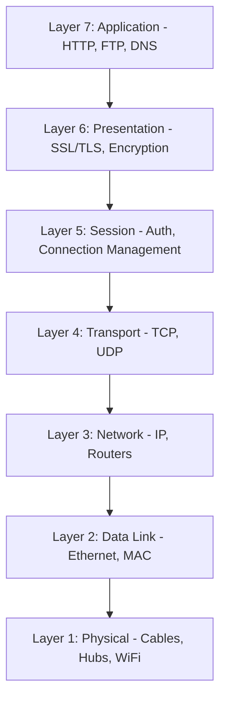

Computer networking is a multi-layered system of protocols that allow different machines to talk to each other. The industry standard tool for understanding this is the **OSI (Open Systems Interconnection) Model**.

## The 7 Layers of OSI

While modern web developers mostly work at Layer 7, understanding the full stack is vital for debugging performance and security issues.

###  OSI Model Diagram

---

## Breakdown by Layer

### Layer 1: Physical
The actual hardware that transmits raw bits (0s and 1s). 
- **Examples**: Fiber optic cables, WiFi radio waves, RJ45 cables.

### Layer 2: Data Link
Transfers data between two nodes connected to the same network.
- **Key Concept**: MAC Address.
- **Examples**: Ethernet, Switches.

### Layer 3: Network
Responsible for routing packets across different networks (the "Internet").
- **Key Concept**: IP Address, Routing tables.
- **Examples**: IP (IPv4/IPv6), ICMP.

### Layer 4: Transport
Ensures that data is delivered reliably and in the correct order.
- **Key Concept**: Port numbers, Handshakes.
- **Examples**: [TCP and UDP](./002-tcp-udp-dns).

### Layer 5: Session
Manages the start, stop, and restart of connections.
- **Examples**: RPC, Sockets.

### Layer 6: Presentation
Handles the translation of data between the application and the network (Encryption and Compression).
- **Examples**: **SSL/TLS**, JPEG, ASCII.

### Layer 7: Application
The layer that interacts directly with the user.
- **Examples**: **HTTP/HTTPS**, DNS, FTP, SMTP.

## Why this matters for Interviews
In a system design interview, if someone asks "How does a browser load a page?", they are asking you to traverse the OSI model from Layer 7 (HTTP request) down to Layer 3 (IP routing) and Layer 4 (TCP handshake).
