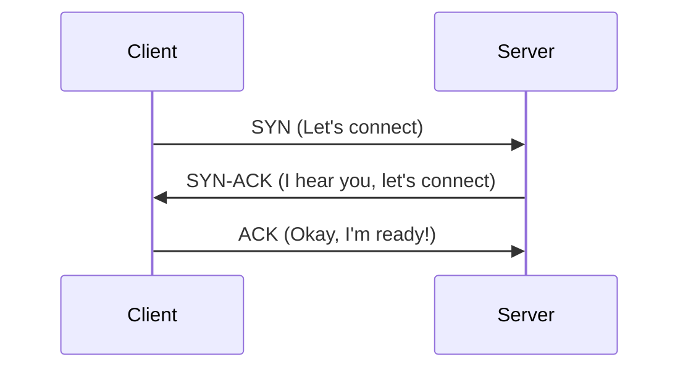

# TCP, UDP, and DNS

These are the three most important protocols at the heart of the modern internet.

## 1. TCP (Transmission Control Protocol)

TCP is **connection-oriented** and **reliable**. It ensures that every packet sent arrives safely and in the correct order.

### The 3-Way Handshake
Before data can be sent, a connection must be established:
1. **SYN**: Client sends a "Synchronize" request.
2. **SYN-ACK**: Server acknowledges and sends its own "Synchronize" request.
3. **ACK**: Client acknowledges the server.

###  TCP Handshake Diagram

- **Pros**: Reliability, error correction, packet ordering.
- **Cons**: High latency (due to handshakes and ACKs).
- **Use Case**: Web browsing (HTTP/HTTPS), Email, File transfer.

---

## 2. UDP (User Datagram Protocol)

UDP is **connectionless** and **unreliable**. It sends packets without checking if they arrive.

- **Pros**: incredibly fast, low overhead.
- **Cons**: Packets can be lost or arrive out of order.
- **Use Case**: Voice/Video calls (it's better to lose a millisecond of audio than to pause and wait), Online gaming, Live streaming.

| Feature | TCP | UDP |
| :--- | :--- | :--- |
| **Reliability** | Guaranteed | None |
| **Speed** | Slower | Faster |
| **Handshake** | Yes (3-way) | No |
| **Ordering** | Maintains order | No order |

---

## 3. DNS (Domain Name System)

DNS is the "Phonebook of the Web." It translates human-readable domain names (e.g., `google.com`) into IP addresses (e.g., `142.250.190.46`).

### The DNS Lifecycle
1. **Recursion**: Your computer asks a Recursive Resolver (usually your ISP).
2. **Root Servers**: Resolver asks the Root where `.com` is.
3. **TLD Servers**: Resolver asks the `.com` TLD where `google.com` is.
4. **Authoritative Servers**: Resolver asks the final authority for the actual IP.
5. **Caching**: The result is cached at multiple levels (Browser, OS, ISP) for future speed.

> **Interview Tip**: If asked "What happens when you type a URL?", explain both the **DNS resolution** (getting the IP) and the **TCP handshake** (setting up the pipe) before any HTTP data is even sent.
