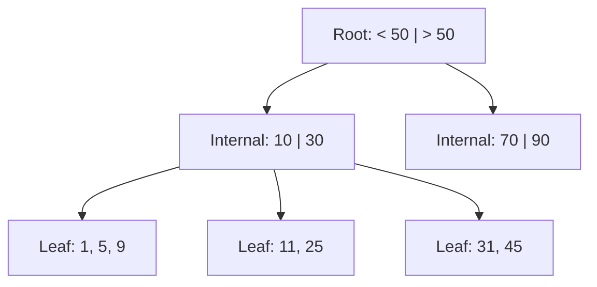

# Database Indexing Internals

An index is a data structure that improves the speed of data retrieval operations on a database table at the cost of additional storage and slower writes.

## 1. B-Tree (Balanced Tree)

The standard index structure for most RDBMS (SQL) like PostgreSQL and MySQL.

- **How it works**: A B-Tree keeps data sorted and allows for binary-style searches, insertions, and deletions in **O(log n)** time. It is optimized for systems that read and write large blocks of data.
- **Pros**: Excellent for range queries (`WHERE age > 18`) and point lookups.
- **Structure**:
  - **Root Node**: Top level.
  - **Internal Nodes**: Pointers to other nodes.
  - **Leaf Nodes**: The actual data or pointers to the actual data.

###  B-Tree Diagram

---

## 2. LSM Tree (Log-Structured Merge-Tree)

Commonly used in NoSQL databases like Cassandra, LevelDB, and RocksDB.

- **How it works**: Instead of modifying data in place, LSM Trees append all changes to a log (**Memtable** in memory). Once the log is full, it's flushed to disk as an **SSTable** (Sorted String Table). Background processes then "merge" and "compact" these tables.
- **Pros**: Extremely fast **Write** performance (writes are just sequential appends).
- **Cons**: Slower **Read** performance (might have to check multiple SSTables).

---

## 3. Clustered vs. Non-Clustered Indexes

### Clustered Index
- Determines the physical order of data in the table.
- A table can have only **one** clustered index (usually the Primary Key).
- Searching is faster because data is right there in the leaf node.

### Non-Clustered Index
- A separate structure from the data rows. It contains a pointer to the actual data location.
- You can have multiple non-clustered indexes.

## 4. Compound (Composite) Indexes
An index on multiple columns (e.g., `INDEX (last_name, first_name)`).

- **Left-Prefix Rule**: This index works for `(last_name)` and `(last_name, first_name)`, but it **cannot** be used for just `(first_name)`.

> **Interview Pro-Tip**: If you're asked how to speed up a slow query, discuss **Index Selectivity**. High selectivity (like a primary key) is good; low selectivity (like a "gender" column) is often useless as an index.
