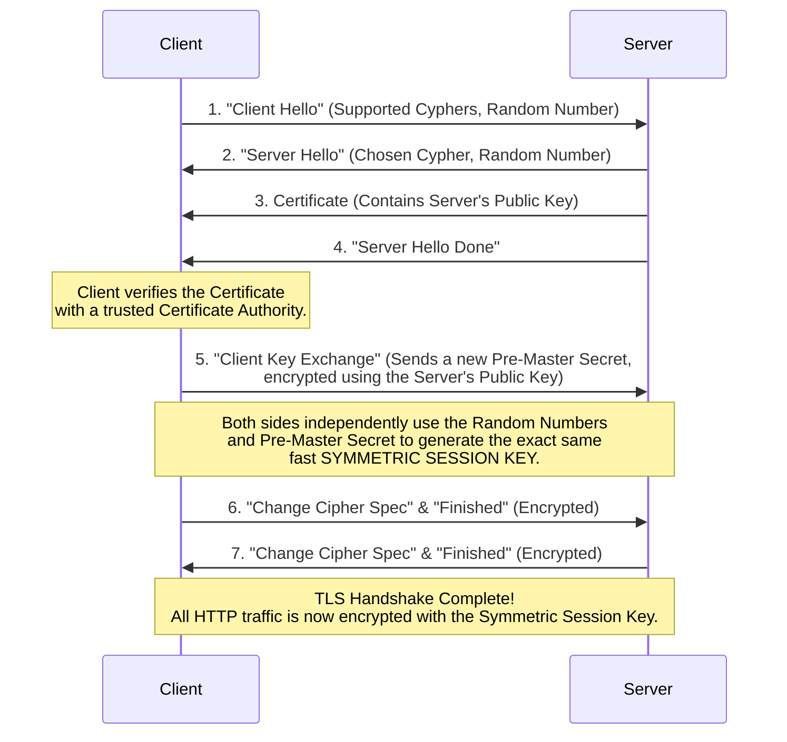

In the early days of the internet, all web traffic was sent via **HTTP** in plain text. If you typed your password into a website, the password traveled across the internet exactly as you typed it. 

If anyone intercepted the traffic (e.g., a hacker on the same public Starbucks Wi-Fi, or a rogue ISP), they could read everything you were sending.

To solve this, engineers created **HTTPS (HTTP Secure)**, which wraps the HTTP protocol inside a secure, encrypted tunnel using **TLS (Transport Layer Security)**.

## 1. The Core Encryption Concepts

To understand how TLS secures the internet, you must understand two forms of encryption:

### Symmetric Encryption (The Single Key)
Both the sender and receiver use the *exact same key* to lock and unlock the box.
*   **Pros:** Extremely fast and efficient. Perfect for encrypting massive amounts of data (like streaming a 4K Netflix movie).
*   **Cons:** The Key Distribution Problem. How do I safely send you the key over the internet without a hacker stealing the key while it's in transit?

### Asymmetric Encryption (The Two Keys)
You have a mathematical pair of keys: a **Public Key** and a **Private Key**. 
*   The Public Key can only *lock* the box. You can give this to anyone in the world.
*   The Private Key is the only thing that can *unlock* the box. You never share this with anyone.
*   **Pros:** Solves the key distribution problem. You give me your Public Key, I use it to encrypt a secret message, and send it back to you. Only *you* can decrypt it.
*   **Cons:** Mathematically very slow. It is too slow to encrypt massive amounts of web traffic (like Netflix streaming) in real-time.

## 2. The TLS Handshake

TLS is brilliant because it combines the best of both worlds. It uses slow **Asymmetric Encryption** to safely agree upon a fast **Symmetric Key**. Once the symmetric key is agreed upon, they throw away the asymmetric keys and use the fast symmetric key for the rest of the session!

Here is the exact step-by-step breakdown of how a secure connection is established:

### The Role of Certificate Authorities (CAs)
In Step 3, the Server sends its Certificate containing its Public Key. But what prevents a hacker from intercepting the connection and sending *their own* Public Key?

This is solved by **Certificate Authorities** (like Let's Encrypt or DigiCert). 
Your operating system and browser come pre-installed with the root certificates of trusted CAs. When `amazon.com` sends you its Public Key, it also sends a cryptographic signature from a trusted CA proving that Amazon actually owns that key. If the signature is invalid, your browser shows a massive red "Your connection is not private" warning.
