Modern Python **Lists** are dynamic arrays. They are the most versatile and frequently used data structure in the language, capable of holding objects of any type.

---

## 1. The "Resizable Shelf"

Imagine a **Bookshelf** where you can add or remove books at will.
1. If you run out of space, the shelf automatically becomes twice as long to make room for more. (**Dynamic Resizing**)
2. You can grab any book instantly if you know its position. (**O(1) Access**)
3. If you want to insert a book at the very beginning, you have to slide every other book over. (**O(n) Insertion**)

```mermaid
graph LR
    subgraph ListMem ["List in Memory (Pointer Array)"]
    direction LR
    A[Ptr 0] --> Obj0[Int: 10]
    B[Ptr 1] --> Obj1[Str: 'Hi']
    C[Ptr 2] --> Obj2[Bool: True]
    end
    style ListMem fill:#1a1a1a,stroke:#333
```



---

## 2. Power Tool: Slicing

Slicing allows you to extract specific portions of a list with a simple syntax: `list[start:stop:step]`.

```python
nums = [0, 1, 2, 3, 4, 5, 6]

print(nums[1:4])   # [1, 2, 3] (Stop is exclusive)
print(nums[:3])    # [0, 1, 2] (Start from beginning)
print(nums[::2])   # [0, 2, 4, 6] (Step of 2)
print(nums[::-1])  # [6, 5, 4, 3, 2, 1, 0] (Reverse the list!)
```

---

## 3. Key Operations & Complexity

| Operation | Time Complexity | Note |
| :--- | :--- | :--- |
| **Access** | O(1) | Direct index lookup. |
| **Append** | O(1) | Amortized constant time. |
| **Insert** | O(n) | Requires shifting elements. |
| **Pop (End)** | O(1) | No shifting required. |
| **Pop (Start)**| O(n) | Requires shifting everything left. |
| **Search** | O(n) | Linear scan. |

---

## 4. Multi-Language Contrast

| Feature | Python List | JS Array | Java ArrayList |
| :--- | :--- | :--- | :--- |
| **Typing** | Heterogeneous (Any) | Heterogeneous (Any) | Homogeneous (One type) |
| **Resizing** | Automatic | Automatic | Automatic |
| **Insert** | `insert(i, x)` | `splice(i, 0, x)` | `add(i, x)` |

---

## 5. Interview Pro-Tips

### Don't use `pop(0)` in a loop
Removing the first element of a list is **O(n)** because Python has to shift every other element. If you need to add/remove from the front frequently, use a **`collections.deque`**, which offers O(1) pops from both ends.

### List Slicing creates a Copy
When you do `new_list = old_list[:]`, Python creates a shallow copy. This takes **O(n)** time and space. In an interview, be careful not to slice inside a loop, as it can turn an O(n) algorithm into an O(n²) one.

### Sorting Lists
Python uses **Timsort** (a hybrid of Merge Sort and Insertion Sort). It is highly optimized for real-world data and has an **O(n log n)** worst-case and **O(n)** best-case complexity.
- `nums.sort()` (In-place)
- `sorted_nums = sorted(nums)` (Returns new list)

### What Interviewers Are Testing
- Do you understand the cost of `insert` and `pop(0)`?
- Can you use slicing to solve string/array manipulation problems?
- Do you know how to reverse a list in one line? (`[::-1]`)

---

## Key Takeaway

Lists are the primary "container" in Python. While they are incredibly easy to use, understanding that they are **arrays of pointers** under the hood will help you avoid common performance pitfalls in large-scale applications.
