When you run a Python script, you aren't running "Python code" directly. Instead, a program called the **Interpreter** reads your code and translates it into something the computer can understand. The most common interpreter is **CPython** (written in C).

---

## 1. The Real Python Flow

Most people think Python is strictly an "Interpreted" language, but that's a half-truth. Python actually uses **Compilation** under the hood.

```mermaid
graph TD
    Source[Python Source Code: .py] --> Compiler[1. Internal Compiler]
    Compiler --> Bytecode[2. Bytecode: .pyc]
    Bytecode --> PVM[3. Python Virtual Machine / Interpreter]
    PVM --> Machine[4. CPU / Machine Code]
    
    style Source fill:#3776ab,color:#fff
    style Machine fill:#1a1a1a,stroke:#333
```

1. **Internal Compiler**: Checks your syntax and translates your code into a lower-level format called **Bytecode**.
2. **Bytecode**: A platform-independent intermediate language. If you look in your project, you'll sometimes see `__pycache__` folders containing `.pyc` files—that's the cached bytecode!
3. **PVM (Python Virtual Machine)**: The core engine that reads the bytecode and executes it.

---

## 2. Why "C" Python?

Python itself is just a specification. **CPython** is the reference implementation written in the C programming language.
- Because it's written in C, Python can easily talk to low-level hardware or high-performance C libraries (like those used in AI).
- Other implementations exist, like **PyPy** (which uses a JIT compiler for speed) and **Jython** (which runs on the Java Virtual Machine).

---

## 3. Dynamic typing vs. Performance

Because Python is **Dynamically Typed**, the engine has a lot of work to do.
- In a language like C++, the compiler knows exactly how much memory an integer needs before the program even starts.
- In Python, the engine must check: "What is this object? Is it an int? Should I add it? Is there an error?"
- This **"Runtime Checking"** is what makes Python flexible and easy to write, but also what makes it slower than compiled languages like Go or Rust.

---

## 4. Interview Pro-Tips

### Python vs. Java vs. C (The Compilation Spectrum)
- **C/C++**: Compiled directly to machine code (Fastest).
- **Java**: Compiled to Bytecode, then run on a JVM (Medium).
- **Python**: Compiled to Bytecode internally, then interpreted by the PVM line-by-line (Most flexible).

### What is a `.pyc` file?
If an interviewer asks why your project has `__pycache__` folders, tell them: "Python compiles source code to bytecode to avoid re-parsing the text every time the script runs. This makes starting the program faster."

### Is Python "Slow"?
The standard answer is: "Python is developer-fast but machine-slow." While the engine has overhead, most performance-heavy work (like Data Science) happens in **C extensions** (NumPy/TensorFlow) where the speed is comparable to native C.

### What Interviewers Are Testing
- Do you understand that Python is not *just* interpreted?
- Can you explain the role of Bytecode?
- Do you know the difference between source code (`.py`) and cached bytecode (`.pyc`)?

---

## Key Takeaway

Understanding the Python Engine removes the "Magic" from coding. By knowing how the **Compiler** and **Virtual Machine** work together, you can better reason about performance and architectural choices in your software.
