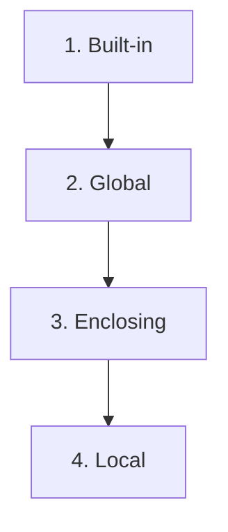

**Scope** defines where a variable can be seen and used in your code. Python manages these boundaries using **Namespaces**—essentially dictionaries that map names to objects.

---

## 1. The LEGB Rule

When you look for a variable, Python searches in this strict order:

| Level | Name | Description |
| :--- | :--- | :--- |
| **L** | **Local** | Inside the current function. |
| **E** | **Enclosing** | In the "parent" function (for nested functions). |
| **G** | **Global** | At the top level of the module/file. |
| **B** | **Built-in** | Predefined Python names (e.g., `len`, `print`). |



---

## 2. Modifying Boundaries: `global` and `nonlocal`

By default, functions can **read** global variables but cannot **modify** them. If you try to change a global variable inside a function, Python will create a new *local* variable with the same name instead.

### The `global` Keyword
To tell Python, "I want to change the variable that lives outside this function," use the `global` keyword.

```python
x = 10

def change():
    global x
    x = 20 # Modifies the x at the top level
```

### The `nonlocal` Keyword (For Nested Functions)
If you have a function inside a function, and the inner one needs to change a variable in the outer one, use `nonlocal`.

```python
def outer():
    count = 0
    def inner():
        nonlocal count
        count += 1
    inner()
    return count
```
*This is the core foundation of **Closures**.*

---

## 3. Shadows and Pitfalls

**Shadowing** occurs when a local variable has the same name as a global one. The local name "hides" the global one until the function finishes.

> [!CAUTION]
> Never name your variables after built-in functions! If you name a variable `list = [1, 2, 3]`, you will "shadow" the built-in `list()` function, and you won't be able to create new lists until that variable is gone.

---

## 4. Interview Pro-Tips

### The "Namespace" is just a Dictionary
You can actually see Python's namespaces!
- `locals()`: Returns a dictionary of the local namespace.
- `globals()`: Returns a dictionary of the global namespace.
Experienced developers use these for debugging or dynamic variable access.

### Why avoid Global variables?
Interviewers often ask why global variables are considered bad practice.
- **Reason**: They create "Hidden Coupling." It's hard to tell which function changed a variable, leading to bugs that are nearly impossible to track down in large codebases.

### The LEGB Search Speed
Searching for a **Local** variable is faster than searching for a **Global** or **Built-in** one. In extreme performance optimization (like inside a tight loop with millions of iterations), developers sometimes "local-ize" a global function to save time:
- `local_len = len; for ...: local_len(x)`

### What Interviewers Are Testing
- Can you explain the LEGB lookup order?
- Do you know the difference between `global` and `nonlocal`?
- Are you aware of the dangers of variable shadowing?

---

## Key Takeaway

Scope is how Python keeps your code from becoming a messy tangle of variable names. By following the **LEGB rule** and minimizing your use of `global` keywords, you'll write code that is clean, predictable, and easy to scale.
