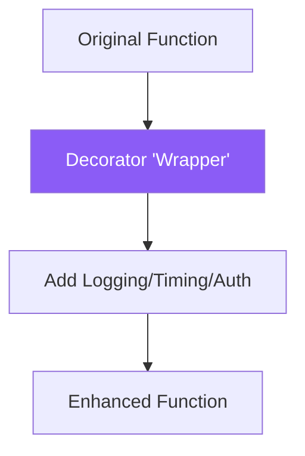

**Decorators** are one of the most powerful and specialized features of Python. They allow you to "wrap" a function to add new behavior without permanently changing the original code.

---

## 1. Prerequisites: First-Class Functions

To understand decorators, you must remember:
1. Functions can be assigned to **Variables**.
2. Functions can be passed as **Arguments** to other functions.
3. Functions can be **Defined inside** other functions.

---

## 2. Closures: Functions that "Remember"

A **Closure** is an inner function that remembers the variables in its outer (enclosing) scope, even after the outer function has finished executing.

```python
def make_multiplier(x):
    def multiplier(n):
        return n * x # Remembers 'x' from outer scope
    return multiplier

double = make_multiplier(2)
print(double(5)) # 10
```

---

## 3. Decorators: The "Gift Wrapping" Pattern

A **Decorator** is just a function that takes another function as an argument and returns a modified version of it.



### The Manual Way
```python
def my_decorator(func):
    def wrapper():
        print("Something is happening before.")
        func()
        print("Something is happening after.")
    return wrapper

def say_hello():
    print("Hello!")

# Enhancing the function manually
enhanced_hello = my_decorator(say_hello)
enhanced_hello()
```

### The "Pythonic" Way (`@`)
Python provides the `@` symbol to make this beautiful and readable.

```python
@my_decorator
def say_hello():
    print("Hello!")

say_hello()
```

---

## 4. Interview Pro-Tips

### Use `@wraps` from `functools`
When you wrap a function, the original function's name and metadata are lost. To keep the metadata (like the function name and docstrings), always use `functools.wraps`.

```python
from functools import wraps

def my_decorator(func):
    @wraps(func)
    def wrapper(*args, **kwargs):
        return func(*args, **kwargs)
    return wrapper
```

### Real-World Use Cases
When an interviewer asks, "When would you actually use a decorator?", give these examples:
- **Logging**: Automatically log every time a function is called.
- **Timing**: Measure how long a function takes to run.
- **Authentication**: Check if a user is logged in before running an API function.
- **Caching (`@lru_cache`)**: Store the result of expensive calculations.

### Decorators with Arguments
If you see a decorator like `@repeat(3)`, it means the decorator itself was created by *another* function! This is called a **Decorator Factory**. It's three layers of nested functions.

### What Interviewers Are Testing
- Do you understand how Closures work?
- Can you explain the `@` syntax?
- Do you know the importance of `functools.wraps`?

---

## Key Takeaway

Decorators are the ultimate tool for **Clean Code**. By separating "What" a function does from "How" it's managed (logging, timing, auth), you can keep your core logic simple while adding powerful features across your entire codebase.
