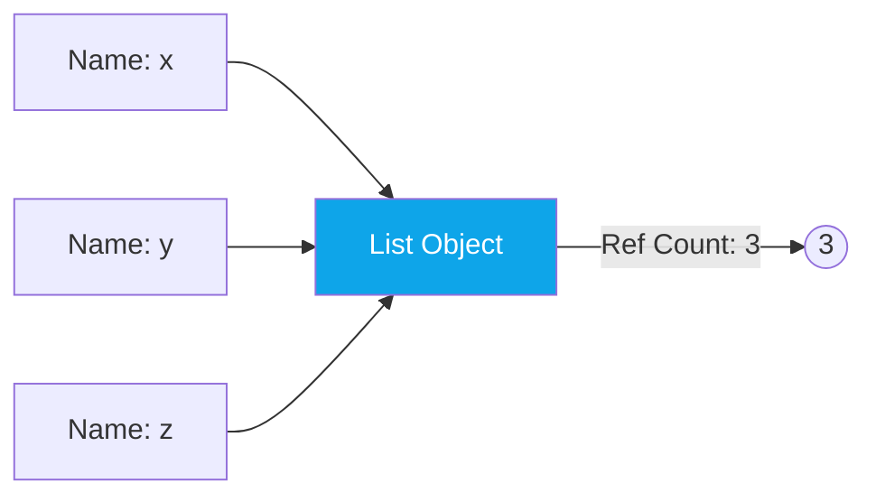

Python handles memory management automatically, allowing developers to focus on logic rather than manual allocations. However, understanding the **Global Interpreter Lock (GIL)** and **Reference Counting** is crucial for writing high-performance code.

---

## 1. Reference Counting: The Core Logic

Every object in Python maintains a **Reference Count**—a simple integer tracking how many names (variables) are pointing to it.

1. When you stick a label on an object, the count goes **up**.
2. When a label is removed (or a variable goes out of scope), the count goes **down**.
3. When the count hits **0**, Python immediately deletes the object and frees the memory.

---

## 2. The Garbage Collector (GC)

Reference counting has one major flaw: **Reference Cycles**. If Object A points to B, and B points back to A, their counts will never hit zero, even if your program can't reach them anymore.

Python's **Garbage Collector** periodically scans for these "islands" of circular references and cleans them up using a generation-based approach.

---

## 3. The GIL: The Global Interpreter Lock

The **GIL** is a mutex (a lock) that protects access to Python objects, preventing multiple threads from executing Python bytecode at the exact same time.

### Why does it exist?
The GIL simplifies CPython's memory management by ensuring thread safety. Without it, the reference counting mechanism would be prone to "Race Conditions" where two threads might try to delete an object at the same time.

### The Trade-off
- **CPU-Bound Tasks**: The GIL makes multi-threading **useless** for heavy computations (math, image processing) because only one CPU core is used at a time.
- **I/O-Bound Tasks**: The GIL is **not a problem** for tasks that spend time waiting (network requests, database queries), as the lock is released during the waiting period.

---

## 4. Interview Pro-Tips

### Identifying Reference Cycles
Interviewers might ask: "How do you break a reference cycle?"
- **Answer**: "Use the `weakref` module." Weak references allow you to point to an object without increasing its reference count.

### The GIL in Python 3.13+
Recent versions of Python are introducing a **"No-GIL"** mode (Experimental). Being aware of the "Free-threaded" Python movement shows you are up-to-date with the latest industry shifts.

### Memory Leaks in Python
Can Python have memory leaks? **Yes**. If you store large amounts of data in a global list and never clear it, or if you create massive reference cycles that the GC hasn't reached yet, your program's memory usage will climb.

### What Interviewers Are Testing
- Do you understand how Reference Counting works?
- Can you explain why the GIL is a bottleneck for multi-threading?
- Do you know the difference between CPU-bound and I/O-bound tasks?

---

## Key Takeaway

Python's memory management is a sophisticated balance of **convenience** and **safety**. While the GIL imposes limits on multi-threading, the automatic cleanup of objects allows for a remarkably low-friction development experience.
