Python provides two distinct ways to handle multiple tasks at once: **Threading** and **Multiprocessing**. Because of the Global Interpreter Lock (GIL), picking the right one is the difference between a fast app and a stalled one.

---

## 1. Threading: The "IO Waiter"

**Threading** allows multiple tasks to run in a single process. Since they share the same memory, they are lightweight and fast to create.

However, in CPython, threads are constrained by the **GIL**. Only one thread can execute Python code at a time.
- **Best For**: **I/O-Bound tasks** (Connecting to a database, downloading files, waiting for user input). While one thread waits for the network, another can do work.

```mermaid
graph TD
    subgraph Process ["Single Process (GIL)"]
    T1[Thread 1] --- Wait[Waiting for Network]
    T2[Thread 2] --- Work[Doing Work]
    end
    style Process fill:#1a1a1a,stroke:#333
```

---

## 2. Multiprocessing: The "Core Worker"

**Multiprocessing** creates entirely separate Python processes. Each process has its own memory space and its **own GIL**.

- **Best For**: **CPU-Bound tasks** (Image processing, complex math, data analysis). This allows Python to use every core on your computer simultaneously.

```mermaid
graph LR
    subgraph P1 ["Process 1 (Core 1)"]
    T1[Work]
    end
    subgraph P2 ["Process 2 (Core 2)"]
    T2[Work]
    end
    style P1 fill:#1a1a1a,stroke:#333
    style P2 fill:#1a1a1a,stroke:#333
```

---

## 2. Choosing Your Weapon

| Feature | Threading | Multiprocessing |
| :--- | :--- | :--- |
| **Shares Memory?** | Yes | No (requires Inter-Process Communication) |
| **GIL Bound?** | Yes | No |
| **Overhead** | Low | High (slow to start) |
| **Best Use Case**| I/O (Waiting) | CPU (Doing) |

---

## 4. Multi-Language Contrast: Go/JS/Java

- **Go**: Uses "Goroutines"—extremely lightweight threads that handle parallelism automatically.
- **Javascript**: Single-threaded event loop. Uses "Web Workers" for parallel tasks.
- **Java**: Robust multi-threading without a GIL; can use all cores natively with threads.

---

## 5. Interview Pro-Tips

### The "GIL" Answer
If an interviewer asks, "Why can't I use 8 cores with Python threads?", the answer is: "The CPython Global Interpreter Lock (GIL) ensures only one thread executes bytecode at a time to maintain thread-safe memory management."

### Communication between Processes
In Multiprocessing, since memory isn't shared, you must use **`Queue`** or **`Pipe`** from the `multiprocessing` module to send data between workers.

### When to avoid Multiprocessing
Creating a process is expensive. If your task takes 0.01 seconds, the overhead of starting a new process might actually make your program **slower** than just running it in a simple loop.

### What Interviewers Are Testing
- Do you understand the difference between I/O-bound and CPU-bound?
- Can you explain how the GIL affects threading?
- Do you know which module (`threading` vs `multiprocessing`) to reach for?

---

## Key Takeaway

Python's concurrency is a "Choose Your Own Adventure" story. By identifying if your bottleneck is **Waiting** (Threading) or **Thinking** (Multiprocessing), you can unlock massive performance gains in your applications.
