**Asynchronous Programming** (or `asyncio`) is Python's modern way of handling thousands of concurrent I/O tasks in a single thread. It is the secret power behind modern web frameworks like **FastAPI**.

---

## 1. The Intuition: "The Busy Chef"

Imagine a **Chef in a kitchen**.
- **Synchronous**: The chef puts toast in the toaster and **stands still** until it's done.
- **Multithreading**: You hire **three chefs**. One for toast, one for eggs, one for coffee. (Expensive!)
- **Asynchronous**: The chef puts toast in, and while it's toasting, they **immediately** start the eggs. When the toast dings, they come back to it.

```mermaid
graph TD
    subgraph EventLoop ["The Async Event Loop"]
    Task1[Task 1: Fetch API] --> Loop{Loop}
    Task2[Task 2: Read File] --> Loop
    Loop --> Done[Return Finished Tasks]
    end
    style EventLoop fill:#1a1a1a,stroke:#333
```



---

## 2. Basic Syntax: `async` and `await`

To use async, you must mark your function as an **`async def`** (making it a "Coroutine") and use **`await`** to tell Python where it can pause and do other work.

```python
import asyncio

async def say_hi():
    print("Starting...")
    await asyncio.sleep(1) # Pause here, let others work
    print("...Done!")

asyncio.run(say_hi())
```

> [!IMPORTANT]
> You cannot `await` just anything. You can only await other async functions, Tasks, or Futures (objects that represent "work in progress").

---

## 3. Why use Async over Threads?

| Feature | Threading | Asyncio |
| :--- | :--- | :--- |
| **Concurrency** | Preemptive (OS switches threads). | Cooperative (You define switch points). |
| **Resources** | High memory per thread. | Low (Millions of tasks in 1 thread). |
| **Complexity** | Risk of Race Conditions. | Safer, but harder to wrap your head around. |
| **Scaling** | Hundreds of connections. | Thousands to Millions of connections. |

---

## 4. Interview Pro-Tips

### Don't block the loop!
This is the cardinal sin of async. If you use a synchronous function (like `time.sleep()` or a heavy math loop) inside an `async def`, you **freeze the entire program**. 
- **Rule**: Always use the async version of a library (e.g., `httpx` instead of `requests`) when working in an async codebase.

### `asyncio.gather()`
If you have 100 API calls to make, don't await them one by one in a loop (that's still synchronous logic!). Instead, use `asyncio.gather(*tasks)` to run them all concurrently.

### The "Aha!" of Coroutines
When you call an `async def` function, it **does not run**. It returns a **Coroutine object**. It only runs when you `await` it or pass it to an event loop management function like `asyncio.run()`.

### What Interviewers Are Testing
- Do you understand the difference between concurrent and parallel?
- Can you explain why you can't use `time.sleep` in an async function?
- Do you know how to run multiple tasks at once using `gather`?

---

## Key Takeaway

Asynchronous Python is about **efficiency**. By not wasting time waiting for the network or hard drive, you can build applications that handle incredible amounts of traffic using minimal server resources.
