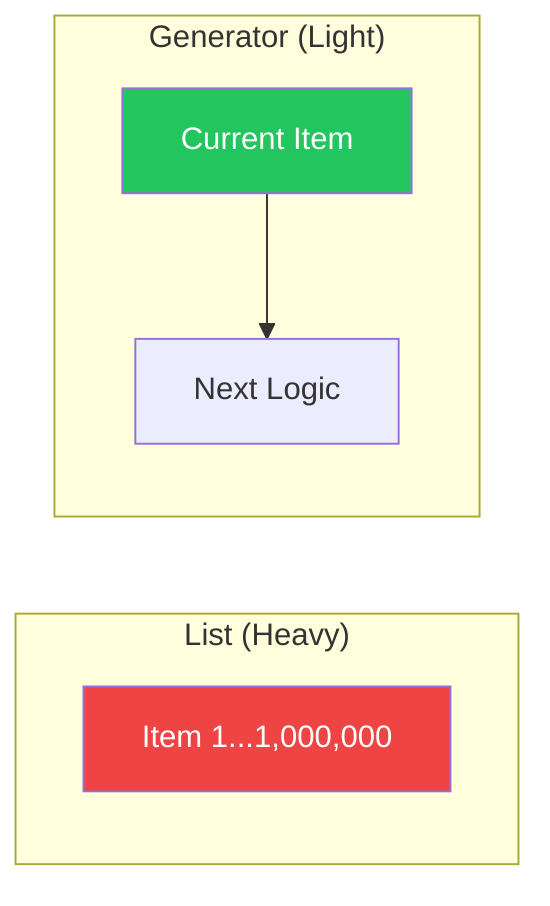

**Iterators** and **Generators** are the key to handling massive amounts of data in Python without crashing your computer. They allow you to process items one-at-a-time instead of loading everything into memory at once.

---

## 1. The Iterator Protocol

An **Iterable** is anything you can loop over (like a list). An **Iterator** is the object that actually does the work of tracking where we are in the loop.

To be an iterator, an object must implement:
1. **`__iter__`**: Returns the iterator object itself.
2. **`__next__`**: Returns the next value in the sequence (or raises `StopIteration` when finished).

---

## 2. Generators: The `yield` Magic

A **Generator** is a special kind of function that uses the `yield` keyword. Instead of returning a value and "dying," it "pauses" and saves its state, only resuming when asked for the next item.

```python
def countdown(n):
    while n > 0:
        yield n # Pause and return n
        n -= 1

for num in countdown(3):
    print(num)
```

### Memory Efficiency (The "Aha!" Moment)
If you have a million items:
- **List**: Stores all 1,000,000 items in RAM at once.
- **Generator**: Stores only **one** item and the logic for the next one.



---

## 3. Generator Expressions

Just as you have List Comprehensions, you can create generators on-the-fly using parentheses `()`.

```python
# List (Takes memory)
sq_list = [x**2 for x in range(1000000)]

# Generator (Uses almost zero memory)
sq_gen = (x**2 for x in range(1000000))
```

---

## 4. Interview Pro-Tips

### The "Lazy Evaluation" Concept
If an interviewer asks, "How would you read a 10GB file on a computer with 4GB of RAM?", the answer is: "I would use a **Generator** to read the file line-by-line using a `for line in file` loop."

### `next()` vs `for` loop
You can manually advance an iterator using the `next(it)` built-in function. A `for` loop is essentially just a fancy wrapper that calls `next()` repeatedly and catches the `StopIteration` error for you.

### What is `yield from`?
Introduced in 3.3, it allows a generator to delegate part of its operations to another generator—useful for flattening nested structures.

### What Interviewers Are Testing
- Do you understand how generators save memory?
- Can you explain what `yield` does (pausing vs returning)?
- Do you know the difference between an Iterable and an Iterator?

---

## Key Takeaway

Iterators and Generators are about **scalability**. By moving from "Eager" lists to "Lazy" generators, you can write programs that handle data of any size with a tiny, constant memory footprint.
