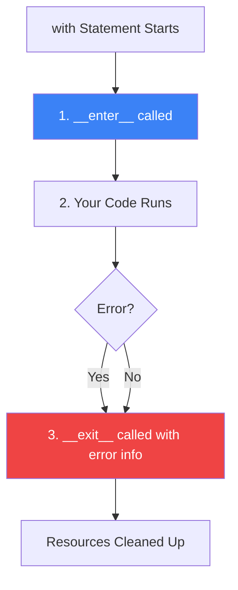

**Context Managers** are the standard way in Python to manage resources like files, database connections, and network sockets. They ensure that resources are properly cleaned up, even if an error occurs.

---

## 1. The Power of `with`

The most common use of a context manager is opening a file:

```python
with open("notes.txt", "w") as f:
    f.write("Hello World")
# File is automatically closed here!
```

Without `with`, you have to remember to call `f.close()`. If your program crashes *before* you reach that line, the file remains open, which can lead to data corruption or "Too many open files" errors.

---

## 2. The Lifecycle

Under the hood, any object usable with `with` must implement the **Context Manager Protocol**:

1. **`__enter__`**: Setup logic (e.g., opening a file).
2. **`__exit__`**: Teardown logic (e.g., closing a file).



---

## 3. Creating Your Own

### The Class Way
```python
class Database:
    def __enter__(self):
        print("Connecting to DB...")
        return self
    def __exit__(self, exc_type, exc_val, exc_tb):
        print("Closing connection.")

with Database() as db:
    print("Doing work...")
```

### The "Pythonic" Way (`contextlib`)
For simple cases, you can use the `@contextmanager` decorator to turn a generator into a context manager. Everything before `yield` is setup, and everything after is teardown.

```python
from contextlib import contextmanager

@contextmanager
def my_timer():
    print("Timer started")
    yield
    print("Timer ended")
```

---

## 4. Interview Pro-Tips

### Suppressing Errors
In the `__exit__` method, if you return `True`, Python will "swallow" any error that happened inside the code block. This is rarely used but good to know as a trivia point.

### `contextlib.suppress`
If you want to ignore a specific error without a bulky `try-except`, you can use:
- `with suppress(FileNotFoundError): open("ghost.txt")`

### Standard Library Examples
When asked for examples, mention:
- `open()`: Files.
- `threading.Lock()`: Managing thread safety.
- `unittest.mock.patch()`: Mocking in tests.

### What Interviewers Are Testing
- Do you understand **why** we use `with` (Resource Management)?
- Can you explain the `__enter__` and `__exit__` methods?
- Do you know how to use `@contextmanager` for cleaner code?

---

## Key Takeaway

Context managers make your code **safe by default**. By automating the "Cleanup" phase of your logic, you eliminate a whole class of resource-leak bugs and make your software much more robust.
