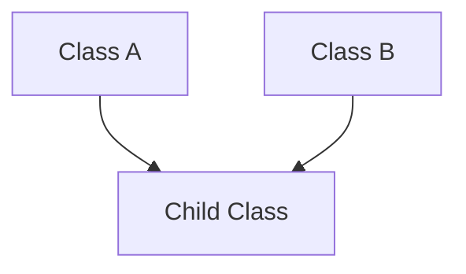

Python is an **Object-Oriented Programming (OOP)** language. While it supports other styles, the majority of Python libraries are built around the concept of classes and objects.

---

## 1. The Anatomy of a Python Class

```python
class Robot:
    # Class Attribute (Shared by all robots)
    population = 0

    def __init__(self, name):
        # Instance Attribute (Unique to this robot)
        self.name = name
        Robot.population += 1

    def greet(self):
        return f"Hi, I'm {self.name}"
```

- **`self`**: The first argument to every instance method. It points to the specific object you are working with.
- **`__init__`**: The constructor.

---

## 2. Inheritance and MRO

Python supports **Multiple Inheritance**, meaning a class can have more than one parent.



### MRO (Method Resolution Order)
If Parent A and Parent B both have a method named `dance()`, which one does the Child use?
Python uses the **C3 Linearization** algorithm to determine the order. You can see this order by calling `Child.mro()`. 

---

## 3. Pythonic OOP: Properties and Methods

### `@property` (Getters/Setters)
In Python, we don't write `get_salary()` and `set_salary()`. We use the `@property` decorator to make a method look like an attribute.

```python
class Employee:
    @property
    def salary(self):
        return self._salary
```

### `@classmethod` vs `@staticmethod`
- **Instance Method**: Access to `self` (the object).
- **Class Method (`@classmethod`)**: Access to `cls` (the class itself). Often used for "Factory Methods" (creating objects).
- **Static Method (`@staticmethod`)**: No access to `self` or `cls`. It's just a function that lives inside the class for organization.

---

## 4. Interview Pro-Tips

### Mixins
A **Mixin** is a class that provides specific functionality to other classes via inheritance, but isn't meant to stand on its own. It's a clean way to stay "DRY" (Don't Repeat Yourself).

### Composition over Inheritance
Experienced developers often say: "Favor composition." Instead of inheriting from a complex class, give your class an instance of that class as an attribute (`self.engine = Engine()`). This makes your code more flexible and easier to test.

### Private Attributes
Python doesn't have true "private" variables like Java. We use a **single underscore** (`_name`) as a convention to say "Please don't touch this outside the class." A **double underscore** (`__name`) triggers "Name Mangling," which makes it harder (but not impossible) to access.

### What Interviewers Are Testing
- Can you explain the difference between a Class Attribute and an Instance Attribute?
- Do you understand the LEGB scope vs the class scope?
- Can you explain the difference between `@classmethod` and `@staticmethod`?

---

## Key Takeaway

OOP in Python is designed to be **Explicit**. By mastering classes, inheritance, and properties, you can build complex systems that are organized, modular, and easy for other developers to integrate into.
