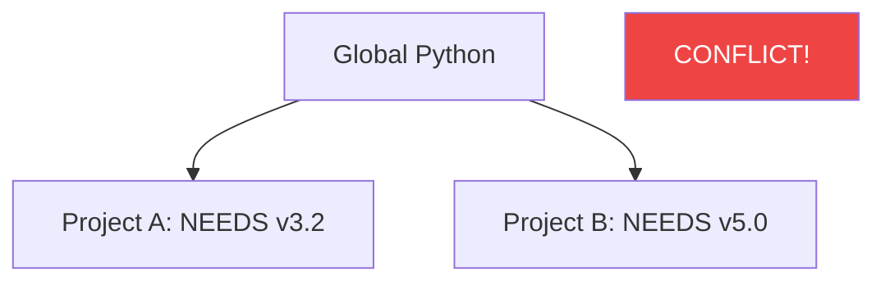

In Python, project management is critical. **Virtual Environments** allow you to create "islands" for your projects, ensuring that the libraries for Project A don't conflict with Project B.

---

## 1. The Problem: "Dependency Hell"

Imagine Project A needs **Django 3.2**, but Project B needs **Django 5.0**. If you install these globally on your computer, they will fight each other, and one or both of your projects will stop working.

---

## 2. The Solution: `venv`

A **Virtual Environment** is a folder that contains its own copy of the Python interpreter and its own private library folder.

### How to use it

1. **Create**: `python -m venv venv`
2. **Activate**:
   - Windows: `venv\Scripts\activate`
   - Mac/Linux: `source venv/bin/activate`
3. **Install**: `pip install requests`

Once activated, your terminal "lives" inside that island. Anything you `pip install` stays there.

---

## 3. `pip` and `requirements.txt`

**`pip`** is the Python Package Installer. To share your project with others, you list your dependencies in a file called `requirements.txt`.

- **To save**: `pip freeze > requirements.txt`
- **To install from a file**: `pip install -r requirements.txt`

---

## 4. Modern Tools: Beyond `venv`

While `venv` is the standard, the professional community often uses more advanced tools:

- **Poetry**: Manages dependencies, virtual environments, and publishing to PyPI all in one tool. It uses `pyproject.toml` instead of `requirements.txt`.
- **uv**: An extremely fast Python package manager written in Rust. It's becoming the new industry favorite for speed.
- **Conda**: Popular in Data Science; it manages not just Python packages, but also non-Python libraries (like C++ or Fortran utilities).

---

## 5. Interview Pro-Tips

### Should you commit your `venv` to Git?

**NO**. Never commit the virtual environment folder to version control. It's specific to your computer's OS. Instead, commit the `requirements.txt` (or `pyproject.toml`) and have the next developer regenerate the environment.

### The `__init__.py` file

An interviewer might ask what this file does.

- **Answer**: It tells Python that a directory should be treated as a **Package**. While optional in newer Python versions, it is still the standard way to organize large codebases into modules.

### What is the the Python "Triple Jump"?

1. Create a Venv.
2. Activate it.
3. Install requirements.
   If you do this before starting any project, you avoid 99% of environment bugs.

### What Interviewers Are Testing

- Do you understand the importance of isolating project dependencies?
- Can you manage packages using `pip`?
- Are you aware of modern industry tools like Poetry or uv?

---

## Key Takeaway

Mastering environments is the hallmark of a **Professional Python Developer**. By isolating your projects and explicitly managing your dependencies, you ensure that your code runs reliably for everyone, anywhere.
